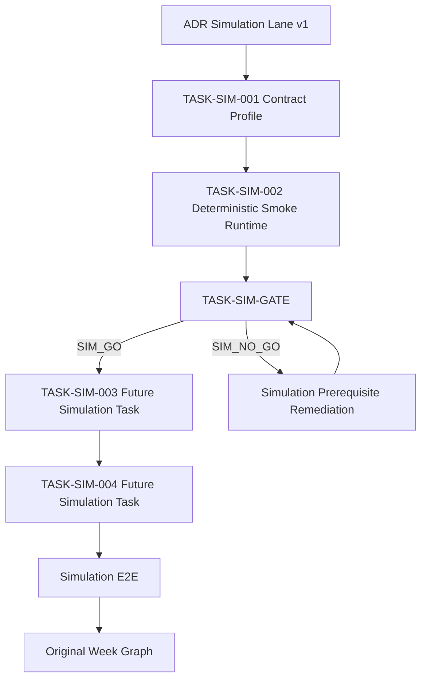

# Simulation Task Mapping v1

> Status: FROZEN
> Governing ADR: `ADR-Simulation-Lane-v1.md`
> Purpose: Define the new simulation-only task dependency graph without modifying the existing Week 1–6 task graph.

---

# 1. Existing Task Graph Remains Authoritative

The current authoritative Week mapping is not replaced by this document.

This document does not change:

```text
TASK-W1-001
TASK-W1-002
TASK-W1-003
TASK-W1-004
TASK-W1-005
TASK-W2-*
TASK-W3-*
TASK-W4-*
TASK-W5-*
TASK-W6-*
```

Any authorization attached to those IDs remains governed by their existing plans and gates.

---

# 2. Simulation Lane Purpose

The Simulation Lane exists to remove software uncertainty before the original hardware-dependent development path resumes.

It is:

```text
pre-integration
simulation-only
non-physical
non-training by default
```

unless a later simulation task explicitly obtains a separate training authorization.

---

# 3. Initial Simulation Graph



---

# 4. TASK-SIM-001

Name:

```text
Simulation Contract Profile
```

Responsibility:

* select the existing architecture boundaries used by simulation;
* identify which existing planning/frozen contracts constrain simulation;
* explicitly identify any missing executable contract;
* define fixture semantics without inventing physical actuator ownership;
* define input/output/failure/timeout/reconciliation expectations needed by `TASK-SIM-002`.

Output may include:

```text
docs/simulation/simulation_contract_profile_v1.md
```

This task shall not implement a simulator or physical adapter.

---

# 5. TASK-SIM-002

Name:

```text
Deterministic Smoke Runtime
```

Responsibility:

* implement the smallest bounded deterministic executable path that conforms to the accepted simulation contract profile;
* demonstrate execution without physical devices;
* produce machine-readable evidence;
* establish the concrete execution evidence required by `TASK-SIM-GATE`.

It is not a full simulation implementation.

---

# 6. TASK-SIM-GATE

Name:

```text
Simulation Lane Authorization Gate
```

Consumes only already-produced accepted evidence.

Inputs at minimum:

```text
ADR-Simulation-Lane-v1
TASK-SIM-001 accepted evidence
TASK-SIM-002 accepted evidence
existing architecture / contract bindings
existing P0 authorization state
```

Output:

```text
SIM_GO
SIM_NO_GO
```

No W-task authorization field may be modified.

---

# 7. Future Simulation Tasks

Downstream IDs are intentionally separate from the Week graph.

Possible future structure:

```text
TASK-SIM-003
Simulation Skill Integration

TASK-SIM-004
Simulation Mission Integration

TASK-SIM-005
Simulation Failure / Recovery

TASK-SIM-006
Simulation Observability

TASK-SIM-E2E
Simulation End-to-End Qualification
```

Exact specifications must be separately approved before implementation.

---

# 8. Relationship to Original Week Graph

Simulation Lane completion may reduce risk before entering the original Week graph.

It does not automatically satisfy:

```text
TASK-W1-001
TASK-W1-002
TASK-W1-003
...
```

requirements.

For example:

```text
Simulation teleoperation logic
```

is not evidence that:

```text
physical teleoperation
```

has passed.

Likewise:

```text
SIM_FIXTURE_SET_V1
```

is not:

```text
Dataset V1
```

---

# 9. Training Relationship

Tasks that do not require real fine-tuning may proceed while training resource readiness remains blocked.

Any future simulation task that actually requires:

```text
SmolVLA fine-tuning
```

must separately prove:

```text
fine_tuning_authorized = true
```

under the applicable training-resource gate.

`SIM_GO` itself does not provide that authorization.

---

# 10. Physical Relationship

Simulation Lane tasks may not require:

```text
robot device discovery
physical camera availability
gripper availability
physical state feedback
physical actuator access
physical E-stop execution
```

unless the task is explicitly reclassified outside the Simulation Lane.

---

# 11. Exit From Simulation Lane

Simulation Lane completion does not automatically mean the original W1 graph may start.

Transition to the original graph requires the gates already governing that graph to authorize it.

The Simulation Lane therefore provides:

```text
risk reduction
contract validation
deterministic evidence
simulation evidence
```

but not an authorization bypass.

---

# 12. Mapping Invariants

```text
SIM task ID != W task ID

SIM_GO != W1_GO

Simulation fixture != Dataset V1

Simulation skill behavior != physical execution authorization

Device readiness != motion authorization
```

---

# 13. Freeze Checklist

```text
[ ] No existing Week IDs redefined
[ ] No existing P0 authorization overridden
[ ] TASK-SIM-001 precedes TASK-SIM-002
[ ] TASK-SIM-002 precedes TASK-SIM-GATE
[ ] No circular simulation-gate dependency
[ ] Training ownership remains separate
[ ] Physical ownership remains separate
[ ] Dataset V1 ownership remains unchanged
```
