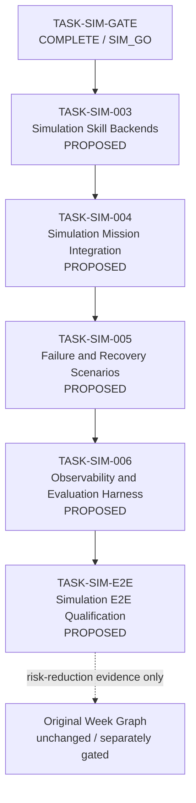

# Simulation Task Mapping v2 — Proposed Delivery Backlog

> Status: `DRAFT / PROPOSED`
> Planning revision: 2026-09-15
> Governing frozen baseline: `context/simulation_task_mapping_v1.md`
> Governing ADR: `docs/architecture/adr/ADR-Simulation-Lane-v1.md`
> Purpose: Record the proposed post-`SIM_GO` delivery backlog without rewriting the accepted v1 mapping or authorizing implementation.

---

## 1. Authority and Versioning

`simulation_task_mapping_v1.md` is frozen and hash-bound by the accepted `TASK-SIM-GATE` evidence. This v2 document is a planning overlay only.

```text
v1 = accepted historical gate input; immutable
v2 = proposed downstream backlog; not yet approved
```

Nothing in v2 changes:

```text
P0-004R = NO_GO
TASK-W1-001 authorized = false
TASK-W1-002 authorized = false
Dataset V1 authorized = false
fine_tuning_authorized = false
physical_motion_authorized = false
hardware_target_frozen = false
```

---

## 2. Completed Simulation-Lane Foundation

The following are verified merged/accepted facts, not proposed work:

| Task | Status | Accepted result | Downstream effect |
|---|---|---|---|
| `TASK-SIM-C01` | `COMPLETE / ACCEPTED` | `SIM_CONTRACT_GAPS_RESOLVED` | enabled SIM-001 re-evaluation |
| `TASK-SIM-001` | `COMPLETE / ACCEPTED` | `SIM_CONTRACT_PROFILE_READY` | enabled SIM-002 |
| `TASK-SIM-002` | `COMPLETE / ACCEPTED` | `SIM_SMOKE_READY` | enabled SIM-GATE evaluation |
| `TASK-SIM-GATE` | `COMPLETE / ACCEPTED` | `SIM_GO` | `simulation_lane_authorized = true` |

The accepted foundation provides:

- a closed executable Simulation Lane contract and JSON Schema;
- logical operations `mission.execute`, `navigation.execute`, `vla.execute`, `action_status.get`, and `verification.verify`;
- deterministic success, failure, timeout, and reconciliation smoke evidence;
- explicit isolation from physical hardware, Dataset V1, and training authorization.

---

## 3. Proposed Delivery Graph

Every downstream item remains `PROPOSED` until its own Task specification is created and approved.



Planning dependency:

```text
SIM-GATE accepted
  -> SIM-003 accepted
  -> SIM-004 accepted
  -> SIM-005 accepted
  -> SIM-006 accepted
  -> SIM-E2E qualified
```

This linear order is the planning default. A future reviewed planning change may split or parallelize tasks only when contracts, file ownership, and evidence dependencies make that safe.

---

## 4. Proposed Backlog

### TASK-SIM-003 — Simulation Skill Backends

```text
Status: PROPOSED
Eligible for specification: YES
Eligible for implementation: NO — no approved TASK-SIM-003 specification exists
Depends on: accepted TASK-SIM-GATE = SIM_GO
```

Proposed objective:

- implement deterministic, bounded simulation backends behind the accepted Navigation Skill, VLA Skill, and Verification boundaries;
- support only the frozen logical operations and closed request/result schema;
- provide stable fixture selection and action-status lookup suitable for later mission integration;
- preserve deterministic time, identity, idempotency, and cleanup behavior.

Proposed exit evidence:

- schema-valid backend request/result tests;
- deterministic repeated-run evidence;
- bounded execution/cleanup evidence;
- proof that no public direct-actuator or physical-device interface was added.

Explicitly excluded:

- mission-level orchestration;
- physical robot/camera access;
- ROS/Nav2/MoveIt/`ros2_control` binding;
- model loading, inference, training, or Dataset V1.

### TASK-SIM-004 — Simulation Mission Integration

```text
Status: PROPOSED
Eligible for specification: after SIM-003 acceptance, unless dependency review explicitly permits earlier authoring
Eligible for implementation: NO
Depends on: TASK-SIM-003 accepted
```

Proposed objective:

- connect the Deterministic Mission Executor to the accepted simulation skill backends through existing boundaries;
- execute one canonical simulation-only line-side supply mission end to end;
- preserve mission/action state, correlation identity, idempotency, completion authority, and verification rules;
- produce a reproducible successful mission trace.

Proposed exit evidence:

- one deterministic canonical success mission;
- state-transition and idempotency tests;
- evidence that completion requires authoritative skill results plus verification `pass`;
- no bypass around the executable contract.

Explicitly excluded:

- failure/recovery coverage beyond the minimum integration guard cases;
- physical motion or physical telemetry;
- synthetic fixture claims as Dataset V1;
- Week-task completion claims.

### TASK-SIM-005 — Simulation Failure and Recovery Scenarios

```text
Status: PROPOSED
Eligible for specification: after SIM-004 acceptance
Eligible for implementation: NO
Depends on: TASK-SIM-004 accepted
```

Proposed objective:

- extend the integrated mission path with a bounded failure taxonomy;
- cover navigation failure, VLA failure, timeout/unknown, reconciliation, verification fail/uncertain, retry exhaustion, and escalation;
- prove that ambiguous outcomes cannot become success without authoritative reconciliation;
- keep retry and recovery policy deterministic and bounded.

Proposed exit evidence:

- scenario manifest with stable IDs and expected outcomes;
- machine-readable traces for each mandatory failure class;
- retry/reconciliation/idempotency invariant tests;
- fail-closed evidence for unknown, malformed, or contradictory results.

Explicitly excluded:

- physical fault injection;
- production success-rate or reliability claims;
- unbounded retry or wall-clock soak;
- Agent-selected raw recovery commands.

### TASK-SIM-006 — Simulation Observability and Evaluation Harness

```text
Status: PROPOSED
Eligible for specification: after SIM-005 acceptance
Eligible for implementation: NO
Depends on: TASK-SIM-005 accepted
```

Proposed objective:

- provide structured mission/action/skill/verification traces across the accepted scenario suite;
- add deterministic replay and result comparison;
- compute clearly scoped simulation metrics without extrapolating to physical or production performance;
- bind scenario, code, contract, and evidence versions.

Proposed exit evidence:

- versioned scenario/evaluation manifest;
- repeatable replay results;
- machine-readable metrics with numerator, denominator, and exclusion rules;
- evidence-integrity and tamper/fail-closed tests.

Explicitly excluded:

- production observability readiness;
- physical latency, safety, or reliability claims;
- 24/72-hour soak requirements;
- model-quality benchmarking or fine-tuning.

### TASK-SIM-E2E — Simulation End-to-End Qualification

```text
Status: PROPOSED
Eligible for specification: after SIM-006 acceptance
Eligible for implementation: NO
Depends on: TASK-SIM-003 through TASK-SIM-006 accepted
```

Proposed objective:

- execute and independently evaluate the complete bounded simulation scenario suite;
- verify contract, mission, recovery, observability, replay, and evidence-integrity requirements as one qualification package;
- produce exactly one task-specific decision such as `SIM_E2E_QUALIFIED` or `SIM_E2E_BLOCKED`, to be frozen by its future Task specification.

Proposed exit evidence:

- canonical E2E scenario results;
- full regression and deterministic replay evidence;
- unresolved limitation register;
- independent read-only review and post-review acceptance record.

Explicitly excluded:

- automatic authorization of the original Week graph;
- physical hardware readiness or motion authorization;
- Dataset V1, real VLA benchmark, or production-readiness claims.

---

## 5. Backlog Status Rules

For every proposed item:

```text
listed in mapping
!= TASK specification approved
!= implementation authorized
!= implementation complete
!= independently accepted
```

Status progression must be explicit:

```text
PROPOSED
-> TASK specification created
-> human review/approval
-> READY FOR IMPLEMENTATION
-> implementation/evidence
-> independent read-only review
-> acceptance record
-> COMPLETE / ACCEPTED
```

Only `TASK-SIM-003` is currently the next candidate for specification. Later items may remain visible for roadmap coherence but may not be implemented merely because they appear in this document.

---

## 6. Cross-Lane Invariants

```text
SIM task ID != W task ID
SIM_GO != W1_GO
Simulation fixture != Dataset V1
Simulation E2E != physical E2E
Simulation success metric != production success metric
Simulation skill backend != direct actuator contract
Device readiness != motion authorization
Training remains independently gated
```

No proposed task may rewrite accepted P0/SIM evidence, silently change the frozen executable contract, or freeze candidate hardware.

---

## 7. Planning Decisions Still Required

Before creating `TASK-SIM-003`, review and freeze only the choices needed by that task:

- backend ownership and package placement;
- whether to extend the current smoke module or introduce a separate runtime package;
- exact deterministic fixture configuration mechanism;
- evidence file/report naming;
- compatibility requirements with the existing MVP mission runtime;
- Task-specific acceptance decision vocabulary.

Do not resolve SIM-004+ design details prematurely inside the SIM-003 specification.
