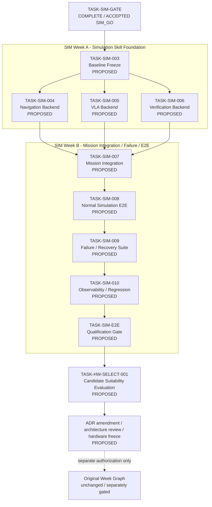

# Simulation Task Mapping v2 — Proposed Post-Gate Backlog

> Status: `DRAFT / PROPOSED`
> Planning revision: 2026-09-15
> Governing frozen baseline: `context/simulation_task_mapping_v1.md`
> Governing ADR: `docs/architecture/adr/ADR-Simulation-Lane-v1.md`
> Purpose: Define the proposed Simulation First backlog after accepted `SIM_GO` without authorizing implementation or rewriting accepted evidence.

---

## 1. Authority and Versioning

`simulation_task_mapping_v1.md` is frozen and hash-bound by accepted `TASK-SIM-GATE` evidence. This v2 document is a planning overlay only.

```text
v1 = accepted historical gate input; immutable
v2 = proposed downstream backlog; not approved
```

Nothing in v2 changes:

```text
P0-004R = NO_GO
TASK-W1-001 authorized = false
TASK-W1-002 authorized = false
Dataset V1 authorized = false
fine_tuning_authorized = false
physical_motion_authorized = false
hardware_target_frozen = false
```

---

## 2. Completed Simulation-Lane Foundation

These are verified merged/accepted facts, not proposed work:

| Task | Status | Accepted result | Effect |
|---|---|---|---|
| `TASK-SIM-C01` | `COMPLETE / ACCEPTED` | `SIM_CONTRACT_GAPS_RESOLVED` | executable contract/schema established |
| `TASK-SIM-001` | `COMPLETE / ACCEPTED` | `SIM_CONTRACT_PROFILE_READY` | SIM-002 enabled |
| `TASK-SIM-002` | `COMPLETE / ACCEPTED` | `SIM_SMOKE_READY` | SIM-GATE evaluation enabled |
| `TASK-SIM-GATE` | `COMPLETE / ACCEPTED` | `SIM_GO` | `simulation_lane_authorized = true` |

The accepted foundation provides:

- a closed executable Simulation Lane contract and JSON Schema;
- logical operations `mission.execute`, `navigation.execute`, `vla.execute`, `action_status.get`, and `verification.verify`;
- deterministic success, failure, timeout, and reconciliation smoke evidence;
- explicit isolation from physical hardware, Dataset V1, and training authorization.

---

## 3. Proposed Delivery Roadmap

Every downstream item remains `PROPOSED` until its own Task specification is created, reviewed, and approved.



Default planning dependency:

```text
accepted SIM_GO
-> SIM-003 baseline frozen
-> SIM-004 Navigation backend
   + SIM-005 VLA backend
   + SIM-006 Verification backend accepted
-> SIM-007 Mission integration accepted
-> SIM-008 Normal E2E accepted
-> SIM-009 Failure/Recovery suite accepted
-> SIM-010 Observability/Regression accepted
-> SIM-E2E qualification accepted
-> hardware-selection track may begin under separate authority
```

---

## 4. SIM Week A — Simulation Skill Foundation

| Task | Purpose | Core output | Status |
|---|---|---|---|
| `TASK-SIM-003` | Simulation Baseline Freeze | accepted SIM artifacts, Git/source hashes, fixture/runtime/test baseline | `PROPOSED` |
| `TASK-SIM-004` | Navigation Skill Deterministic Backend | navigation success/failure/timeout simulation | `PROPOSED` |
| `TASK-SIM-005` | VLA Skill Deterministic Backend | VLA success/failure/unknown-outcome fixtures | `PROPOSED` |
| `TASK-SIM-006` | Verification Backend | expected/observed verification and reconciliation fixtures | `PROPOSED` |

### TASK-SIM-003 — Simulation Baseline Freeze

```text
Status: PROPOSED
Eligible for specification: YES
Eligible for implementation: NO — no approved Task specification exists
Depends on: accepted TASK-SIM-GATE = SIM_GO
```

Purpose:

- freeze the accepted Simulation development baseline without adding substantive new runtime behavior;
- bind the accepted SIM-001, SIM-002, and SIM-GATE artifacts to exact Git revisions and source hashes;
- record the Simulation ADR, contract profile/schema, smoke runtime, fixture baseline, and test baseline as one reproducible manifest.

Required baseline inputs:

```text
ACCEPTED SIM-001
ACCEPTED SIM-002
ACCEPTED SIM-GATE
Simulation ADR
executable contract and schema
contract profile
smoke runtime
fixture identity/version/hash
Git commit SHA and source hashes
focused/full test baseline
```

Proposed output identity:

```text
SIM_BASELINE_V1
```

All later Simulation tasks must bind the accepted `SIM_BASELINE_V1` manifest, its Git revision, and relevant source hashes. The exact task-specific decision field and artifact paths must be frozen in the future Task specification.

Explicitly excluded:

- new Skill behavior or mission orchestration;
- modification of accepted SIM evidence;
- physical, Dataset V1, training, or Week authorization.

### TASK-SIM-004 — Navigation Skill Deterministic Backend

```text
Status: PROPOSED
Eligible for specification: after SIM-003 acceptance
Eligible for implementation: NO
Depends on: accepted SIM_BASELINE_V1
```

Purpose:

- place a deterministic backend behind the frozen Navigation Skill boundary;
- validate Skill contract semantics before Gazebo/Nav2 or myAGV integration;
- preserve stable action/idempotency identity, bounded execution, retry budget, and authoritative status lookup.

Minimum scenario intent and contract mapping:

| Scenario intent | Contract representation |
|---|---|
| `SUCCESS` | `result=success`, `status=succeeded`, requested arrival verified |
| `TIMEOUT` | `DEPENDENCY_TIMEOUT`, `result=pending`, `status=unknown`, reconciliation required |
| `UNAVAILABLE` | `RESOURCE_UNAVAILABLE`, terminal/retryable behavior fixed by Task policy |
| `INVALID_GOAL` | `VALIDATION`, fail closed before simulated execution |
| `UNKNOWN_OUTCOME` | only through a contract-allowed `pending/unknown` result; never a new ad-hoc category |

Proposed evidence:

- schema-valid deterministic request/result fixtures;
- repeated-run and bounded-cleanup evidence;
- status/reconciliation correlation tests;
- proof of no Gazebo, Nav2, myAGV, physical-device, or direct-actuator dependency.

### TASK-SIM-005 — VLA Skill Deterministic Backend

```text
Status: PROPOSED
Eligible for specification: after SIM-003 acceptance
Eligible for implementation: NO
Depends on: accepted SIM_BASELINE_V1
```

Purpose:

- place a deterministic fixture backend behind the frozen VLA Skill boundary;
- validate request-to-result semantics without SmolVLA model loading, inference, or fine-tuning;
- preserve observation identity/hash, workspace profile, policy version, and reconciliation semantics.

Minimum scenario intent:

```text
request
  -> deterministic VLA fixture
  -> SUCCEEDED
     FAILED
     TIMED_OUT
     UNKNOWN
```

`TIMED_OUT`/`UNKNOWN` must use the accepted contract's `pending/unknown` semantics and authoritative `action_status.get` reconciliation. The following invariants are mandatory:

```text
UNKNOWN -> SUCCEEDED directly is forbidden
unknown outcome -> reconciliation before completion/retry
observation evidence -> completion/reconcile/recovery/HITL decision
uncertain != success
```

Proposed evidence:

- deterministic VLA success, known failure, timeout, and unknown-result fixtures;
- invalid/ambiguous observation rejection;
- forbidden transition and bounded retry tests;
- proof that no model, training, physical camera, or actuator path was used.

### TASK-SIM-006 — Verification Simulation Backend

```text
Status: PROPOSED
Eligible for specification: after SIM-003 acceptance
Eligible for implementation: NO
Depends on: accepted SIM_BASELINE_V1
```

Purpose:

- deterministically compare expected state with observed Simulation state;
- preserve the accepted `verification.verify` verdicts `pass`, `fail`, and `uncertain`;
- supply authoritative evidence for executor-owned confirmation, reconciliation, recovery, or HITL routing.

Conceptual flow:

```text
Expected State + Observed Sim State
               -> Verification verdict
               -> CONFIRMED | RECONCILE | RECOVERY | HITL
```

The uppercase routing labels describe executor decisions, not new Verification contract verdicts. Recommended mapping:

```text
pass      -> CONFIRMED
uncertain -> RECONCILE, then bounded RECOVERY or HITL if unresolved
fail      -> deterministic RECOVERY or HITL policy
```

Verification must not commit mission completion by itself.

Proposed evidence:

- exact-match, mismatch, insufficient, ambiguous, and malformed observation cases;
- immutable observation identity/version/hash checks;
- deterministic verdict and routing-input evidence;
- proof that `uncertain` never becomes `pass` by confidence metadata.

Completion of SIM Week A should answer:

> Can the Mission Executor consume each individual Skill through the accepted contract without real hardware?

It does not yet prove integrated mission execution.

SIM-004, SIM-005, and SIM-006 may be planned as parallel workstreams only after SIM-003 is accepted and only when implementation packages, evidence paths, and file ownership do not materially overlap. Otherwise execute them sequentially without introducing false semantic dependencies between the three Skill backends.

---

## 5. SIM Week B — Mission Integration / Failure / E2E

| Task | Purpose | Status |
|---|---|---|
| `TASK-SIM-007` | Simulation Mission Integration | `PROPOSED` |
| `TASK-SIM-008` | Normal Simulation E2E | `PROPOSED` |
| `TASK-SIM-009` | Failure / Recovery Scenario Suite | `PROPOSED` |
| `TASK-SIM-010` | Simulation Observability / Evidence / Regression | `PROPOSED` |
| `TASK-SIM-E2E` | Simulation Qualification Gate | `PROPOSED` |

### TASK-SIM-007 — Simulation Mission Integration

```text
Status: PROPOSED
Eligible for specification: after SIM-004, SIM-005, and SIM-006 are all accepted
Eligible for implementation: NO
Depends on: accepted SIM-004, SIM-005, and SIM-006 backends
```

Purpose:

```text
Mission Executor
  + Navigation Skill Sim
  + VLA Skill Sim
  + Verification Sim
  -> one contract-bound integrated Simulation runtime
```

Existing MVP mission state, deterministic gateway, normal E2E, and single-failure recovery implementation may be reused when compatible. Reuse never auto-passes a SIM Exit Criterion:

```text
reused implementation + new SIM-specific tests/evidence = eligible proof
reused implementation alone = insufficient
MVP complete != SIM backlog complete
```

Proposed evidence:

- exact boundary wiring and version bindings;
- mission/action lifecycle and idempotency tests;
- authoritative verification required before mission completion;
- no bypass of Skill/Verification contracts.

### TASK-SIM-008 — Normal Simulation E2E

```text
Status: PROPOSED
Eligible for specification: after SIM-007 acceptance
Eligible for implementation: NO
Depends on: accepted SIM-007 Mission integration
```

Purpose:

```text
factory request
-> mission
-> simulated navigation
-> simulated VLA
-> verification
-> mission success
```

Minimum machine-readable evidence:

```text
mission_id
action lifecycle
initial state
final state
Skill results
Verification result
trace/correlation identity
bounded duration
fixture and contract versions
source revision and hashes
```

One successful scenario proves only the bounded canonical Simulation path, not physical or production success.

### TASK-SIM-009 — Failure / Recovery Scenario Suite

```text
Status: PROPOSED
Eligible for specification: after SIM-008 acceptance
Eligible for implementation: NO
Depends on: accepted normal Simulation E2E
```

Minimum proposed scenarios:

```text
Navigation timeout
VLA failed
VLA unknown outcome
Verification mismatch
Factory API invalid response
Skill unavailable
```

Each scenario must explicitly prove its applicable decision:

```text
retry?
reconcile?
recover?
HITL?
fail closed?
```

Factory API invalid-response coverage must reuse an existing typed boundary or first surface a concrete contract gap; it must not silently expand the frozen Simulation contract.

Proposed evidence:

- versioned scenario manifest with stable expected outcomes;
- retry/reconciliation/idempotency and budget invariants;
- fail-closed behavior for malformed or contradictory results;
- no unbounded retry, sleep, process leak, or physical fault injection.

### TASK-SIM-010 — Simulation Observability / Evidence / Regression

```text
Status: PROPOSED
Eligible for specification: after SIM-009 acceptance
Eligible for implementation: NO
Depends on: accepted normal and failure Simulation suites
```

Purpose:

- freeze structured evidence, trace correlation, mission/action timelines, failure codes, recovery decisions, fixture versions, and Git/source revisions;
- add deterministic replay and regression comparison;
- make metrics auditable without extrapolating to physical or production performance.

Minimum outputs:

```text
structured evidence
trace correlation
mission/action timeline
failure_code
recovery decision
fixture/contract version
Git SHA and source hashes
replay/regression result
```

Explicitly excluded:

- physical latency/safety/reliability claims;
- 24/72-hour production soak;
- model-quality benchmark or fine-tuning claims.

---

## 6. TASK-SIM-E2E — Simulation Qualification Gate

```text
Status: PROPOSED
Eligible for specification: after SIM-010 acceptance
Eligible for implementation: NO
Depends on: accepted TASK-SIM-003 through TASK-SIM-010 evidence
Gate behavior: evidence consumption/evaluation only; no remediation implementation
```

Proposed decisions:

```text
SIM_E2E_QUALIFIED
SIM_E2E_NOT_QUALIFIED
```

Minimum qualification conditions:

```yaml
normal_e2e: PASS
required_failure_cases: PASS
physical_dependency: false
forbidden_state_transition: false
leaked_process: false
evidence_reproducible: true
regression_green: true
observability_sufficient: true
```

The future Task specification must define exact predicates, provenance rules, required evidence hashes, fail-closed behavior, and post-review acceptance recording. A truthful `SIM_E2E_NOT_QUALIFIED` remains a valid Gate-task completion outcome.

Accepted `SIM_E2E_QUALIFIED` is the substantive completion point for Simulation First. It remains simulation-only evidence and does not authorize the original Week graph or physical activity.

---

## 7. Proposed Hardware-Selection Track After Simulation E2E

The first proposed hardware task is:

```text
TASK-HW-SELECT-001
Candidate Suitability Evaluation
Status: PROPOSED
```

Proposed dependency and change-control flow:

```text
accepted SIM_E2E_QUALIFIED
-> TASK-HW-SELECT-001 Candidate Suitability Evaluation
-> ADR amendments or supersession
-> independent Architecture Review
-> explicit Hardware Target Freeze
```

Candidate set to evaluate:

```text
Manipulator:  myCobot 280 Pi
AMR:          myAGV JN 2023
Camera:       Intel RealSense D455
Edge compute: Jetson Orin Nano
```

The evaluation must consider control/state paths, gripper, workspace/safety, observation contract, simulation compatibility, deployment topology, and downstream integration impact. Candidate ownership does not imply selection, operational readiness, or motion authorization.

`TASK-HW-SELECT-001` and all later ADR/review/freeze steps remain `PROPOSED`. Simulation E2E qualification does not automatically authorize them or guarantee a hardware choice.

---

## 8. Backlog Status and Execution Rules

For every proposed item:

```text
listed in mapping
!= Task specification approved
!= implementation authorized
!= implementation complete
!= independently accepted
```

Required status progression:

```text
PROPOSED
-> Task specification created
-> human review/approval
-> READY FOR IMPLEMENTATION
-> implementation/evidence
-> independent read-only review
-> post-review acceptance
-> COMPLETE / ACCEPTED
```

Only `TASK-SIM-003` is currently eligible to proceed to Task-specification authoring. Every other new Task remains both `PROPOSED` and predecessor-blocked.

---

## 9. Cross-Lane Invariants

```text
SIM task ID != W task ID
SIM_GO != W1_GO
SIM_BASELINE_V1 != a new architecture freeze
Simulation fixture != Dataset V1
Simulation E2E != physical E2E
Simulation success metric != production success metric
Simulation backend != direct actuator contract
Candidate hardware != frozen target
Device readiness != motion authorization
Training remains independently gated
```

No proposed Task may rewrite accepted P0/SIM evidence, silently change the frozen executable contract, or freeze candidate hardware.

---

## 10. Immediate Planning Decision

The next planning action is limited to:

```text
Create and review TASK-SIM-003 specification
```

That specification should freeze only the accepted baseline identity, bound artifacts/hashes, validation method, and output decision needed by later Simulation tasks. It must not implement SIM-004+ behavior or pre-approve later backlog items.
