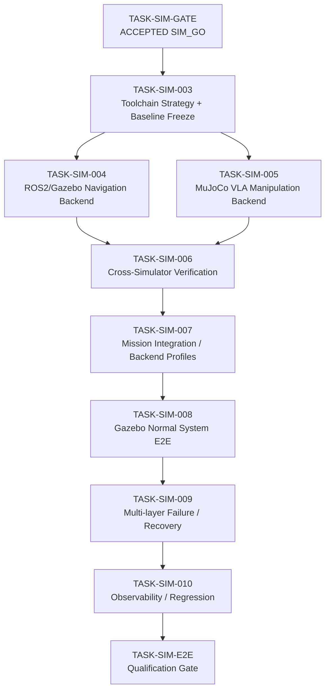

# Simulation Task Mapping v2 — Proposed ROS 2 Jazzy / Gazebo Harmonic / MuJoCo Backlog

> Status: `DRAFT / PROPOSED`
> Planning revision: 2026-09-15
> Governing frozen baseline: `context/simulation_task_mapping_v1.md`
> Governing ADR: `docs/architecture/adr/ADR-Simulation-Lane-v1.md`
> Purpose: Define the proposed post-`SIM_GO` Simulation First backlog using ROS 2 Jazzy, Gazebo Harmonic, and MuJoCo without authorizing implementation or rewriting accepted evidence.

---

## 1. Authority and Versioning

`simulation_task_mapping_v1.md` is frozen and hash-bound by accepted `TASK-SIM-GATE` evidence.

```text
v1 = accepted historical gate input; immutable
v2 = proposed downstream planning overlay; not approved
```

Nothing in v2 changes:

```text
P0-004R = NO_GO
TASK-W1-001 authorized = false
TASK-W1-002 authorized = false
Dataset V1 authorized = false
fine_tuning_authorized = false
physical_motion_authorized = false
hardware_target_frozen = false
```

No v2 item is executable until its own Task specification is created, reviewed, and approved.

---

## 2. Completed Simulation Foundation

| Task | Status | Accepted result |
|---|---|---|
| `TASK-SIM-C01` | `COMPLETE / ACCEPTED` | `SIM_CONTRACT_GAPS_RESOLVED` |
| `TASK-SIM-001` | `COMPLETE / ACCEPTED` | `SIM_CONTRACT_PROFILE_READY` |
| `TASK-SIM-002` | `COMPLETE / ACCEPTED` | `SIM_SMOKE_READY` |
| `TASK-SIM-GATE` | `COMPLETE / ACCEPTED` | `SIM_GO`; `simulation_lane_authorized = true` |

Accepted foundation:

- executable Simulation Lane contract and JSON Schema;
- operations `mission.execute`, `navigation.execute`, `vla.execute`, `action_status.get`, `verification.verify`;
- deterministic success/failure/timeout/reconciliation evidence;
- explicit isolation from physical hardware, Dataset V1, training, and Week authorization.

Deterministic fixtures remain the L0 regression baseline after physics simulators are introduced.

---

## 3. Proposed Simulation Platform Strategy

### 3.1 Required technology roles

```text
ROS 2 Jazzy
= system middleware / launch / Skill integration / Nav2-facing execution

Gazebo Harmonic
= authoritative integrated Simulation world
= AMR/navigation/sensor/world physics
= normal system E2E and system-level navigation/sensor faults

MuJoCo
= manipulation-physics engineering backend
= manipulator/object/contact dynamics
= VLA observation/action physics and manipulation faults

Deterministic fixtures
= contract/lifecycle/timeout/reconciliation/fail-closed regression baseline
```

Exact installed versions, package identities, launch entry points, runtime facts, and hashes are not accepted evidence yet. `TASK-SIM-003` must measure and freeze them.

### 3.2 Fidelity model

```text
L0       deterministic contract/runtime
L1-NAV   ROS 2 Jazzy + Gazebo Harmonic navigation/component simulation
L1-VLA   MuJoCo manipulation physics
L1-VERIFY simulator-neutral Verification adapters
L2-SYSTEM ROS 2 Jazzy + Gazebo Harmonic integrated system E2E
```

### 3.3 Authority rule

Gazebo Harmonic is the single authoritative integrated world for L2 E2E.

MuJoCo is a component manipulation bench. v1 does not synchronize Gazebo and MuJoCo as two live authoritative physics worlds.

```text
real-time Gazebo <-> MuJoCo dual-world co-simulation = OUT OF SCOPE for v1
```

MuJoCo evidence is consumed through accepted VLA/Verification boundaries, not by sharing live world state with Gazebo.

### 3.4 Physical-target neutrality

```text
Gazebo robot model != frozen myAGV target
MuJoCo arm model   != frozen myCobot target
simulated camera   != frozen D455 contract
simulation compute != frozen Orin deployment
```

Simulator models are engineering proxies until hardware selection is separately authorized.

---

## 4. Proposed Delivery Roadmap



Planning sequence:

```text
SIM Week A
SIM-003
-> SIM-004 Gazebo Navigation
 + SIM-005 MuJoCo Manipulation
-> SIM-006 Cross-Simulator Verification

SIM Week B
SIM-007 Mission Integration
-> SIM-008 Gazebo Normal System E2E
-> SIM-009 Multi-layer Failure/Recovery
-> SIM-010 Observability/Regression
-> SIM-E2E Qualification
-> separate Hardware Selection track
```

SIM-004 and SIM-005 may run in parallel after SIM-003 if file ownership/evidence paths do not materially overlap.

---

## 5. SIM Week A — Simulator Strategy and Skill Foundations

| Task | Purpose | Primary technology | Status |
|---|---|---|---|
| `TASK-SIM-003` | Simulation Toolchain Strategy & Baseline Freeze | all three | `PROPOSED` |
| `TASK-SIM-004` | Navigation Skill Simulation Backend | ROS 2 Jazzy + Gazebo Harmonic | `PROPOSED` |
| `TASK-SIM-005` | VLA Manipulation Simulation Backend | MuJoCo | `PROPOSED` |
| `TASK-SIM-006` | Cross-Simulator Verification Backend | simulator-neutral | `PROPOSED` |

### TASK-SIM-003 — Simulation Toolchain Strategy & Baseline Freeze

```text
Eligible for specification: YES
Eligible for implementation: NO
Depends on: accepted TASK-SIM-GATE = SIM_GO
```

Purpose:

- bind accepted SIM-C01/001/002/GATE artifacts to exact Git/source hashes;
- freeze ROS 2 Jazzy, Gazebo Harmonic, and MuJoCo roles for the post-gate lane;
- measure exact installed/runtime identities rather than guessing versions;
- freeze L0/L1-NAV/L1-VLA/L1-VERIFY/L2-SYSTEM fidelity policy;
- freeze Gazebo as integrated-world authority and MuJoCo as manipulation bench;
- freeze `dual_world_cosimulation = prohibited_v1`;
- establish minimal runnable toolchain smoke required before SIM-004/005 implementation.

Required baseline inputs:

```text
ACCEPTED SIM-C01 / SIM-001 / SIM-002 / SIM-GATE
Simulation ADR
frozen simulation_task_mapping_v1.md
proposed simulation_task_mapping_v2.md
executable contract + JSON Schema
contract profile
deterministic smoke runtime
fixture identity/hash
Git SHA + source hashes
focused/full test baseline
```

Toolchain facts to capture:

```text
ROS 2 distribution/runtime identity
Gazebo Harmonic runtime identity
ros_gz / bridge availability
Nav2-facing packages/entry points required by SIM-004
MuJoCo package/runtime identity
MuJoCo import/headless/step capability required by SIM-005
Python/runtime environment
launch/config/source hashes
```

Proposed output:

```text
SIM_BASELINE_V1
```

Expected strategy fields:

```yaml
ros2_distro: jazzy
gazebo_release: harmonic
mujoco_version: measured_not_guessed
system_simulator: gazebo_harmonic
navigation_backend: ros2_jazzy_gazebo_harmonic
manipulation_physics_backend: mujoco
integrated_world_authority: gazebo_harmonic
dual_world_cosimulation: prohibited_v1
```

Explicitly excluded:

- implementing SIM-004/005 Skill behavior;
- Mission integration/E2E;
- modifying accepted SIM evidence;
- physical access/hardware freeze;
- Dataset V1/fine-tuning/Week authorization.

`SIM_BASELINE_V1` is a Simulation development baseline, not a physical architecture freeze.

### TASK-SIM-004 — Navigation Skill ROS 2 Jazzy + Gazebo Harmonic Backend

```text
Eligible for specification: after SIM-003 acceptance
Depends on: accepted SIM_BASELINE_V1
```

Purpose:

- retain deterministic Navigation contract tests as L0 regression;
- implement L1-NAV behind the frozen Navigation Skill boundary;
- use ROS 2 Jazzy + Gazebo Harmonic and Nav2-facing execution required by the Task;
- validate bounded robot/world/sensor/TF/odometry/goal-result behavior;
- avoid custom SLAM/Nav2 research.

Model policy:

- use a generic/proxy mobile base sufficient to prove the contract;
- do not claim it is the frozen myAGV target;
- hash/version world, model, launch, bridge, and config assets.

Minimum scenario intent:

```text
SUCCESS
TIMEOUT -> pending/unknown + reconciliation
UNAVAILABLE / lifecycle-not-ready
INVALID_GOAL -> fail closed
BLOCKED_OR_ABORTED
UNKNOWN_OUTCOME -> authoritative status reconciliation
```

Proposed evidence:

- ROS 2 Jazzy / Gazebo Harmonic / bridge bindings;
- Gazebo world/model/config hashes;
- ROS action/topic/TF/odometry evidence required by the Task;
- bounded launch and cleanup;
- repeatability and reconciliation tests;
- no physical robot/direct-actuator dependency.

### TASK-SIM-005 — VLA Skill MuJoCo Manipulation Backend

```text
Eligible for specification: after SIM-003 acceptance
Depends on: accepted SIM_BASELINE_V1
```

Purpose:

- retain deterministic VLA fixtures as L0 regression;
- implement L1-VLA behind the frozen VLA Skill boundary using MuJoCo;
- validate manipulator/object/contact and observation/action physics without claiming physical performance;
- preserve observation identity, action lifecycle, policy identity, and reconciliation semantics.

Model policy:

- use a generic/contract-compatible manipulator unless a later ADR freezes hardware;
- do not label the model as the authoritative myCobot target;
- hash/version model, scene, assets, and scenario config.

Actual SmolVLA fine-tuning is not required or authorized. A deterministic/scripted policy may generate actions through the accepted VLA Skill contract while MuJoCo provides physics.

Minimum scenarios:

```text
nominal manipulation objective
grasp miss
object slip/contact loss
joint/workspace limit
invalid/ambiguous observation
bounded timeout
unknown outcome -> action_status.get reconciliation
```

Mandatory invariants:

```text
UNKNOWN -> SUCCEEDED directly forbidden
uncertain != success
MuJoCo success != physical success
no Dataset V1 / fine-tuning / physical camera / physical actuator
```

### TASK-SIM-006 — Cross-Simulator Verification Backend

```text
Eligible for specification: after SIM-004 and SIM-005 acceptance
Depends on: accepted SIM-004 + SIM-005
```

Purpose:

- preserve `verification.verify` verdicts `pass`, `fail`, `uncertain`;
- normalize deterministic, Gazebo, and MuJoCo evidence into Verification inputs;
- prove Verification semantics do not depend on simulator-specific hidden state;
- supply executor routing input without committing mission completion.

Flow:

```text
Expected State
+
Observed Evidence
  deterministic | Gazebo | MuJoCo
        ↓
normalized verification input
        ↓
pass | fail | uncertain
        ↓
CONFIRMED | RECONCILE | RECOVERY | HITL
```

Required evidence should cover exact match, mismatch, insufficient/ambiguous/stale/malformed observation, immutable observation identity, and `uncertain` never auto-promoting to `pass`.

Week A completion should prove:

> Navigation, manipulation physics, and Verification can execute through accepted contracts using ROS 2 Jazzy, Gazebo Harmonic, and MuJoCo without real hardware.

It does not prove integrated mission E2E.

---

## 6. SIM Week B — Mission Integration / Failure / E2E

| Task | Purpose | Status |
|---|---|---|
| `TASK-SIM-007` | Mission Integration / Backend Profiles | `PROPOSED` |
| `TASK-SIM-008` | Canonical Normal Gazebo System E2E | `PROPOSED` |
| `TASK-SIM-009` | Multi-layer Failure / Recovery Suite | `PROPOSED` |
| `TASK-SIM-010` | Simulator-aware Observability / Evidence / Regression | `PROPOSED` |
| `TASK-SIM-E2E` | Simulation Qualification Gate | `PROPOSED` |

### TASK-SIM-007 — Mission Integration / Backend Profiles

```text
Eligible for specification: after SIM-006 acceptance
Depends on: accepted SIM-004 + SIM-005 + SIM-006
```

Purpose:

- integrate Mission Executor with accepted Navigation/VLA/Verification Simulation backends;
- use ROS 2 Jazzy for system-facing orchestration required by the Task;
- support explicit backend profiles without changing the accepted public contract;
- preserve one authoritative integrated world.

Conceptual profiles:

```text
deterministic:
  Navigation = fixture
  VLA = fixture
  Verification = fixture

navigation_physics:
  Navigation = ROS2 Jazzy + Gazebo Harmonic
  VLA = fixture/proxy
  Verification = normalized evidence

manipulation_physics:
  Navigation = fixture
  VLA = MuJoCo
  Verification = normalized evidence

system:
  integrated world = Gazebo Harmonic
  Navigation = ROS2 Jazzy + Gazebo Harmonic
  VLA = contract-preserving system representation defined by Task
  Verification = system observation adapter
```

The `system` profile must not create live dual-authority Gazebo↔MuJoCo physics.

Existing MVP implementation may be reused only with new SIM-specific tests/evidence.

### TASK-SIM-008 — Canonical Normal Gazebo System E2E

```text
Eligible for specification: after SIM-007 acceptance
Depends on: accepted SIM-007
```

Purpose:

Run the canonical mission with Gazebo Harmonic as the L2 authoritative world.

```text
factory request
-> Mission Executor
-> Navigation Skill
-> ROS 2 Jazzy / Nav2-facing execution
-> Gazebo Harmonic system world
-> contract-preserving manipulation step
-> Verification
-> mission success
```

The Task must state exactly how manipulation is represented in the Gazebo system E2E without claiming MuJoCo contact fidelity. Accepted SIM-005 MuJoCo evidence remains separately required.

Minimum evidence:

```text
mission/action lifecycle
initial/final state
Navigation/VLA/Verification results
ROS correlation identity
Gazebo world/model/bridge/config identity
bounded duration + simulation time
source revisions/hashes
```

### TASK-SIM-009 — Multi-layer Failure / Recovery Suite

```text
Eligible for specification: after SIM-008 acceptance
Depends on: accepted normal Gazebo E2E
```

Minimum fault classes:

```text
L0 contract/dependency:
  malformed response
  dependency timeout/unavailable
  unknown or contradictory result/status

L1-NAV Gazebo:
  blocked path / obstacle
  navigation abort/timeout
  sensor/TF/dependency unavailable when Task-supported

L1-VLA MuJoCo:
  grasp miss
  slip/contact loss
  joint/workspace limit
  timeout
  ambiguous observation
  unknown outcome

L2 mission/verification:
  Skill success but observed state mismatch
  stale observation
  uncertain verification -> reconcile/HITL
```

Each scenario must prove the intended `retry / reconcile / recover / HITL / fail-closed` behavior with bounded cleanup.

### TASK-SIM-010 — Simulator-aware Observability / Evidence / Regression

```text
Eligible for specification: after SIM-009 acceptance
Depends on: accepted normal + failure Simulation suites
```

Common provenance:

```text
mission/action/correlation identity
Skill + Verification result
failure_code + recovery decision
contract version
Git SHA + source hashes
backend profile
```

Gazebo provenance where applicable:

```text
ROS 2 identity
Gazebo version/release
world/model hash
ros_gz bridge/config hash
launch/config hash
simulation time / wall time / measured execution indicator
```

MuJoCo provenance where applicable:

```text
MuJoCo version
model/scene/config hash
seed or deterministic initialization identity
timestep/step settings needed for reproduction
initial-state identity
```

Simulation metrics must remain explicitly separate from physical/production claims.

---

## 7. TASK-SIM-E2E — Simulation Qualification Gate

```text
Eligible for specification: after SIM-010 acceptance
Depends on: accepted SIM-003 through SIM-010 evidence
Gate behavior: evidence evaluation only
```

Proposed decisions:

```text
SIM_E2E_QUALIFIED
SIM_E2E_NOT_QUALIFIED
```

Minimum qualification matrix:

```yaml
baseline:
  sim_baseline_bound: PASS
  accepted_contract_regression: PASS

deterministic:
  L0_contract_runtime: PASS
  timeout_reconciliation: PASS

gazebo:
  ros2_jazzy_gazebo_navigation: PASS
  normal_system_e2e: PASS
  required_navigation_system_failures: PASS

mujoco:
  manipulation_backend: PASS
  required_manipulation_failures: PASS
  model_config_provenance: PASS

verification:
  cross_simulator_verification: PASS
  uncertain_never_auto_success: PASS

system:
  required_failure_cases: PASS
  forbidden_state_transition: false
  leaked_process: false
  evidence_reproducible: true
  regression_green: true
  observability_sufficient: true
  physical_dependency: false
  dual_world_cosimulation_required: false
```

A truthful `SIM_E2E_NOT_QUALIFIED` is a valid Gate-task completion.

Accepted `SIM_E2E_QUALIFIED` remains simulation-only evidence and does not authorize physical motion, Dataset V1, fine-tuning, hardware freeze, or original Week-1 execution.

---

## 8. Hardware Selection After Simulation E2E

Proposed flow remains:

```text
accepted SIM_E2E_QUALIFIED
-> TASK-HW-SELECT-001 Candidate Suitability Evaluation
-> ADR amendments/supersession
-> independent Architecture Review
-> explicit Hardware Target Freeze
```

Candidate inventory:

```text
Manipulator:  myCobot 280 Pi
AMR:          myAGV JN 2023
Camera:       Intel RealSense D455
Edge compute: Jetson Orin Nano
```

Simulation evidence may inform suitability but may not silently select a candidate.

---

## 9. Backlog Status / Execution Rules

```text
listed in mapping
!= Task specification approved
!= implementation authorized
!= implementation complete
!= independently accepted
```

Progression:

```text
PROPOSED
-> specification
-> specification review/approval
-> READY FOR IMPLEMENTATION
-> implementation/evidence
-> independent review
-> post-review acceptance
-> COMPLETE / ACCEPTED
```

Only `TASK-SIM-003` is currently eligible for specification authoring.

---

## 10. Cross-Lane / Cross-Simulator Invariants

```text
SIM task ID != W task ID
SIM_GO != W1_GO

SIM_BASELINE_V1 != physical architecture freeze
Simulation fixture != Dataset V1
Simulation E2E != physical E2E
Simulation success != production success

ROS 2 Jazzy simulation integration != physical deployment evidence
Gazebo model != frozen physical target
MuJoCo model != frozen physical target

Gazebo = authoritative integrated Simulation world
MuJoCo = manipulation physics bench
Gazebo + MuJoCo != dual live authoritative world in v1

Simulation backend != direct actuator contract
Candidate hardware != frozen target
Device readiness != motion authorization
Training remains independently gated
```

No Task may rewrite accepted P0/SIM evidence, silently change the executable contract, freeze candidate hardware, use simulation success as physical evidence, or add real-time dual-engine co-simulation without a separate architecture decision.

---

## 11. Immediate Planning Decision

Next action:

```text
Create and review TASK-SIM-003
— Simulation Toolchain Strategy & Baseline Freeze
```

The Task specification should:

1. bind accepted SIM evidence;
2. verify exact ROS 2 Jazzy, Gazebo Harmonic, `ros_gz`/navigation-runtime, and MuJoCo facts;
3. freeze simulator responsibilities/fidelity levels;
4. freeze `dual_world_cosimulation = prohibited_v1`;
5. define baseline artifact paths, hashes, validation commands, and task-specific decision;
6. define eligibility for SIM-004 and SIM-005.

It must not implement Gazebo Navigation, MuJoCo VLA behavior, Mission E2E, hardware selection, Dataset V1, fine-tuning, teleoperation, or physical motion.
