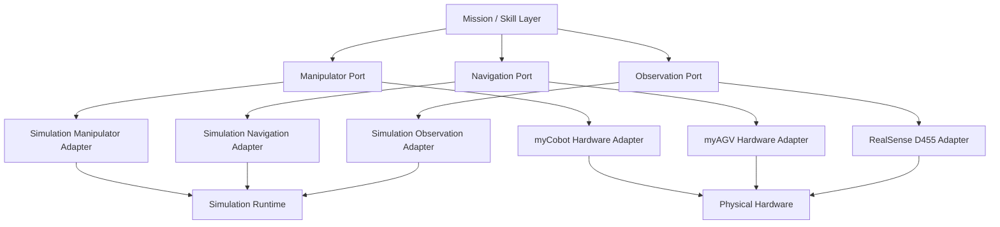
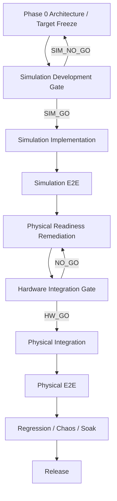

# ADR — Simulation-First Development Gating

> Status: PROPOSED_FOR_FREEZE  
> Decision Type: Architecture / Delivery / Readiness Gating  
> Scope: Phase 0 through physical integration  
> Related Tasks:
> - TASK-P0-004
> - TASK-P0-004R
> - TASK-P0-005
> - TASK-P0-006
> - TASK-P0-007
> - TASK-P0-SIM-GATE
> - future TASK-P0-006R
> - future TASK-P0-007R
> - Week 1–6 tasks

---

# 1. Context

The project is intended to be implemented using a **Simulation First → Hardware Later** development strategy.

The project currently has independently evaluated readiness dimensions:

```text
TASK-P0-005
VLA software runtime
→ accepted

TASK-P0-006
Robot / Camera / Device I/O readiness
→ implementation accepted
→ DEVICE_IO_BLOCKED

TASK-P0-007
Training compute / budget readiness
→ separately evaluated

TASK-P0-004R
Full consolidated readiness
→ NO_GO
```

The current consolidated gate requires physical-device, camera, safety, and other hardware-dependent prerequisites before authorizing Week 1.

That dependency ordering is stronger than necessary for simulation-only development.

It prevents simulation work from beginning even when:

- architecture is frozen;
- software contracts are frozen;
- simulation adapters can be implemented;
- no physical motion is required;
- no real device I/O is required;
- hardware targets are already known.

This creates unnecessary coupling between:

```text
simulation development readiness
```

and:

```text
physical integration readiness
```

---

# 2. Problem

The project must distinguish three different questions.

## A. Target Selection

> What physical hardware will the final system integrate with?

This should be answered during Phase 0.

---

## B. Simulation Development Readiness

> Can the project safely implement and validate the software architecture in simulation without physical hardware?

This should be answered before simulation-first Week work begins.

---

## C. Physical Integration Readiness

> Can the validated simulation implementation now be connected to real hardware safely?

This should be answered later, immediately before physical integration.

These questions shall no longer be represented by one global readiness decision.

---

# 3. Decision

The project adopts a **two-gate simulation-first delivery model**.

```text
Phase 0
Target / Architecture Freeze
        │
        ▼
Simulation Development Gate
        │
      SIM_GO
        │
        ▼
Simulation-only implementation
        │
        ▼
Simulation E2E validation
        │
        ▼
Physical Integration Gate
        │
       HW_GO
        │
        ▼
Physical hardware integration
```

---

# 4. Phase 0 Hardware Policy

Phase 0 shall freeze the intended physical hardware targets.

Phase 0 shall answer:

```text
Which manipulator?
Which AMR?
Which camera?
Which edge compute?
Which major physical interfaces?
Which simulation abstraction corresponds to each device?
```

Phase 0 shall **not require** all selected hardware to be:

- connected;
- powered;
- discovered;
- motion-tested;
- teleoperated;
- fully integrated;
- physically safety-qualified.

Therefore:

```text
HARDWARE_SELECTED
```

does not imply:

```text
HARDWARE_READY
```

---

# 5. Simulation Development Gate

A separate gate named:

```text
TASK-P0-SIM-GATE
```

shall determine whether simulation-only Week development may begin.

Its decision shall be one of:

```text
SIM_GO
SIM_NO_GO
```

`SIM_GO` authorizes only explicitly simulation-safe work.

It does not authorize physical execution.

---

# 6. Physical Integration Gate

Before any task replaces a simulation adapter with a real physical-hardware adapter, physical readiness shall be independently re-evaluated.

Existing `TASK-P0-006` evidence may be reused as historical evidence, but current physical readiness shall be established through a later re-verification such as:

```text
TASK-P0-006R
```

or a successor hardware-readiness gate.

Physical integration shall remain blocked until the required physical gate is GO.

---

# 7. Relationship to TASK-P0-004R

The existing:

```text
TASK-P0-004R = NO_GO
```

shall remain valid historical evidence.

Its meaning is:

> The project was not ready for unrestricted/full physical VLA development under the consolidated readiness criteria evaluated at that time.

This ADR does not rewrite or falsify that result.

Instead, this ADR introduces a **narrower simulation-only authorization path**.

Therefore:

```text
P0-004R NO_GO
```

may coexist with:

```text
P0-SIM-GATE SIM_GO
```

because the two gates authorize different scopes.

---

# 8. Authorization Model

The project shall no longer treat Week authorization as one Boolean for all work.

Authorization shall be activity-scoped.

Example:

| Activity | SIM_GO | HW_GO |
|---|---:|---:|
| Architecture implementation | YES | YES |
| Deterministic fakes | YES | YES |
| Simulation adapters | YES | YES |
| Simulated AMR | YES | YES |
| Simulated manipulator | YES | YES |
| Simulated camera/observation | YES | YES |
| Simulation-only teleoperation | YES | YES |
| Dataset schema/pipeline development | YES | YES |
| Physical demonstration collection | NO | YES |
| Real robot command | NO | YES |
| Real gripper actuation | NO | YES |
| Physical teleoperation | NO | YES |
| Real camera device dependency | NO | YES |
| SmolVLA fine-tuning | only if training-resource gate allows | only if training-resource gate allows |
| Paid compute provisioning | NO unless separately authorized | NO unless separately authorized |

---

# 9. Training Resource Independence

`TASK-P0-007` readiness shall be interpreted according to the work that actually requires training compute.

A blocked training-resource outcome shall not automatically block:

- simulation architecture;
- deterministic fakes;
- mission runtime;
- simulated navigation;
- simulated manipulation;
- simulation E2E;
- interface validation.

It shall block work that actually requires the unresolved training resource.

For example:

```text
SmolVLA fine-tuning
```

remains unauthorized while required training compute/budget is unresolved.

---

# 10. Dataset Boundary

A validated physical Dataset V1 shall not be a prerequisite for the Simulation Development Gate if Dataset V1 is owned by a downstream Week task.

Phase 0 may instead require:

- dataset schema;
- data ownership;
- observation/action contract;
- expected storage location;
- simulation data path;
- dataset generation prerequisites.

This prevents the dependency cycle:

```text
P0 gate
requires Dataset V1
        ↓
Dataset V1 requires Week authorization
        ↓
Week authorization requires P0 gate
```

Physical demonstration collection remains prohibited until physical readiness is granted.

---

# 11. Adapter Architecture

Simulation and physical implementations shall share frozen domain interfaces.

The intended architecture is:



The mission/business layer must not depend directly on a physical-device implementation.

---

# 12. Simulation-First Invariants

The following are frozen project invariants.

## INV-SIM-01

Simulation-only work must not require physical robot availability.

## INV-SIM-02

Simulation-only work must not issue physical actuator commands.

## INV-SIM-03

Mission/domain contracts shall remain identical across simulation and physical adapters wherever the architecture requires interchangeability.

## INV-SIM-04

A simulation adapter shall not encode behavior that only a particular physical driver can provide unless represented through the frozen abstraction.

## INV-SIM-05

Physical-device readiness failures shall not be converted into simulation readiness failures unless the simulation task directly requires that physical capability.

## INV-SIM-06

A blocked training-resource condition shall block only tasks that require the unresolved training resource.

## INV-SIM-07

No simulation gate may authorize physical motion.

## INV-SIM-08

Physical integration requires a separate, current hardware-readiness decision.

---

# 13. Physical Target Strategy

The current intended physical target set shall be maintained separately in:

```text
docs/hardware/hardware_target_freeze_v1.md
```

Changes to those targets require explicit change control.

Simulation implementation shall target the frozen interface contract rather than ad-hoc simulator-specific APIs.

---

# 14. Consequences

## Positive

- software implementation can proceed before physical hardware is ready;
- hardware failures do not block unrelated software work;
- physical safety risk is deferred until software behavior is already validated;
- simulation and hardware integration boundaries become explicit;
- scope authorization becomes easier to audit;
- hardware transition risk becomes measurable.

## Negative

- simulation may not reproduce all physical-device behavior;
- physical integration can still reveal latency, calibration, timing, device-driver, and safety defects;
- adapter interfaces must be maintained carefully;
- simulation fidelity must not be confused with physical validation.

---

# 15. Risk Mitigations

### Simulation-to-Reality Gap

Mitigation:

- preserve real hardware contracts;
- document simulator assumptions;
- perform later hardware-readiness re-verification;
- add physical regression tests after HW_GO.

### Interface Drift

Mitigation:

- freeze ports/contracts before simulation implementation;
- require compatibility tests for simulation and hardware adapters.

### False Authorization

Mitigation:

- authorization matrix must explicitly distinguish simulation and physical work;
- `SIM_GO` shall never imply `HW_GO`.

---

# 16. Migration From Current Flow

Existing evidence is preserved.

```text
P0-005
→ preserve

P0-006 DEVICE_IO_BLOCKED
→ preserve as physical-readiness evidence

P0-007 resource evidence
→ preserve as training-resource evidence

P0-004R NO_GO
→ preserve as full-readiness gate history
```

New artifacts are added:

```text
ADR-Simulation-First-Gating.md
hardware_target_freeze_v1.md
TASK-P0-SIM-GATE.md
```

No accepted predecessor evidence is rewritten merely to adopt this ADR.

---

# 17. Final Project Flow



---

# 18. Decision

The project formally adopts:

```text
Simulation First
→ Simulation Validation
→ Hardware Readiness
→ Physical Integration
```

as the default delivery strategy.

Physical hardware selection is a Phase 0 responsibility.

Physical hardware operational readiness is not a prerequisite for simulation-only development.

---

# 19. Freeze Condition

This ADR becomes:

```text
ACCEPTED / FROZEN
```

only after architecture review confirms:

- no contradiction with frozen domain contracts;
- no unintended physical authorization;
- no circular Dataset dependency;
- activity-scoped authorization is explicit;
- physical integration remains protected by a separate gate.

Once frozen, subsequent Task specifications shall follow this gating model.