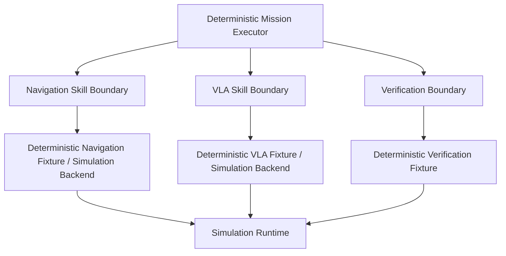

# ADR — Simulation Lane v1

> Status: FROZEN
> Decision Type: Architecture / Delivery / Authorization Boundary
> Scope: Simulation-only pre-integration lane
> Version: v1
> Does Not Supersede:
>
> * ADR-001
> * ADR-002
> * ADR-005
> * ADR-010
> * TASK-P0-004R
> * existing `TASK-W1-*` through `TASK-W6-*` mapping

---

# 1. Context

The project has completed substantial Phase 0 readiness work.

Existing accepted or historical decisions include:

```text
TASK-P0-005
VLA software runtime evidence

TASK-P0-006
Device / camera / physical I/O readiness assessment

TASK-P0-007
Training-resource readiness assessment

TASK-P0-004R
Consolidated readiness re-gate
```

The accepted/historical `TASK-P0-004R` authorization semantics must remain unchanged.

In particular:

```text
TASK-W1-001 authorized = false
```

must not be reinterpreted as:

```text
TASK-W1-001 simulation-only authorized = true
```

Adding a qualifier to the same task ID would silently override the accepted authorization semantics.

Therefore Simulation First development shall be introduced through a **new task namespace and dependency graph**, not by redefining the existing Week task IDs.

---

# 2. Problem

The project intends to validate as much software behavior as possible before relying on physical hardware.

However, the authoritative Week 1–6 mapping currently contains hardware-dependent work such as:

* environment / hardware I/O;
* physical teleoperation;
* Dataset V1;
* fine-tuning;
* evaluation;
* later Agent and ROS/AMR/VLA integration.

The project needs a way to:

1. implement deterministic simulation/fake behavior before physical readiness;
2. preserve all existing P0 and Week authorization semantics;
3. avoid introducing new actuator-facing contracts that contradict the frozen architecture;
4. avoid requiring simulation implementations before the gate that is supposed to authorize their development;
5. avoid allowing a generic hardware readiness flag to authorize physical motion.

---

# 3. Decision

The project introduces a separate task namespace:

```text
TASK-SIM-*
```

This Simulation Lane is independent of the existing:

```text
TASK-W1-*
TASK-W2-*
...
TASK-W6-*
```

mapping.

The initial Simulation Lane is:

```text
TASK-SIM-001
Simulation Contract Profile
        ↓
TASK-SIM-002
Deterministic Smoke Runtime
        ↓
TASK-SIM-GATE
Simulation Lane Authorization
        ↓
SIM_GO / SIM_NO_GO
```

Only after `SIM_GO` may downstream `TASK-SIM-003+` simulation work begin.

---

# 4. Existing Week Authorization Is Preserved

The following rule is frozen:

```text
Simulation authorization
≠
Week-task authorization
```

Therefore:

```text
SIM_GO
```

shall never modify:

```text
TASK-W1-001 authorized
TASK-W1-002 authorized
TASK-W1-003 authorized
...
```

Existing accepted authorization values remain authoritative until changed through their own governing gate.

Example:

```text
P0-004R:
TASK-W1-001 authorized = false

TASK-SIM-GATE:
TASK-SIM downstream lane authorized = true
```

These statements are compatible because they refer to different task identities.

---

# 5. Relationship to P0-004R

`TASK-P0-004R` remains historical and authoritative for the scope it evaluated.

Its result is not bypassed.

This ADR adds a different question:

> Can a separate simulation-only task lane execute without changing the existing Week authorization state and without requiring physical hardware?

Therefore:

```text
P0-004R = NO_GO
```

and:

```text
TASK-SIM-GATE = SIM_GO
```

may coexist.

Interpretation:

```text
Original Week / physical-integrated lane:
NOT AUTHORIZED

Independent Simulation Lane:
AUTHORIZED
```

---

# 6. Frozen Architectural Boundary

Simulation work must use the existing frozen/high-level architecture.

The currently recognized conceptual execution flow remains:

```text
Deterministic Mission Executor
        │
        ├── Navigation Skill boundary
        ├── VLA Skill boundary
        └── Verification boundary
```

Simulation code shall be placed **behind these existing boundaries**.

The Simulation Lane shall not introduce direct mission-layer actuator interfaces such as:

```text
Mission → ManipulatorPort
Mission → NavigationPort
Mission → ObservationPort
```

unless a future separately versioned contract change explicitly authorizes them.

---

# 7. Simulation Placement

The intended simulation structure is:



The exact executable API remains governed by the existing contract status.

If the current contract is still planning-only and contains no executable API, the Simulation Lane shall not silently invent a frozen public API.

That gap must be represented explicitly in `TASK-SIM-001`.

---

# 8. No Direct Actuator Contract

The Simulation Lane shall preserve the existing principle that VLA does not own a direct actuator contract.

The simulation implementation may emulate:

* skill invocation;
* skill result;
* observation;
* failure;
* timeout;
* reconciliation;
* verification;

but shall not redefine the VLA boundary into a direct:

```text
joint command
motor command
gripper command
trajectory command
```

contract.

A future lower-level interface requires a separately reviewed/versioned contract defining at minimum:

* command envelope;
* authorization;
* ownership;
* lifecycle;
* timeout;
* reconciliation;
* failure semantics;
* idempotency;
* safety constraints;
* compatibility tests.

---

# 9. Simulation Lane Task Identity

Simulation work shall use unique task IDs.

Initial IDs:

```text
TASK-SIM-001
TASK-SIM-002
TASK-SIM-GATE
```

Future simulation tasks may use:

```text
TASK-SIM-003
TASK-SIM-004
...
```

No `TASK-SIM-*` ID may be represented as equivalent to any existing `TASK-W*` ID.

---

# 10. Authorization Model

Authorization is activity-specific.

The project shall not use a blanket:

```text
HW_GO
```

to authorize all physical behavior.

Instead, future physical authorization must be represented by independent explicit decisions such as:

```text
device_io_ready
camera_acquisition_authorized
physical_motion_authorized
physical_gripper_authorized
physical_teleop_authorized
demonstration_collection_authorized
fine_tuning_authorized
```

Possible valid state:

```text
device_io_ready = true
camera_acquisition_authorized = true

physical_motion_authorized = false
physical_teleop_authorized = false
demonstration_collection_authorized = false
```

Device readiness is therefore only a prerequisite, not blanket execution authority.

---

# 11. Simulation Lane Authorization

`SIM_GO` may authorize only `TASK-SIM-*` work.

At minimum it shall keep these false:

```text
TASK-W1-001 authorized = existing authoritative value
TASK-W1-002 authorized = existing authoritative value
physical_motion_authorized = false
physical_gripper_authorized = false
physical_teleop_authorized = false
physical_dataset_collection_authorized = false
```

Training/fine-tuning authorization is controlled separately by training-resource readiness.

---

# 12. Dataset Boundary

The Simulation Lane shall not redefine the existing physical/training Dataset V1 task.

Use separate simulation terminology.

Examples:

```text
Simulation Fixture Set
Synthetic Observation Fixture
Deterministic Episode Fixture
Contract Test Fixture
```

Recommended identifier:

```text
SIM_FIXTURE_SET_V1
```

Explicit invariant:

```text
SIM_FIXTURE_SET_V1
≠
Dataset V1
```

Simulation fixtures may validate:

* observation shape;
* action/skill semantics;
* deterministic state transitions;
* timeout behavior;
* verification paths;

but do not constitute the existing Dataset V1 deliverable.

---

# 13. Hardware Target Policy

The Simulation Lane does not require final physical-hardware selection.

Currently owned or preferred hardware may be recorded as candidates.

Selection of final physical targets remains governed by existing ADRs and later change control.

A new final target may only be frozen when a later architectural decision explicitly:

* amends or supersedes conflicting ADRs;
* states decision authority;
* gives rationale;
* evaluates contract impact;
* evaluates simulation impact;
* preserves prior readiness evidence as historical evidence.

---

# 14. Deterministic-First Strategy

The Simulation Lane aligns with the existing deterministic-fixture-first architecture.

Simulation shall begin with deterministic bounded behavior rather than immediately requiring high-fidelity physics.

Progression may be:

```text
Deterministic Fixtures
        ↓
Bounded Smoke Runtime
        ↓
Simulation Backend
        ↓
Simulation E2E
        ↓
Physical Integration
```

This reduces ambiguity between:

```text
software correctness
```

and:

```text
hardware / timing / calibration defects
```

---

# 15. Gate Ordering

The Simulation Gate shall not attempt to prove downstream simulation implementation before that implementation exists.

Instead:

```text
TASK-SIM-001
defines what must be executable

TASK-SIM-002
provides a bounded executable smoke proof

TASK-SIM-GATE
evaluates that already-existing proof
```

Therefore the gate does not use subjective wording such as:

```text
otherwise sufficiently evidenced
```

for executable readiness.

It consumes explicit prior evidence.

---

# 16. Invariants

## INV-SIM-001 — Existing W tasks are immutable by Simulation Lane

No `TASK-SIM-*` decision may alter an existing W-task authorization.

## INV-SIM-002 — Existing P0 evidence is historical

Simulation Lane adoption shall not rewrite P0-005/P0-006/P0-007/P0-004R evidence.

## INV-SIM-003 — Existing architectural boundary is preserved

Simulation fixtures sit behind Navigation Skill, VLA Skill, and Verification boundaries unless a new versioned contract explicitly changes them.

## INV-SIM-004 — No physical motion

No Simulation Lane task may issue real robot, gripper, actuator, or trajectory commands.

## INV-SIM-005 — No implicit physical authorization

`SIM_GO` never implies device readiness or physical execution authority.

## INV-SIM-006 — No Dataset V1 aliasing

Simulation fixtures shall not be named or accepted as Dataset V1.

## INV-SIM-007 — Training is independently gated

A training-resource blocker does not block simulation work that requires no training.

It does block any task whose success requires actual training/fine-tuning.

## INV-SIM-008 — Gate consumes existing smoke evidence

`TASK-SIM-GATE` shall not implement the behavior it evaluates.

---

# 17. Migration

The following remain unchanged:

```text
TASK-P0-005
TASK-P0-006
TASK-P0-007
TASK-P0-004R
TASK-W1-* through TASK-W6-*
ADR-001
ADR-002
ADR-005
ADR-010
```

New artifacts:

```text
ADR-Simulation-Lane-v1.md
simulation_task_mapping_v1.md
hardware_target_selection_status_v1.md
TASK-SIM-001.md
TASK-SIM-002.md
TASK-SIM-GATE.md
```

---

# 18. Decision

The project adopts a separate Simulation Lane.

The Simulation Lane:

* does not replace the original Week task graph;
* does not override P0-004R;
* does not freeze unresolved physical hardware;
* does not introduce direct actuator contracts;
* does not authorize physical execution;
* requires a contract profile and smoke implementation before gate evaluation.

---

# 19. Freeze Conditions

This ADR may become `FROZEN` only after review confirms:

```text
[ ] Existing P0-004R semantics preserved
[ ] Existing W-task IDs untouched
[ ] ADR-001/002/005/010 not silently superseded
[ ] Existing skill / verification boundaries preserved
[ ] No blanket HW_GO authorization
[ ] TASK-SIM-001 precedes TASK-SIM-002
[ ] TASK-SIM-002 precedes TASK-SIM-GATE
[ ] Dataset V1 is not aliased by simulation fixtures
[ ] No physical execution authorized
[ ] Simulation mapping has no dependency cycle
```