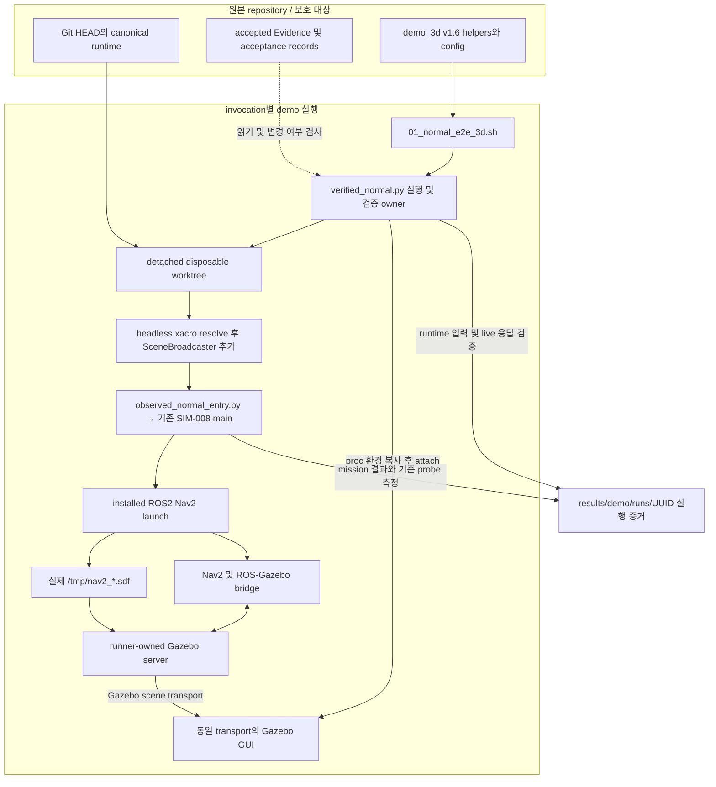
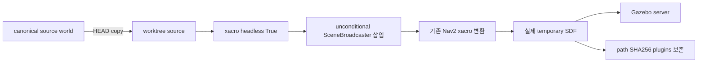
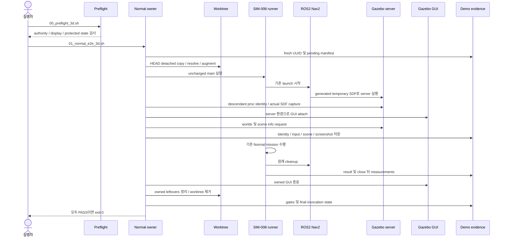

# demo_3d v1.6 — 시스템 아키텍처 및 워크플로우

작성 기준: 2026-10-05. 이 문서는 `demo_3d/VERSION=1.6`의 현재 코드와 저장된 실행 증거를 설명한다. 구현 변경이나 새로운 시스템 실행은 수행하지 않았다.

## 1. 목적과 현재 검증 상태

`demo_3d`는 실제 SIM-008 Normal E2E mission을 Gazebo 3D로 보여주는 repository overlay이다. 기존 mission runner와 installed Nav2 launch를 실행하고, 해당 runner가 생성한 Gazebo server에 GUI를 연결한다. browser HUD는 선택적 보조 화면이다.

v1.6은 source world 안의 조건부 SceneBroadcaster가 `headless:=True` 변환으로 사라지는 문제를 해결한다. 격리된 world copy를 먼저 headless 변환한 뒤 world scope에 unconditional SceneBroadcaster를 추가한다. 이후 Nav2가 생성한 실제 runtime SDF와 live scene을 검사하므로 source 수정만으로 성공을 판단하지 않는다.

**아키텍처가 제공하는 검증 절차와 모든 실행의 성공 보장은 구분한다.** 저장된 `results/demo/final_validation/`의 C17은 전체 PASS다. 그러나 작성 시 최신 invocation `3a872aa7c7b640dcab449dbf2571737c`는 scene/GUI gates A–F와 canonical integrity H를 통과하고 mission/cleanup gate G에서 FAIL했다. mission 오류는 `NAVIGATION_LIFECYCLE_START_FAILED`이며 cleanup 기록의 owned survivor는 0이다. 최신 실행이 성공한 것으로 설명하지 않는다.

진단 과정과 rejected hypotheses는 [Diagnostic History](GAZEBO_3D_DIAGNOSTIC_HISTORY.md)에 보존한다.

## 2. 전체 시스템 아키텍처



ROS 통신과 Gazebo GUI 통신은 서로 다른 경계다. ROS/Nav2는 `ROS_DOMAIN_ID`와 DDS 설정을 사용하며 GUI scene 전달은 `GZ_PARTITION`으로 격리된 Gazebo transport를 사용한다. GUI/server의 두 환경 값을 모두 비교하지만, 환경 일치만으로 scene 수신이나 mission 성공을 대신하지 않는다.

## 3. 구성 요소와 책임

| 구성 요소 | 실제 파일 | 책임 |
|---|---|---|
| 사전 점검 | `demo_3d/scripts/00_preflight_3d.sh`, `tools/preflight_3d.py` | 필요한 authority 파일, protected Git 상태, Gazebo/xacro/display, 이전 owned process 확인 |
| Normal 진입점 | `demo_3d/scripts/01_normal_e2e_3d.sh` | demo config를 읽고 Python Normal 경로 실행 |
| 실행 라우터 | `demo_3d/tools/demo3d_runtime.py` | Normal을 `verified_normal.run()`으로 전달; optional presentation 분기 |
| Normal 실행 owner | `demo_3d/tools/verified_normal.py` | invocation lock, output manifest, server discovery, live validation, GUI, cleanup, gates |
| 공통 실행 경계 | `demo_3d/tools/demo3d_common.py` | detached worktree, world augmentation, proc discovery, transport env, session 관리 |
| 관측 entry | `demo_3d/tools/observed_normal_entry.py` | worktree의 기존 runner module을 import해 main 호출; original close 뒤 existing measurements export |
| 실제 mission | `scripts/run_simulation_normal_system_e2e.py` | 기존 Normal E2E state/mission/probe 실행 |
| 실제 simulation launch | installed `nav2_bringup/tb4_simulation_launch.py` | ROS/Nav2와 Gazebo server 시작, xacro temporary SDF 생성 |
| scene publication | installed SceneBroadcaster system plugin | live world scene service 및 GUI scene 제공 |
| middleware 설정 | `demo_3d/config/fastdds_loopback.xml` | demo participant의 explicit UDPv4 loopback 통신 |
| 별도 검증기 | `demo_3d/scripts/05_verify_3d_runtime.sh`, `tools/verify_3d_runtime.py` | 현재 owned runtime 재조회 또는 완료 invocation proof 검사 |
| 보조 HUD | `demo_3d/scripts/launch_3d_hud.sh`, `tools/hud_server.py` | 선택적 browser presentation |

worktree는 현재 `Git HEAD`에서 생성된다. 따라서 원본 workspace의 uncommitted canonical code 변경이 자동으로 실행 대상에 포함되는 구조는 아니다. demo helper는 원본 `demo_3d` 경로에서 실행하고, mission module과 world는 worktree 경로를 사용한다.

## 4. World와 transport의 authority

### 4.1 World 입력 경계



`inject_scene_broadcaster_text()`는 installed `/opt/ros/jazzy/share/ros_gz_sim_demos/worlds/default.sdf`에서 plugin 정의를 읽는다. 이 host의 정의는 다음과 같다.

```xml
<plugin filename="gz-sim-scene-broadcaster-system"
        name="gz::sim::systems::SceneBroadcaster"/>
```

world의 직접 child plugin인지 구조적으로 확인하며, 조건부 xacro 안에 문자열이 존재하는 것을 active plugin으로 보지 않는다. `/opt/ros/jazzy`와 canonical source world는 수정하지 않는다. PATH wrapper로 Gazebo 실행을 가로채거나 실행 중 temporary SDF를 경쟁적으로 수정하지 않는다.

### 4.2 Runtime identity 경계

canonical runtime이 fresh `ROS_DOMAIN_ID`, `GZ_PARTITION`, `ROS_LOG_DIR`를 소유한다. demo는 runner의 descendant Gazebo server를 발견하고 `/proc/<pid>/cmdline`, `environ`, executable, start time 등의 identity를 읽는다. GUI 환경은 이 server 환경에서 구성한다.

server가 교체되면 기존 owned GUI를 닫고 새 server에 attach하는 경로를 수행한다. 임의의 가장 오래된 server 또는 pre-existing 사용자 server를 attach 대상으로 선택하지 않는다. PID와 start time을 함께 확인해 PID 재사용으로 다른 process를 종료하는 것을 방지한다.

## 5. Demo-only middleware adaptation

ROS clock와 lifecycle readiness 문제에 대한 v1.6 환경 경계는 다음과 같다.

| 설정 | 값 / 역할 |
|---|---|
| `RMW_IMPLEMENTATION` | `rmw_fastrtps_cpp` |
| `ROS_AUTOMATIC_DISCOVERY_RANGE` | `SYSTEM_DEFAULT` |
| `FASTRTPS_DEFAULT_PROFILES_FILE` | `demo_3d/config/fastdds_loopback.xml`의 absolute path |
| `FASTDDS_DEFAULT_PROFILES_FILE` | 동일 profile path |
| profile transport | custom UDPv4, `127.0.0.1`, built-in transports 비활성화 |
| `FASTDDS_BUILTIN_TRANSPORTS` | demo child 환경에서 제거 |

설치 FastDDS 2.14가 사용하는 older profile 변수도 전달한다. `LOCALHOST`로 단순 대체하면 Jazzy RMW가 shared-memory transport를 다시 추가하는 경계가 있으므로 같은 구성으로 취급하지 않는다.

이는 `DEMO_MIDDLEWARE_ADAPTATION`이다. mission deadlines, retry semantics 또는 QoS를 수정하는 방법은 아니다. 통신 범위는 local host이며 remote ROS participant 연결은 이 경로의 범위 밖이다. 이 설정으로 C16/C17 full PASS가 확인되었으나 이후 mixed outcomes가 있으므로 내부 SHM stall의 정확한 원인이나 반복 실행 안정성이 모두 입증된 것은 아니다.

## 6. Normal E2E 실행 워크플로우



1. **Preflight:** canonical authority 파일과 protected tree 상태, installed plugin 예제, xacro, display, 이전 기록의 owned PID 생존 여부를 검사한다. 실제 mission runner를 capability query로 실행하지 않는다.
2. **Invocation 생성:** `.normal_3d.lock`의 non-blocking lock으로 동시 Normal 실행을 거절한다. 기본 output은 `results/demo/runs/<uuid>/`이며 manifest를 `pending`으로 작성하고 `latest_validation` symlink를 원자적으로 갱신한다.
3. **격리 및 augmentation:** HEAD detached worktree를 만들고 world copy를 resolve/augment한다. `REPO_ROOT`, cwd, Python import 경로는 worktree를 가리킨다.
4. **실제 mission 시작:** 관측 entry가 기존 runner main을 호출한다. ROS/Nav2 startup을 pause하거나 SIGSTOP으로 지연하지 않는다.
5. **실제 server 발견:** runner descendant server에서 actual SDF path와 environment를 읽는다. temporary 파일 생성과 process 발견의 race를 위해 최대 3초 file wait를 수행한다.
6. **입력과 scene 검증:** consumed SDF를 즉시 복사하고 SHA256/plugins를 기록한다. `/gazebo/worlds`와 `/world/sim008_normal_system_world/scene/info`를 조회하여 expected world와 `brake_ecu_type_b_001`을 검사한다.
7. **GUI 관측:** 동일 transport로 GUI를 시작하고 liveness/environment를 확인한다. owned GUI의 X11 window에서 rendered content 후보를 검사해 screenshot을 보존한다. pixel heuristic 자체는 entity semantic recognition이 아니므로 live scene response 및 직접 시각 검사와 함께 읽는다.
8. **Mission 결과 수집:** 원래 runner의 result와 기존 measurements를 보존한다. close wrapper는 original cleanup을 호출한 뒤 measurements를 export하며 readiness 동작을 대체하지 않는다.
9. **Bounded cleanup:** GUI를 종료하고 canonical cleanup에 최대 6초를 준다. 남은 owned identity에만 SIGTERM/SIGKILL을 적용하고 disposable worktree를 제거한다. outer demo safety bound는 150초이며 canonical startup deadline 연장과는 별개다.
10. **최종 판정:** canonical hashes/status와 A–H gates를 작성한다. 모든 gate가 true일 때만 invocation `complete`, exit 0을 반환한다. 그 외에는 `failed`, exit 1이다.

preflight는 별도 진입점이다. `01_normal_e2e_3d.sh` 자체가 preflight를 자동 실행하는 것으로 가정하지 않는다.

## 7. Validation gates와 결과 저장

| Gate | 실제 판정 책임 | 대표 증거 |
|---|---|---|
| A | 발견된 server/GUI transport equality | `runtime_identity.json`, `02_transport.json` |
| B | consumed world name 및 live worlds 응답 | `runtime_sdf_provenance.json`, `world_validation.json` |
| C | scene service 존재 | `06_services.txt` |
| D | live scene의 expected ECU entity | `07_scene_response.txt`, `scene_validation.json` |
| E | actual SDF capture 및 visualization plugin 확인 | `04_runtime_world.sdf`, `05_plugins.txt`, provenance |
| F | attach 시 liveness, fatal renderer scan, 검증 exception 없음, rendered screenshot | `gui_health.json`, `09_gui.log`, `gazebo_3d.png` |
| G | runner exit0, `SIM_NORMAL_E2E_READY`, original cleanup complete, owned survivors 없음 | `normal_e2e_result.json`, `process_lifecycle.json` |
| H | protected tracked hashes 동일 및 protected Git status clean | `canonical_hashes_before.json`, `canonical_integrity.txt` |

기본 invocation의 구조는 다음과 같다. 상황에 따라 일부 capture가 실패하거나 미생성일 수 있으므로 파일 존재만으로 PASS를 판정하지 않는다.

```text
results/demo/
├── .normal_3d.lock
├── latest_validation -> runs/<uuid>/
├── 3d_demo_state.json
├── runs/<uuid>/
│   ├── invocation.json
│   ├── runtime_identity.json
│   ├── runtime_sdf_provenance.json
│   ├── 03_source_world.sdf / 04_runtime_world.sdf
│   ├── 06_services.txt / 07_scene_response.txt
│   ├── 08_server.log / 09_gui.log / 10_runner.log
│   ├── scene_validation.json / world_validation.json
│   ├── middleware_configuration.json / fastdds_loopback.xml
│   ├── runtime_observations.json / normal_e2e_result.json
│   ├── gui_health.json / gazebo_3d.png
│   ├── process_lifecycle.json / canonical_integrity.txt
│   └── gates.json / SUMMARY.md
├── final_validation/      # 과거 C17 qualification proof
└── diagnostics/          # 실패 cycle와 Ground-Truth
```

`DEMO_VALIDATION_DIR`로 별도 output을 지정할 수 있다. 구현은 기존 invocation/proof marker가 있는 directory를 거절하며, 운용상 fresh directory를 사용한다. explicit directory 실행은 기본 `latest_validation` symlink 갱신 경로와 다르므로 verifier에도 같은 directory를 명시한다.

## 8. 운용 및 재검증 워크플로우

repository root에서 실행한다.

```bash
source .venv-sim/bin/activate
./demo_3d/scripts/00_preflight_3d.sh
./demo_3d/scripts/01_normal_e2e_3d.sh
./demo_3d/scripts/05_verify_3d_runtime.sh
```

실행 중 별도 terminal에서 마지막 명령을 호출하면 기록된 owned server/GUI가 살아 있는 경우 live scene/world/transport를 재조회한다. 종료 후에는 manifest가 `complete`이고 모든 stored gate가 PASS인지 검사한다. 이때 출력은 `COMPLETED_RUN_PROOF_PASS`이며 살아 있는 runtime을 의미하지 않는다. `failed` 또는 incomplete invocation은 이전 성공을 재사용하지 않는다.

Normal 종료와 함께 GUI가 닫히는 것은 bounded cleanup의 결과다. 새 검증을 위해 이미 보존된 `final_validation/`을 재사용하지 않는다. 오류가 나면 해당 invocation의 manifest, gates, original probes와 logs를 우선 확인한다.

## 9. 선택적 Showcase 워크플로우

| 진입점 | 실행 / 표시 내용 | Normal qualification과의 관계 |
|---|---|---|
| `02_navigation_timeout_3d.sh` | 기존 SIM-009 full failure suite 실행, 선택 결과 표시, live navigation server follow | 별도 failure demo |
| `03_verification_uncertain_3d.sh` | 기존 full failure suite 실행, 선택 결과 표시; 종료 뒤 별도 presentation context 가능 | Normal과 동시 co-simulation 아님 |
| `04_final_qualification_3d.sh` | accepted Evidence 읽기와 paused presentation world | 새 mission 또는 canonical acceptance 생성 아님 |
| `run_3d_showcase.sh` | preflight → Normal → 위 optional steps 순서 | Normal 실패 시 shell fail-fast로 중단 |
| `launch_3d_hud.sh` | browser HUD | 선택적 secondary presentation |

기존 SIM-009에 scenario-filter CLI가 없으므로 두 failure 진입점은 선택 scenario 하나만 실행한다고 설명하지 않는다. `DEMO_NO_WAIT=1`은 showcase/optional presentation prompts를 건너뛰는 설정이며 canonical mission timing을 조작하는 설정이 아니다.

## 10. Canonical과 Demo의 책임 경계

| 구분 | 내용 |
|---|---|
| Canonical runtime | 기존 SIM-008 mission/state/retry/deadline, Nav2 launch 및 원래 simulation semantics |
| Accepted authority | `results/simulation/**`, `results/reviews/**`, canonical world/hash 및 acceptance records |
| `DEMO_VISUALIZATION_AUGMENTATION` | worktree의 resolved world에 SceneBroadcaster 추가, GUI attach와 screenshot |
| `DEMO_MIDDLEWARE_ADAPTATION` | local UDP-only FastDDS profile과 child environment |
| `DEMO_RUNTIME_OBSERVATION` | original cleanup 뒤 기존 measurements export |
| Demo Evidence | `results/demo/**`; frozen accepted Evidence와 별도로 저장 |

따라서 demo SDF는 frozen accepted SDF와 동일한 binary/hash Evidence로 주장하지 않는다. 실제 mission의 기존 VLA surrogate semantic placement를 사용하며 fake animation으로 대체하지 않는다. MuJoCo는 supporting component Evidence이며 Gazebo와 live-coupled 시스템으로 설명하지 않는다.

원본 repository의 accepted Evidence와 installed ROS files는 demo 실행을 위해 수정하지 않는다. disposable worktree 내부에 생성되는 result를 demo output으로 복사할 수 있지만 원본 accepted result를 덮어쓰지 않는다.

## 11. 현재 실패 경계와 다음 진단

primary 3D 경로는 runtime SDF → SceneBroadcaster → expected live scene → matched GUI → rendered warehouse까지 입증되었다. 현재 남은 주요 경계는 최신 실행의 원래 10초 lifecycle startup bound다. 별도 R01에서는 stats CLI 출력에 JSON 두 개가 포함되어 single-document parser observation이 실패한 증거도 있다.

다음 단일 실험은 기존 v1.6 설정과 원래 bounds를 유지한 독립 invocation에서 lifecycle manage_nodes request, activation/bond, response 타임라인을 비침습적으로 동시에 수집하는 것이다. scene/world/GUI 재수정이나 timeout 연장은 이 증거를 대체하지 않는다. 이 문서 작성에서는 실험을 실행하지 않았다.

## 12. 근거와 관련 문서

- [진단 이력 및 최신 acceptance matrix](GAZEBO_3D_DIAGNOSTIC_HISTORY.md)
- [package README](../../demo_3d/README.md)
- [실행 guide](../../demo_3d/3D_DEMO_GUIDE.md)
- [Normal 실행 및 gate 구현](../../demo_3d/tools/verified_normal.py)
- [world/transport/session 구현](../../demo_3d/tools/demo3d_common.py)
- [관측 entry](../../demo_3d/tools/observed_normal_entry.py)
- [live/completed verifier](../../demo_3d/tools/verify_3d_runtime.py)
- [UDP loopback profile](../../demo_3d/config/fastdds_loopback.xml)
- [과거 C17 qualification gates](../../results/demo/final_validation/gates.json)
- [작성 기준 최신 R03 gates](../../results/demo/runs/3a872aa7c7b640dcab449dbf2571737c/gates.json)
- [작성 기준 최신 R03 mission result](../../results/demo/runs/3a872aa7c7b640dcab449dbf2571737c/normal_e2e_result.json)
