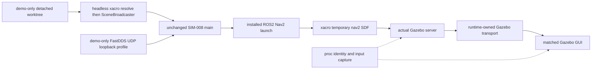
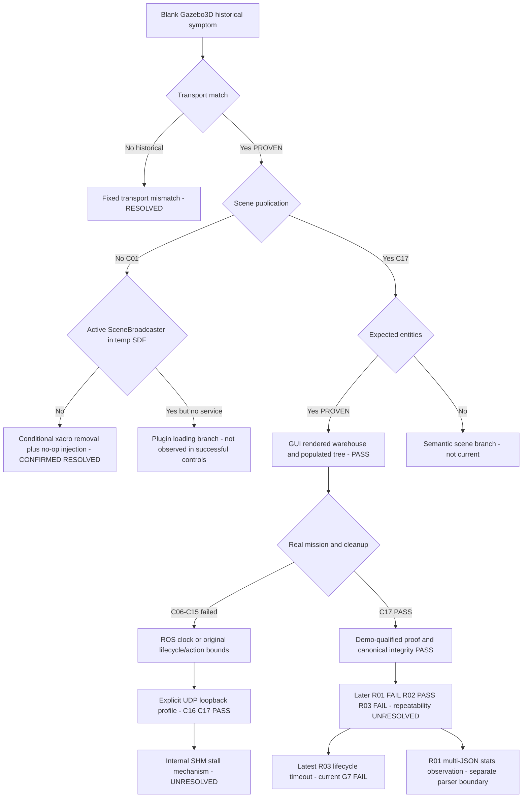

# Gazebo 3D Demo — Diagnostic History

## 1. Document Purpose

이 문서는 Simulation-First Gazebo 3D demo의 authoritative diagnostic trail이다. 작성 기준일은 2026-10-05(Asia/Seoul)이며, Git base는 `c2951b7` / branch `task/sim-demo`, 현재 package `VERSION`은 `1.6`이다. v1.6 구현과 최종 ZIP은 작업 트리에 존재하지만 별도의 완료 commit으로 기록되어 있지 않다.

진단은 `SYMPTOM → HYPOTHESIS → DIAGNOSTIC → OBSERVED EVIDENCE → DECISION → CHANGE → VALIDATION → RESULT → NEXT HYPOTHESIS`를 따른다. 기각한 가설과 실패한 실행을 보존하며 새 근거 없이 같은 실패 수정을 재시도하지 않는다. canonical acceptance Evidence와 demo visualization Evidence는 별개이다.

`PROVEN`은 직접 artifact/command/응답으로 확인한 사실, `OBSERVED`는 특정 실행이나 보존 문서에 기록된 관찰, `INFERRED`는 증거로부터의 해석, `NOT_YET_PROVEN`은 미입증 상태이다. `EVIDENCE_STATUS: NOT_FOUND`는 지정 범위에서 원본을 찾지 못했다는 뜻이며, 과거 사건이 없었다는 뜻은 아니다. 파일 존재만으로 실행 성공을 선언하지 않는다.

유지보수 규칙: 새 실행은 새 cycle로 추가하고 기존 실패 원본을 수정하지 않는다. 최신 ledger/acceptance 상태를 새 증거에 맞추며, 마지막 Decision Log에는 새 D-ID만 추가한다. 아래 과거 결정들은 이번 문서 작성 시 Git/증거로 재구성한 기록이며 당시 작성된 journal로 가장하지 않는다.

작성 중 새 후속 invocation3개를 발견했다. 시간 순서는 R01 FAIL → R02 PASS → R03 FAIL이다. **최신 R03은 scene/GUI가 정상이지만 GateG에서 NAVIGATION_LIFECYCLE_START_FAILED로 실패했다.** C17의 final_validation 및 ZIP은 과거 성공 proof로 보존하며 최신 상태를 대신하지 않는다. 이 documentation 작업은 runner를 실행하지 않았고, 후속 artifact를 누가 생성했는지는 기록만으로 확인하지 못했다.

## 2. System Context

| 항목 | 확인된 내용 | 근거 |
|---|---|---|
| Repository | `~/projects/factory_physical_ai_simDemo` | 현재 cwd / Git |
| OS / WSL | Ubuntu 24.04.4 LTS, microsoft-standard-WSL2 kernel | `gazebo_3d_20261005-023147/os_release.txt`, `uname.txt` |
| ROS | ROS 2 Jazzy, `/opt/ros/jazzy` | C01 launch `/proc`의 ROS_DISTRO 및 명령 |
| Gazebo | Harmonic 계열 `gz sim`; 당시 CLI `--versions`=8.11.0 | 독립 진단 `gz_version.txt` |
| 설치 library | system8.14.0 / ROS vendor8.11.0가 공존 | C01 `installed_plugin.json`; 존재와 실제 로딩 버전은 구별 |
| Python | `.venv-sim`, interpreter `/usr/bin/python3.12` | C01 runner `/proc`; 가상환경 경로는 shared Git main worktree를 가리킨 기록도 있음 |
| Runner / scenario | `scripts/run_simulation_normal_system_e2e.py`; `SIM_NORMAL_BRAKE_ECU_LINE_B` | canonical script / final mission JSON |
| Source world | `data/simulation/sim008_normal_system_world.sdf` | canonical source 및 C01/C17 copies |
| Launch | `ros2 launch nav2_bringup tb4_simulation_launch.py` | C01 launch PID180699 |
| Installed launch | `/opt/ros/jazzy/share/nav2_bringup/launch/tb4_simulation_launch.py` | C01 static copied source |
| Isolation | runtime-owned ROS_DOMAIN_ID / GZ_PARTITION / ROS_LOG_DIR; bounded lifecycle | navigation runner 및 process evidence |
| Accepted authority | `results/simulation/SIM-008_normal_system_e2e.json`, `results/reviews/SIM-008_acceptance.json` | frozen Evidence / ACCEPT manifest |



canonical 실행은 source world를 Nav2에 전달하며 headless preprocessing이 temp SDF를 만든다. 위 도식의 사전 resolve/scene 추가와 UDP loopback은 현재 demo-only 경로이다. GUI는 server가 살아 있는 동안 붙고 mission 완료 후 함께 종료된다.

## 3. Original Failure

- **EXPECTED:** 실제 Normal E2E 실행의 world, robot, ECU를 Gazebo 3D View 및 Entity Tree에서 관찰한다.
- **ACTUAL:** GUI가 열렸으나 원하는 world/object를 표시하지 못했다.
- **USER-VISIBLE SYMPTOM:** blank/black viewport와 empty Entity Tree로 보고되었다. 최초 screenshot은 `EVIDENCE_STATUS: NOT_FOUND`이다.
- **FIRST KNOWN EVIDENCE:** 초기 구현 `0a3735c`와 후속 Git README에 요구/실패가 남아 있다. 직접 runtime 진단 중 가장 이른 보존 묶음은 `gazebo_3d_20261005-023147`이다. 초기 증상 자체에 later SceneBroadcaster 원인을 소급하여 섞지 않는다.

## 4. Diagnostic Timeline

Git 날짜는 commit timestamp, C 날짜는 신선한 result의 `generated_at`을 KST로 변환한 값이다. C02는 이전 accepted JSON을 포함하므로 cycle 순서만 사용한다. H00–H06은 과거 package 단계, C01–C17은 실제 진단 디렉터리 이름을 유지한 순서이다. R01–R03은 작성 중 발견한 results/demo/runs/<invocation_id>의 별칭이며 원본 디렉터리를 만들거나 이름을 바꾸지 않았다. 모든 단계를 한 실행으로 합치지 않는다.

| Cycle / Version | 시점 | Hypothesis | Change / Diagnostic | Key Evidence | Result | Decision |
|---|---|---|---|---|---|---|
| H00 / 최초 빈 3D View / Entity Tree | 2026-10-05 01:19 commit | GUI가 실제 mission server의 world를 수신하지 못한다. | 0a3735c:demo_3d/tools/demo3d_common.py 및 README를 읽어 초기 GUI 환경과 server 실행 순서를 복원했다. | `git:dc3a8aa:demo_3d/README.md` | OBSERVED 기록: 빈 GUI/Entity Tree. 초기 화면의 색상과 정확한 실행 PID는 원본으로 재검증하지 못했다. | UNRESOLVED |
| H01 / v1.1 — runtime-owned transport attach | 2026-10-05 01:42 commit | 고정 demo 환경과 runtime이 생성하는 sim004-* / 동적 domain의 설계 충돌이다. | 8002f99에서 server 발견 후 `/proc/<pid>/environ`을 읽고 GUI를 시작하는 _discover_and_attach로 변경했다. | `git:8002f99:demo_3d/tools/demo3d_runtime.py` | Git README에 TRANSPORT_ENV_MISMATCH와 수정 방향이 기록되며, 이후 H03 독립 /proc 진단이 환경 일치를 검증한다. | CONFIRMED |
| H02 / v1.2 — SIGSTOP GUI warm-up | 2026-10-05 01:59 commit | runner 부모를 잠시 멈추면 GUI가 scene을 수신할 시간을 확보한다. | 8d66e74:demo_3d/tools/demo3d_common.py의 pause_runner_for_gui_warmup / resume_runner_after_gui_warmup을 도입했다. | `git:dc3a8aa:demo_3d/README.md` | dc3a8aa README는 warm-up 실행에서 NAVIGATION_LIFECYCLE_START_FAILED를 관찰했다고 명시한다. 그 실행의 원본 runner log와 SIM_NORMAL_E2E_BLOCKED JSON은 EVIDENCE_STATUS: NOT_FOUND. | REJECTED |
| H03 / v1.3 — current runtime server follow | 2026-10-05 02:25 commit | runner의 descendant server를 따라가고 GUI /proc 환경을 검증하면 stale transport를 제거한다. | dc3a8aa:demo_3d/tools/demo3d_runtime.py에서 _run_with_gui_follow와 _attach_to_exact_server를 사용했다. | `results/demo/diagnostics/gazebo_3d_20261005-023147/REPORT.txt` | 독립 진단의 server PID164596 / GUI PID164713, partition sim004-c0830b86cfc2, domain119가 일치했다. transport_match=1. | CONFIRMED |
| H04 / 전용 진단 — world 존재와 scene publication 분리 | 2026-10-05 02:31 diagnostic | 실제 world는 실행되나 GUI용 scene publication이 빠져 있다. | demo_3d_diagnosis/diagnose_gazebo_3d.sh가 topics, SDF, 환경, logs, 생존 여부를 수집했다. | `demo_3d_diagnosis/diagnose_gazebo_3d.sh` | 02:31:48+09:00 REPORT: scene_probe=NO_SCENE_TOPIC, direct_plugins=4, ECU model1, Depot include1, NO_OBVIOUS_RENDER_ERROR. | PARTIALLY_CONFIRMED |
| H05 / v1.4 — PATH wrapper | 2026-10-05 02:48 commit | PATH 앞의 demo_3d/bin/gz가 authoritative server 실행을 가로챈다. | f6f9589:demo_3d/bin/gz, tools/demo3d_common.py, scripts/05_verify_scene_broadcaster.sh를 도입했다. | `git:c2951b7:demo_3d/CHANGELOG_v1_5.md` | c2951b7 CHANGELOG_v1_5는 scene_service=MISSING, runtime plugin 및 patch log가 비었다고 기록한다. 당시 개별 원본 verifier 출력과 /tmp/nav2_0wuhz_u2.sdf는 EVIDENCE_STATUS: NOT_FOUND. | REJECTED |
| H06 / v1.5 — detached worktree source-world 삽입 | 2026-10-05 03:05 commit | worktree의 source world에 SceneBroadcaster가 있으면 Nav2 temp SDF에도 남는다. | prepare_normal_session이 worktree world를 patch하도록 바뀌었다. 변경 경로는 demo_3d/tools/demo3d_common.py. | `results/demo/diagnostics/codex_cycle_01/05_plugins.txt` | visual_worktree_patch.jsonl 초기 두 행은 changed=false / already_present이며 원본과 patch SHA가 같다. 제시된 PID176573/176690 실행의 직접 attach 출력은 EVIDENCE_STATUS: NOT_FOUND. 후속 C01은 conditional 정의가 실제 temp SDF에서 제거됨을 입증했다. | REJECTED |
| C01 / Ground-Truth — conditional SceneBroadcaster 제거 | 2026-10-05 03:26 | substring no-op + headless xacro가 conditional scene system을 제거한다. | 설치 예제/라이브러리 확인, direct copied-world control, detached-worktree canonical 실행, /proc 및 temp SDF 복사, installed launch static trace. | `results/demo/diagnostics/codex_cycle_01/SUMMARY.md` | direct scene 응답은 ECU를 포함한다. runner180686 → launch180699 → server180781; world:=/tmp/sim008-3d-demo-0a_fde32/data/simulation/sim008_normal_system_world.sdf; consumed /tmp/nav2_z1ioeq_p.sdf. source SHA fff98b8a…와 runtime SHA bd5815a9…가 다르며 runtime에는 scene plugin이 없다. mission은 READY. | CONFIRMED |
| C02 / 최소 scene 수정 후 observer 생성 race | 순서 확인 / fresh 시각 NOT_YET_PROVEN | headless-resolved world에 삽입하면 scene이 살아남는다. | demo3d_common.py의 augmentation을 수정하고 --help 실행을 제거하며 Ruby process title 발견을 보완했다. 새로운 verified_normal.py가 runtime SDF를 즉시 복사하려 했다. | `results/demo/diagnostics/codex_cycle_02/SUMMARY.md` | Exact live runtime SDF is unavailable; runner_exit_code=1; H만 PASS. normal_e2e_result.json의 generated_at은 2026-09-18이며 accepted 파일에서 가져온 이전 결과이다. 새 실행 READY 증거가 아니다. | PARTIALLY_CONFIRMED |
| C03 / observer wait 후 첫 full proof | 2026-10-05 03:32 | 짧은 observer-only file wait가 생성 race를 해결한다. | verified_normal.py에 bounded 생성 대기; world/runner/mission 변경 없음. screenshot capture와 read-only CLI capability regression을 확인했다. | `results/demo/diagnostics/codex_cycle_03/SUMMARY.md` | A–H PASS 및 READY. 초기 gazebo_3d.png는 mesh 로딩 전이며 gazebo_3d_late.png가 populated tree/warehouse를 기록한다. | CONFIRMED |
| C04 / scene PASS / navigation lifecycle FAIL | 2026-10-05 03:38 | 반복 screenshot 작업이 bounded lifecycle에 contention을 더할 수 있다. | 반복 캡처 후 실패를 보존; 다음 실행에서 첫 rendered frame 이후 캡처를 중단한다. 임의 shell argv의 shlex 해석도 제한한다. | `results/demo/diagnostics/codex_cycle_04/SUMMARY.md` | NAVIGATION_LIFECYCLE_START_FAILED; G FAIL. | UNRESOLVED |
| C05 / 첫 rendered frame 유지 후 성공 | 2026-10-05 03:41 | 반복 캡처를 중단해도 3D proof와 mission을 함께 유지한다. | 단일 rendered frame 유지; process title parsing 보완; live world enumeration 수행. | `results/demo/diagnostics/codex_cycle_05/SUMMARY.md` | A–H PASS; server186290 / GUI186419; sim004-d9ab5a64d339 / domain117; 모델3, links28, visuals32. | CONFIRMED |
| C06 / review 보완 후 CLOCK 실패 | 2026-10-05 03:51 | invocation isolation과 ownership 관찰을 보완하면 기존 real path를 신뢰할 수 있다. | fresh output, flock, invocation manifest, worktree preparation guard, shutdown ownership sampling. scene/mission 설정 변경 없음. | `results/demo/diagnostics/codex_cycle_06/SUMMARY.md` | A–F/H PASS, G FAIL: SIMULATION_CLOCK_UNAVAILABLE; 초기 모델2; owned leftovers 없음. | PARTIALLY_CONFIRMED |
| C07 / default/UDP native controls와 실제 실패 비교 | 2026-10-05 03:55 | ROS child 초기화가 Gazebo clock보다 먼저 막힌다. | runtime 변경 없이 /proc 상태와 native talker controls를 수집했다. | `results/demo/diagnostics/codex_cycle_07/SUMMARY.md` | 실제 mission CLOCK FAIL. domains20/58/81의 native talker controls는 default와 UDPv4에서 통과했다. | PARTIALLY_CONFIRMED |
| C08 / timely /proc 및 Gazebo clock 수집 | 2026-10-05 04:01 | full launch에서 ROS 경계가 막히나 Gazebo는 clock을 발행한다. | observe_run.py가 실제 participant의 thread/wchan/FD/env와 clock/stats를 자동 수집했다. | `results/demo/diagnostics/codex_cycle_08/SUMMARY.md` | Gazebo clock/stats 발행 확인, G FAIL. bridge per-node log는 /clock bridge 설정을 기록했다. default/UDP pub/sub는 나중에 통과했다. | CONFIRMED |
| C09 / 기존 runtime probe 사후 export | 2026-10-05 04:08 | probe의 결과/소요 시간을 남기면 실패 경계를 더 좁힌다. | observed_normal_entry.py가 unchanged main을 호출하고 원래 close 뒤 existing measurements를 export한다. | `results/demo/diagnostics/codex_cycle_09/SUMMARY.md` | CLOCK stage FAIL; simulation_clock 5회가 각각 약5초 timed_out=true; executions 없음. | CONFIRMED |
| C10 / 실제 clock graph 경계 | 2026-10-05 04:11 | bridge가 실제 clock subscriber를 등록하지 못하거나 ROS graph 초기화가 막힌다. | probe_live.py로 daemon/direct ROS graph 및 Gazebo /clock metadata를 비교했다. | `results/demo/diagnostics/codex_cycle_10/SUMMARY.md` | Gazebo /clock publisher 존재, Subscribers는 비어 있음; ROS daemon은 Unknown topic, direct graph/echo는6초 timeout. G FAIL. | PARTIALLY_CONFIRMED |
| C11 / UDPv4 built-in full-system control | 2026-10-05 04:14 | SHM-enabled transport 경로가 startup 실패에 관여한다. | invocation에 FASTDDS_BUILTIN_TRANSPORTS=UDPv4만 추가; package config는 아직 변경하지 않는다. | `results/demo/diagnostics/codex_cycle_11/SUMMARY.md` | CLOCK PASS, READY; navigation_lifecycle_start 약9850.552ms; source navigation ABORTED, compute_path_to_pose acknowledgment timeout. G FAIL. | PARTIALLY_CONFIRMED |
| C12 / close_fds diagnostic hook 반증 | 2026-10-05 04:20 | 상속된 active descriptor가 default startup 실패의 단독 원인이다. | codex_cycle_12/hook/sitecustomize.py가 ros2 launch asyncio subprocess에 close_fds=True 적용; default transport 사용. | `results/demo/diagnostics/codex_cycle_12/SUMMARY.md` | hook 활성화와 FD 제거가 기록되었지만 CLOCK FAIL이 재현되었다. | REJECTED |
| C13 / UDP-only 반복 — lifecycle bound | 2026-10-05 04:23 | UDPv4의 clock 개선이 반복되며 action abort는 달라질 수 있다. | UDPv4-only를 다시 실행; hook/deadline/retry 변경 없음. | `results/demo/diagnostics/codex_cycle_13/SUMMARY.md` | clock/localization PASS; navigation_lifecycle_start 10020.684ms timeout; ACTION stage NAVIGATION_LIFECYCLE_START_FAILED. server는 나중에 active를 기록했다. | PARTIALLY_CONFIRMED |
| C14 / LOCALHOST 설정의 역효과 | 2026-10-05 04:24 | LOCALHOST discovery가 UDP-only 환경에서 latency를 줄인다. | UDPv4에 ROS_AUTOMATIC_DISCOVERY_RANGE=LOCALHOST를 추가했다. | `results/demo/diagnostics/codex_cycle_14/SUMMARY.md` | CLOCK FAIL이 재발했다. actual env는 middleware_live.json에 기록된다. 후속 Jazzy RMW source는 LOCALHOST에서 custom SHM transport를 추가함을 보여준다. | REJECTED |
| C15 / profile 변수의 버전 호환성 | 2026-10-05 04:27 | UDP loopback participant profile로 관찰된 경로를 우회할 수 있다. | fastdds_loopback.xml + SYSTEM_DEFAULT를 FASTDDS_DEFAULT_PROFILES_FILE로 전달; 이후 설치 library strings와 올바른 변수 native control 비교. 초기 hypothesis의 SUBNET 서술보다 실제 participant env의 SYSTEM_DEFAULT를 우선한다. | `results/demo/diagnostics/codex_cycle_15/SUMMARY.md` | 첫 full run은 SHM FD를 유지하고 CLOCK FAIL. 설치2.14는 FASTRTPS_DEFAULT_PROFILES_FILE을 지원한다. 수정된 변수의 native pub/sub는 message flow PASS / SHM FD0. | PARTIALLY_CONFIRMED |
| C16 / 지원되는 변수 + 명시적 UDP loopback | 2026-10-05 04:28 | 지원되는 profile 변수와 SYSTEM_DEFAULT를 사용하면 full runtime이 성공한다. | FASTRTPS_DEFAULT_PROFILES_FILE에 같은 profile 전달; SYSTEM_DEFAULT; world/GUI/mission/retry/deadline 변경 없음. | `results/demo/diagnostics/codex_cycle_16/SUMMARY.md` | 4 live ROS participants의 SHM FD0; clock/readiness PASS, lifecycle7728.995ms; navigation 두 번 SUCCEEDED; READY; A–H PASS. | CONFIRMED |
| C17 / v1.6 clean package 최종 검증 | 2026-10-05 04:31 | 검증된 scene/transport 설정을 package에서 재현할 수 있다. | demo_3d/config/fastdds_loopback.xml에 동일 profile; visual_runner_env가 두 profile 변수와 RMW/SYSTEM_DEFAULT를 설정. live /gazebo/worlds GateB, 실제 profile hash/환경을 기록. | `results/demo/diagnostics/codex_cycle_17/SUMMARY.md` | server202768 / GUI202885, sim004-f87a93a4b2ac / domain45; scene 모델3/links28/visuals32; /tmp/nav2_ceh3npt3.sdf sha b39dd027…; final_verification=pass; elapsed88.53s; A–H PASS. | CONFIRMED |

| R01 / stats JSON observation 실패 | 2026-10-05T01:16:56.930Z (UTC) | gz topic -n1의 stdout가 한 JSON이라는 observer 가정이 성립하지 않을 수 있다. | 기존 invocation read-only 분석 / 설정 변경 없음 | `results/demo/runs/403830e0b44b477bbdb60bed59664ce1/runtime_observations.json` | 2026-10-05 10:16:56+09:00 결과는 SIM_NORMAL_E2E_BLOCKED / Gazebo simulation time observation is malformed. stats probe returncode0이지만 stdout_tail에 완전한 JSON2개가 newline으로 연결되어 있다. offline json.loads는 Extra data: line2를 재현했다. A–F/H PASS, G FAIL; survivors0. | CONFIRMED |
| R02 / 동일 profile 후속 성공 | 2026-10-05T01:20:48.273Z (UTC) | 동일 설정에서도 실제 full PASS가 재현 가능한지 관찰한다. | 기존 invocation read-only 분석 / 설정 변경 없음 | `results/demo/runs/e04fbe08b3384f21a34e7a80fe562d1b/runtime_observations.json` | 2026-10-05 10:20:48+09:00 READY / complete / exit0. A–H PASS, navigation2회 SUCCEEDED, final verification pass, survivors0, elapsed84.47s. | CONFIRMED |
| R03 / 최신 lifecycle timeout — 현재 상태 | 2026-10-05T01:24:05.736Z (UTC) | scene fix와 UDP loopback 설정만으로 기존 lifecycle bound의 재현성을 보장하지 못한다. | 기존 invocation read-only 분석 / 설정 변경 없음 | `results/demo/runs/3a872aa7c7b640dcab449dbf2571737c/runtime_observations.json` | 2026-10-05 10:24:05+09:00 SIM_NORMAL_E2E_BLOCKED; ACTION stage NAVIGATION_LIFECYCLE_START_FAILED. navigation_lifecycle_start=10013.583ms / timed_out=true. server225562, GUI225674, sim004-5ae6ee9761cf / domain16. A–F/H PASS, G FAIL; survivors0; elapsed67.11s. | PARTIALLY_CONFIRMED |

## 5. Detailed Diagnostic Cycles

### Cycle H00 — 최초 빈 3D View / Entity Tree

#### Trigger

실제 Normal E2E를 Gazebo 주 화면으로 보여주려 했으나 GUI가 비어 있었다.

#### Hypothesis

GUI가 실제 mission server의 world를 수신하지 못한다.

#### Evidence Before Change

최초 GUI 화면의 독립 screenshot은 EVIDENCE_STATUS: NOT_FOUND. Git 0a3735c와 후속 README에 증상과 초기 환경 설정이 남아 있다.

#### Modification / Experiment

0a3735c:demo_3d/tools/demo3d_common.py 및 README를 읽어 초기 GUI 환경과 server 실행 순서를 복원했다.

관련 파일 / Git 객체:

- `git:0a3735c:demo_3d/tools/demo3d_common.py`
- `git:dc3a8aa:demo_3d/README.md`

#### Expected Result

실제 world/robot/object와 populated Entity Tree가 보여야 한다.

#### Actual Result

OBSERVED 기록: 빈 GUI/Entity Tree. 초기 화면의 색상과 정확한 실행 PID는 원본으로 재검증하지 못했다.

#### Decision

UNRESOLVED

#### What This Cycle Proved

원래 요구와 실패 증상이 후속 역사 문서에 기록되어 있다.

#### What This Cycle Did NOT Prove

초기 증상만으로 transport, SceneBroadcaster, GPU 중 어느 원인인지 구별하지 못한다.

#### Next Diagnostic Question

GUI와 실제 server의 환경이 같은가?

### Cycle H01 — v1.1 — runtime-owned transport attach

#### Trigger

초기 helper가 sim-first-demo-* 및 기본 ROS_DOMAIN_ID=42를 GUI에 부여했다.

#### Hypothesis

고정 demo 환경과 runtime이 생성하는 sim004-* / 동적 domain의 설계 충돌이다.

#### Evidence Before Change

초기 helper의 setdefault 코드와 scripts/run_simulation_navigation.py의 runtime-owned 환경 생성이 서로 다른 권한 경계를 가진다. 초기 실행의 양쪽 /proc dump는 EVIDENCE_STATUS: NOT_FOUND.

#### Modification / Experiment

8002f99에서 server 발견 후 `/proc/<pid>/environ`을 읽고 GUI를 시작하는 _discover_and_attach로 변경했다.

관련 파일 / Git 객체:

- `git:8002f99:demo_3d/README.md`
- `git:8002f99:demo_3d/tools/demo3d_runtime.py`

#### Expected Result

GUI가 실제 server의 partition/domain을 상속한다.

#### Actual Result

Git README에 TRANSPORT_ENV_MISMATCH와 수정 방향이 기록되며, 이후 H03 독립 /proc 진단이 환경 일치를 검증한다.

#### Decision

CONFIRMED

#### What This Cycle Proved

고정 transport 설계가 부적합하며 현재 경로는 실제 server 환경을 따른다.

#### What This Cycle Did NOT Prove

v1.1 직후 실행 자체의 scene publication 또는 렌더링 성공은 입증하지 못한다.

#### Next Diagnostic Question

일치한 transport에서 GUI가 scene을 받는가?

### Cycle H02 — v1.2 — SIGSTOP GUI warm-up

#### Trigger

환경을 맞추어도 빈 GUI가 남아 warm-up race를 의심했다.

#### Hypothesis

runner 부모를 잠시 멈추면 GUI가 scene을 수신할 시간을 확보한다.

#### Evidence Before Change

8d66e74 helper는 부모에 SIGSTOP/SIGCONT를 보내고 기본4초 warm-up을 수행한다. 자식들은 계속 실행된다.

#### Modification / Experiment

8d66e74:demo_3d/tools/demo3d_common.py의 pause_runner_for_gui_warmup / resume_runner_after_gui_warmup을 도입했다.

관련 파일 / Git 객체:

- `git:8d66e74:demo_3d/tools/demo3d_common.py`
- `git:dc3a8aa:demo_3d/README.md`

#### Expected Result

재개 뒤 기존 bounded mission이 정상 완료하고 화면이 채워진다.

#### Actual Result

dc3a8aa README는 warm-up 실행에서 NAVIGATION_LIFECYCLE_START_FAILED를 관찰했다고 명시한다. 그 실행의 원본 runner log와 SIM_NORMAL_E2E_BLOCKED JSON은 EVIDENCE_STATUS: NOT_FOUND.

#### Decision

REJECTED

#### What This Cycle Proved

타이밍 변경 접근은 후속 구현에서 제거되었고 시간 예산을 소비하는 구조가 코드로 확인된다.

#### What This Cycle Did NOT Prove

SIGSTOP가 해당 실패의 유일한 원인이라는 독립 인과 실험은 없다. 최근 cycle04의 유사 오류를 v1.2 원본 증거로 대체할 수 없다.

#### Next Diagnostic Question

부모 pause 없이 현재 server를 지속적으로 따라갈 수 있는가?

### Cycle H03 — v1.3 — current runtime server follow

#### Trigger

warm-up을 제거하고 이전 GUI가 다른 server 환경을 유지하는 문제를 막아야 했다.

#### Hypothesis

runner의 descendant server를 따라가고 GUI /proc 환경을 검증하면 stale transport를 제거한다.

#### Evidence Before Change

v1.2 실패는 Git README에 기록되어 있고 실제 server 교체에 대응할 필요가 있었다.

#### Modification / Experiment

dc3a8aa:demo_3d/tools/demo3d_runtime.py에서 _run_with_gui_follow와 _attach_to_exact_server를 사용했다.

관련 파일 / Git 객체:

- [results/demo/diagnostics/gazebo_3d_20261005-023147/transport_env.txt](../../results/demo/diagnostics/gazebo_3d_20261005-023147/transport_env.txt)
- [results/demo/diagnostics/gazebo_3d_20261005-023147/REPORT.txt](../../results/demo/diagnostics/gazebo_3d_20261005-023147/REPORT.txt)

#### Expected Result

현재 server와 GUI가 같은 transport에 존재한다.

#### Actual Result

독립 진단의 server PID164596 / GUI PID164713, partition sim004-c0830b86cfc2, domain119가 일치했다. transport_match=1.

#### Decision

CONFIRMED

#### What This Cycle Proved

이 실행의 transport identity는 /proc 기반 진단으로 입증되었다.

#### What This Cycle Did NOT Prove

graph identity는 scene 서비스, entity 내용, renderer 화면을 증명하지 않는다.

#### Next Diagnostic Question

일치한 graph에 scene publication이 있는가?

### Cycle H04 — 전용 진단 — world 존재와 scene publication 분리

#### Trigger

v1.3 환경 일치에도 원하는 world가 GUI에 표시되지 않았다.

#### Hypothesis

실제 world는 실행되나 GUI용 scene publication이 빠져 있다.

#### Evidence Before Change

/clock, world clock/stats/state가 보였고 server는 진단 중 살아 있었다.

#### Modification / Experiment

demo_3d_diagnosis/diagnose_gazebo_3d.sh가 topics, SDF, 환경, logs, 생존 여부를 수집했다.

관련 파일 / Git 객체:

- [results/demo/diagnostics/gazebo_3d_20261005-023147/SUMMARY.txt](../../results/demo/diagnostics/gazebo_3d_20261005-023147/SUMMARY.txt)
- [results/demo/diagnostics/gazebo_3d_20261005-023147/server_world.sdf](../../results/demo/diagnostics/gazebo_3d_20261005-023147/server_world.sdf)
- [demo_3d_diagnosis/diagnose_gazebo_3d.sh](../../demo_3d_diagnosis/diagnose_gazebo_3d.sh)

#### Expected Result

scene topic/서비스 또는 plugin 경계에 대한 구별 증거가 나온다.

#### Actual Result

02:31:48+09:00 REPORT: scene_probe=NO_SCENE_TOPIC, direct_plugins=4, ECU model1, Depot include1, NO_OBVIOUS_RENDER_ERROR.

#### Decision

PARTIALLY_CONFIRMED

#### What This Cycle Proved

WORLD EXISTS != GUI SCENE PUBLICATION PROVEN. 복사된 runtime SDF에는 Physics/UserCommands/Sensors/Imu만 있었다.

#### What This Cycle Did NOT Prove

NO_SCENE_TOPIC만으로 모든 scene 서비스 부재를 일반화할 수 없다. 로그 검색에 error가 없다는 사실도 모든 renderer 상태가 정상임을 뜻하지 않는다.

#### Next Diagnostic Question

정확한 SceneBroadcaster를 실제 consumed SDF에 넣으면 publication이 생기는가?

### Cycle H05 — v1.4 — PATH wrapper

#### Trigger

runtime SDF에 scene system이 없다는 관찰에 따라 post-generation 삽입을 시도했다.

#### Hypothesis

PATH 앞의 demo_3d/bin/gz가 authoritative server 실행을 가로챈다.

#### Evidence Before Change

f6f9589 CHANGELOG는 /tmp/nav2_*.sdf patch와 visual_runtime_patch.jsonl 생성을 기대했다.

#### Modification / Experiment

f6f9589:demo_3d/bin/gz, tools/demo3d_common.py, scripts/05_verify_scene_broadcaster.sh를 도입했다.

관련 파일 / Git 객체:

- `git:f6f9589:demo_3d/bin/gz`
- `git:f6f9589:demo_3d/CHANGELOG_v1_4.md`
- `git:c2951b7:demo_3d/CHANGELOG_v1_5.md`

#### Expected Result

runtime temp SDF에 plugin이 추가되고 scene/info가 나타난다.

#### Actual Result

c2951b7 CHANGELOG_v1_5는 scene_service=MISSING, runtime plugin 및 patch log가 비었다고 기록한다. 당시 개별 원본 verifier 출력과 /tmp/nav2_0wuhz_u2.sdf는 EVIDENCE_STATUS: NOT_FOUND.

#### Decision

REJECTED

#### What This Cycle Proved

보존된 후속 기록에서 wrapper 경로의 성공 증거가 없고, 해당 구현은 현재 제거되었다.

#### What This Cycle Did NOT Prove

모든 ROS 환경에서 PATH wrapper가 항상 불가능하다는 일반 명제는 입증하지 않는다.

#### Next Diagnostic Question

authoritative world 생성 경계를 먼저 추적할 수 있는가?

### Cycle H06 — v1.5 — detached worktree source-world 삽입

#### Trigger

PATH 시도가 실패하여 canonical world를 건드리지 않는 source 경계를 선택했다.

#### Hypothesis

worktree의 source world에 SceneBroadcaster가 있으면 Nav2 temp SDF에도 남는다.

#### Evidence Before Change

c2951b7 helper는 raw text에 SceneBroadcaster가 있으면 변경을 건너뛰었다.

#### Modification / Experiment

prepare_normal_session이 worktree world를 patch하도록 바뀌었다. 변경 경로는 demo_3d/tools/demo3d_common.py.

관련 파일 / Git 객체:

- `git:c2951b7:demo_3d/tools/demo3d_common.py`
- [results/demo/visual_worktree_patch.jsonl](../../results/demo/visual_worktree_patch.jsonl)
- [results/demo/diagnostics/codex_cycle_01/05_plugins.txt](../../results/demo/diagnostics/codex_cycle_01/05_plugins.txt)

#### Expected Result

Nav2 preprocessing 뒤 unconditional scene system이 보존된다.

#### Actual Result

visual_worktree_patch.jsonl 초기 두 행은 changed=false / already_present이며 원본과 patch SHA가 같다. 제시된 PID176573/176690 실행의 직접 attach 출력은 EVIDENCE_STATUS: NOT_FOUND. 후속 C01은 conditional 정의가 실제 temp SDF에서 제거됨을 입증했다.

#### Decision

REJECTED

#### What This Cycle Proved

단순 문자열 존재 검사로 active world plugin 여부를 판단할 수 없다. 원래 v1.5의 경계는 C01에서 해소되었다.

#### What This Cycle Did NOT Prove

모든 source patch가 실패하는 것은 아니다. 올바른 unconditional plugin은 이후 동일 Nav2 경계를 통과했다.

#### Next Diagnostic Question

직접 control과 canonical 경로를 나누어 정확히 어느 변환에서 사라지는가?

### Cycle C01 — Ground-Truth — conditional SceneBroadcaster 제거

#### Trigger

v1.5의 source/runtime 경계를 증명해야 했다.

#### Hypothesis

substring no-op + headless xacro가 conditional scene system을 제거한다.

#### Evidence Before Change

v1.5 소스 코드와 conditional canonical SDF가 일치한다.

#### Modification / Experiment

설치 예제/라이브러리 확인, direct copied-world control, detached-worktree canonical 실행, /proc 및 temp SDF 복사, installed launch static trace.

관련 파일 / Git 객체:

- [results/demo/diagnostics/codex_cycle_01/05_plugins.txt](../../results/demo/diagnostics/codex_cycle_01/05_plugins.txt)
- [results/demo/diagnostics/codex_cycle_01/proc_180699.json](../../results/demo/diagnostics/codex_cycle_01/proc_180699.json)
- [results/demo/diagnostics/codex_cycle_01/proc_180781.json](../../results/demo/diagnostics/codex_cycle_01/proc_180781.json)
- [results/demo/diagnostics/codex_cycle_01/direct_scene_response.txt](../../results/demo/diagnostics/codex_cycle_01/direct_scene_response.txt)
- [results/demo/diagnostics/codex_cycle_01/installed_tb4_simulation_launch.py](../../results/demo/diagnostics/codex_cycle_01/installed_tb4_simulation_launch.py)
- [results/demo/diagnostics/codex_cycle_01/installed_plugin.json](../../results/demo/diagnostics/codex_cycle_01/installed_plugin.json)
- [results/demo/diagnostics/codex_cycle_01/SUMMARY.md](../../results/demo/diagnostics/codex_cycle_01/SUMMARY.md)

#### Expected Result

direct control PASS; source conditional 존재; temp active plugin 부재.

#### Actual Result

direct scene 응답은 ECU를 포함한다. runner180686 → launch180699 → server180781; world:=/tmp/sim008-3d-demo-0a_fde32/data/simulation/sim008_normal_system_world.sdf; consumed /tmp/nav2_z1ioeq_p.sdf. source SHA fff98b8a…와 runtime SHA bd5815a9…가 다르며 runtime에는 scene plugin이 없다. mission은 READY.

#### Decision

CONFIRMED

#### What This Cycle Proved

NAV2_WORLD_PREPROCESSING_DROPS_SCENE_BROADCASTER: 정확히 conditional block의 제거와 v1.5 no-op를 입증했다. plugin 설치 실패/다른 source world 사용 가설은 이 control에서 배제했다.

#### What This Cycle Did NOT Prove

모든 world plugin이 xacro에서 제거되지는 않는다. 초기 자동 capture 누락은 Ruby argv rewrite 뒤 독립 capture로 보완되었으며 누락을 성공으로 간주하지 않는다.

#### Next Diagnostic Question

headless 변환 뒤 unconditional plugin을 삽입하면 두 번째 xacro pass에도 남는가?

### Cycle C02 — 최소 scene 수정 후 observer 생성 race

#### Trigger

C01이 원인을 확정했다.

#### Hypothesis

headless-resolved world에 삽입하면 scene이 살아남는다.

#### Evidence Before Change

직접 control은 성공했고 conditional 제거가 실제 temp에서 확인되었다.

#### Modification / Experiment

demo3d_common.py의 augmentation을 수정하고 --help 실행을 제거하며 Ruby process title 발견을 보완했다. 새로운 verified_normal.py가 runtime SDF를 즉시 복사하려 했다.

관련 파일 / Git 객체:

- [results/demo/diagnostics/codex_cycle_02/process_lifecycle.json](../../results/demo/diagnostics/codex_cycle_02/process_lifecycle.json)
- [results/demo/diagnostics/codex_cycle_02/gates.json](../../results/demo/diagnostics/codex_cycle_02/gates.json)
- [results/demo/diagnostics/codex_cycle_02/normal_e2e_result.json](../../results/demo/diagnostics/codex_cycle_02/normal_e2e_result.json)
- [results/demo/diagnostics/codex_cycle_02/SUMMARY.md](../../results/demo/diagnostics/codex_cycle_02/SUMMARY.md)

#### Expected Result

scene/GUI/mission 전체 증거 수집이 성공한다.

#### Actual Result

Exact live runtime SDF is unavailable; runner_exit_code=1; H만 PASS. normal_e2e_result.json의 generated_at은 2026-09-18이며 accepted 파일에서 가져온 이전 결과이다. 새 실행 READY 증거가 아니다.

#### Decision

PARTIALLY_CONFIRMED

#### What This Cycle Proved

process 발견 시점과 xacro file 생성 시점의 observer race가 드러났다. 보호 hash는 유지되었다.

#### What This Cycle Did NOT Prove

scene 수정이 실패했다고 입증하지 못한다. 오래된 READY JSON으로 이번 mission 성공을 주장할 수 없다.

#### Next Diagnostic Question

observer에만 bounded file-existence wait를 넣으면 provenance를 수집할 수 있는가?

### Cycle C03 — observer wait 후 첫 full proof

#### Trigger

C02가 증거 수집 전에 종료되었다.

#### Hypothesis

짧은 observer-only file wait가 생성 race를 해결한다.

#### Evidence Before Change

server argv에 예상 temp path가 존재했지만 첫 관찰에는 파일이 없었다.

#### Modification / Experiment

verified_normal.py에 bounded 생성 대기; world/runner/mission 변경 없음. screenshot capture와 read-only CLI capability regression을 확인했다.

관련 파일 / Git 객체:

- [results/demo/diagnostics/codex_cycle_03/runtime_sdf_provenance.json](../../results/demo/diagnostics/codex_cycle_03/runtime_sdf_provenance.json)
- [results/demo/diagnostics/codex_cycle_03/scene_validation.json](../../results/demo/diagnostics/codex_cycle_03/scene_validation.json)
- [results/demo/diagnostics/codex_cycle_03/gazebo_3d_late.png](../../results/demo/diagnostics/codex_cycle_03/gazebo_3d_late.png)
- [results/demo/diagnostics/codex_cycle_03/probe_regression_red.txt](../../results/demo/diagnostics/codex_cycle_03/probe_regression_red.txt)
- [results/demo/diagnostics/codex_cycle_03/SUMMARY.md](../../results/demo/diagnostics/codex_cycle_03/SUMMARY.md)

#### Expected Result

captured input, scene, GUI 및 실제 mission 검증을 끝낸다.

#### Actual Result

A–H PASS 및 READY. 초기 gazebo_3d.png는 mesh 로딩 전이며 gazebo_3d_late.png가 populated tree/warehouse를 기록한다.

#### Decision

CONFIRMED

#### What This Cycle Proved

unconditional plugin이 실제 runtime에 남고 real scene과 mission이 함께 성공할 수 있다.

#### What This Cycle Did NOT Prove

초기 blank screenshot이 최종 렌더링 증거는 아니다. 한 번의 성공으로 향후 startup 안정성을 보장하지 않는다.

#### Next Diagnostic Question

초기 frame 대신 rendered frame을 유지한 package 실행도 성공하는가?

### Cycle C04 — scene PASS / navigation lifecycle FAIL

#### Trigger

consolidated package 실행에서 mission만 실패했다.

#### Hypothesis

반복 screenshot 작업이 bounded lifecycle에 contention을 더할 수 있다.

#### Evidence Before Change

A–F/H PASS, server activation은 docking_server까지 진행, fatal renderer error 없음.

#### Modification / Experiment

반복 캡처 후 실패를 보존; 다음 실행에서 첫 rendered frame 이후 캡처를 중단한다. 임의 shell argv의 shlex 해석도 제한한다.

관련 파일 / Git 객체:

- [results/demo/diagnostics/codex_cycle_04/08_server.log](../../results/demo/diagnostics/codex_cycle_04/08_server.log)
- [results/demo/diagnostics/codex_cycle_04/normal_e2e_result.json](../../results/demo/diagnostics/codex_cycle_04/normal_e2e_result.json)
- [results/demo/diagnostics/codex_cycle_04/gui_health.json](../../results/demo/diagnostics/codex_cycle_04/gui_health.json)
- [results/demo/diagnostics/codex_cycle_04/SUMMARY.md](../../results/demo/diagnostics/codex_cycle_04/SUMMARY.md)

#### Expected Result

원래 bound를 유지하면서 관찰 부하만 줄인다.

#### Actual Result

NAVIGATION_LIFECYCLE_START_FAILED; G FAIL.

#### Decision

UNRESOLVED

#### What This Cycle Proved

scene/rendering 성공과 mission startup 실패를 구분했다.

#### What This Cycle Did NOT Prove

screenshot이 timeout의 유일한 원인임을 입증하지 못했다. 실패를 scene plugin 수정 근거로 사용할 수 없다.

#### Next Diagnostic Question

관찰만 줄인 동일 mission이 원래 bounds 안에서 완료되는가?

### Cycle C05 — 첫 rendered frame 유지 후 성공

#### Trigger

C04의 관찰 부하 가설을 검토한다.

#### Hypothesis

반복 캡처를 중단해도 3D proof와 mission을 함께 유지한다.

#### Evidence Before Change

C03 성공 / C04 mission 실패가 기록되어 있다.

#### Modification / Experiment

단일 rendered frame 유지; process title parsing 보완; live world enumeration 수행.

관련 파일 / Git 객체:

- [results/demo/diagnostics/codex_cycle_05/world_validation.json](../../results/demo/diagnostics/codex_cycle_05/world_validation.json)
- [results/demo/diagnostics/codex_cycle_05/runtime_identity.json](../../results/demo/diagnostics/codex_cycle_05/runtime_identity.json)
- [results/demo/diagnostics/codex_cycle_05/scene_validation.json](../../results/demo/diagnostics/codex_cycle_05/scene_validation.json)
- [results/demo/diagnostics/codex_cycle_05/gates.json](../../results/demo/diagnostics/codex_cycle_05/gates.json)
- [results/demo/diagnostics/codex_cycle_05/SUMMARY.md](../../results/demo/diagnostics/codex_cycle_05/SUMMARY.md)

#### Expected Result

기존 mission bounds 내 전체 gate 통과.

#### Actual Result

A–H PASS; server186290 / GUI186419; sim004-d9ab5a64d339 / domain117; 모델3, links28, visuals32.

#### Decision

CONFIRMED

#### What This Cycle Proved

이 실행에서 world/scene/rendering/mission/cleanup이 함께 통과했다.

#### What This Cycle Did NOT Prove

C04 timeout의 독점적 원인은 여전히 불명확하며 이후 실패를 배제하지 못한다.

#### Next Diagnostic Question

proof isolation과 failure cleanup에 결함은 없는가?

### Cycle C06 — review 보완 후 CLOCK 실패

#### Trigger

review가 stale output 재사용 및 준비 실패 cleanup 누락을 지적했다.

#### Hypothesis

invocation isolation과 ownership 관찰을 보완하면 기존 real path를 신뢰할 수 있다.

#### Evidence Before Change

review_regression_red.txt 및 diagnostics/test_invocation_lifecycle.py에 재현/검증 조건이 있다.

#### Modification / Experiment

fresh output, flock, invocation manifest, worktree preparation guard, shutdown ownership sampling. scene/mission 설정 변경 없음.

관련 파일 / Git 객체:

- [results/demo/diagnostics/codex_cycle_06/gates.json](../../results/demo/diagnostics/codex_cycle_06/gates.json)
- [results/demo/diagnostics/codex_cycle_06/process_lifecycle.json](../../results/demo/diagnostics/codex_cycle_06/process_lifecycle.json)
- [results/demo/diagnostics/codex_cycle_06/08_server.log](../../results/demo/diagnostics/codex_cycle_06/08_server.log)
- [results/demo/diagnostics/codex_cycle_06/SUMMARY.md](../../results/demo/diagnostics/codex_cycle_06/SUMMARY.md)

#### Expected Result

격리된 새 proof에서 전체 gate 통과.

#### Actual Result

A–F/H PASS, G FAIL: SIMULATION_CLOCK_UNAVAILABLE; 초기 모델2; owned leftovers 없음.

#### Decision

PARTIALLY_CONFIRMED

#### What This Cycle Proved

proof/cleanup 방어와 실제 mission readiness는 별개의 검증이다.

#### What This Cycle Did NOT Prove

consolidated log의 침묵만으로 bridge 초기화가 없다고 확정할 수 없다.

#### Next Diagnostic Question

Gazebo clock은 살아 있는데 ROS startup만 실패하는가?

### Cycle C07 — default/UDP native controls와 실제 실패 비교

#### Trigger

C06은 scene이 정상인데 ROS clock에서 실패했다.

#### Hypothesis

ROS child 초기화가 Gazebo clock보다 먼저 막힌다.

#### Evidence Before Change

Gazebo scene이 있고 machine resource 고갈은 보고되지 않았다.

#### Modification / Experiment

runtime 변경 없이 /proc 상태와 native talker controls를 수집했다.

관련 파일 / Git 객체:

- [results/demo/diagnostics/codex_cycle_07/SUMMARY.md](../../results/demo/diagnostics/codex_cycle_07/SUMMARY.md)
- [results/demo/diagnostics/codex_cycle_07/normal_e2e_result.json](../../results/demo/diagnostics/codex_cycle_07/normal_e2e_result.json)
- [results/demo/diagnostics/codex_cycle_07/SUMMARY.md](../../results/demo/diagnostics/codex_cycle_07/SUMMARY.md)

#### Expected Result

Gazebo와 ROS clock 실패 경계를 구분한다.

#### Actual Result

실제 mission CLOCK FAIL. domains20/58/81의 native talker controls는 default와 UDPv4에서 통과했다.

#### Decision

PARTIALLY_CONFIRMED

#### What This Cycle Proved

낮은 부하의 standalone ROS 초기화는 가능하다.

#### What This Cycle Did NOT Prove

standalone 성공은 실패한 launch participants가 살아 있는 동일 시점의 DDS 건강을 입증하지 못한다.

#### Next Diagnostic Question

실제 실행 중 자동 sampling과 clock 수집으로 launch participant 상태를 볼 수 있는가?

### Cycle C08 — timely /proc 및 Gazebo clock 수집

#### Trigger

standalone control과 full runtime을 같은 조건으로 오해하지 않아야 했다.

#### Hypothesis

full launch에서 ROS 경계가 막히나 Gazebo는 clock을 발행한다.

#### Evidence Before Change

C07 native control만으로 full startup을 설명하지 못했다.

#### Modification / Experiment

observe_run.py가 실제 participant의 thread/wchan/FD/env와 clock/stats를 자동 수집했다.

관련 파일 / Git 객체:

- [results/demo/diagnostics/codex_cycle_08/clock.txt](../../results/demo/diagnostics/codex_cycle_08/clock.txt)
- [results/demo/diagnostics/codex_cycle_08/world_stats.txt](../../results/demo/diagnostics/codex_cycle_08/world_stats.txt)
- [results/demo/diagnostics/codex_cycle_08/ros_startup_samples.json](../../results/demo/diagnostics/codex_cycle_08/ros_startup_samples.json)
- [results/demo/diagnostics/codex_cycle_08/observe_run.py](../../results/demo/diagnostics/codex_cycle_08/observe_run.py)
- [results/demo/diagnostics/codex_cycle_08/SUMMARY.md](../../results/demo/diagnostics/codex_cycle_08/SUMMARY.md)

#### Expected Result

실제 clock publication과 participant 상태가 기록된다.

#### Actual Result

Gazebo clock/stats 발행 확인, G FAIL. bridge per-node log는 /clock bridge 설정을 기록했다. default/UDP pub/sub는 나중에 통과했다.

#### Decision

CONFIRMED

#### What This Cycle Proved

consolidated stdout 부재는 초기화 부재의 충분조건이 아니다. inherited parent DDS FD라는 이상 징후도 기록되었다.

#### What This Cycle Did NOT Prove

futex wait만으로 blocked 함수나 원인을 특정할 수 없다. 약152초 뒤 native control은 실패 시점의 건강을 입증하지 못한다.

#### Next Diagnostic Question

canonical clock probe의 실제 timeout/결과는 무엇인가?

### Cycle C09 — 기존 runtime probe 사후 export

#### Trigger

C08이 Gazebo clock은 있지만 ROS probe 경계는 미확인임을 보여 주었다.

#### Hypothesis

probe의 결과/소요 시간을 남기면 실패 경계를 더 좁힌다.

#### Evidence Before Change

bridge 설정 기록과 Gazebo clock이 있으며 native pub/sub만 정상이다.

#### Modification / Experiment

observed_normal_entry.py가 unchanged main을 호출하고 원래 close 뒤 existing measurements를 export한다.

관련 파일 / Git 객체:

- [results/demo/diagnostics/codex_cycle_09/runtime_observations.json](../../results/demo/diagnostics/codex_cycle_09/runtime_observations.json)
- [results/demo/diagnostics/codex_cycle_09/normal_e2e_result.json](../../results/demo/diagnostics/codex_cycle_09/normal_e2e_result.json)
- [results/demo/diagnostics/codex_cycle_09/SUMMARY.md](../../results/demo/diagnostics/codex_cycle_09/SUMMARY.md)

#### Expected Result

명령/timeout을 바꾸지 않고 readiness 측정을 확보한다.

#### Actual Result

CLOCK stage FAIL; simulation_clock 5회가 각각 약5초 timed_out=true; executions 없음.

#### Decision

CONFIRMED

#### What This Cycle Proved

실패가 기존 ROS clock probe의 시간 제한에서 발생한다. exporter는 startup 뒤 cleanup 후 실행된다.

#### What This Cycle Did NOT Prove

TimeoutExpired stdout가 기존 probe에 보존되지 않은 경우 빈 출력이 오류 메시지 부재를 입증하지 않는다.

#### Next Diagnostic Question

실제 ROS graph와 Gazebo clock subscriber가 있는가?

### Cycle C10 — 실제 clock graph 경계

#### Trigger

probe timeout만으로 discovery/QoS/forwarding을 구분하지 못했다.

#### Hypothesis

bridge가 실제 clock subscriber를 등록하지 못하거나 ROS graph 초기화가 막힌다.

#### Evidence Before Change

Gazebo clock은 발행되며 ROS CLI clock은 timeout.

#### Modification / Experiment

probe_live.py로 daemon/direct ROS graph 및 Gazebo /clock metadata를 비교했다.

관련 파일 / Git 객체:

- [results/demo/diagnostics/codex_cycle_10/runtime_observations.json](../../results/demo/diagnostics/codex_cycle_10/runtime_observations.json)
- [results/demo/diagnostics/codex_cycle_10/SUMMARY.md](../../results/demo/diagnostics/codex_cycle_10/SUMMARY.md)

#### Expected Result

어느 graph 경계에서 끊기는지 구분한다.

#### Actual Result

Gazebo /clock publisher 존재, Subscribers는 비어 있음; ROS daemon은 Unknown topic, direct graph/echo는6초 timeout. G FAIL.

#### Decision

PARTIALLY_CONFIRMED

#### What This Cycle Proved

Gazebo clock 생성 실패 가설은 배제되며 실제 bridge/ROS startup 경계가 남는다.

#### What This Cycle Did NOT Prove

QoS 하나나 SHM 내부 오류가 유일한 원인임을 특정하지 못한다.

#### Next Diagnostic Question

full-system UDPv4-only control에서 clock이 회복되는가?

### Cycle C11 — UDPv4 built-in full-system control

#### Trigger

실제 launch 경계에서 default 실패가 반복되었다.

#### Hypothesis

SHM-enabled transport 경로가 startup 실패에 관여한다.

#### Evidence Before Change

C06–10 clock FAIL; native UDP control에는 SHM FD가 없다.

#### Modification / Experiment

invocation에 FASTDDS_BUILTIN_TRANSPORTS=UDPv4만 추가; package config는 아직 변경하지 않는다.

관련 파일 / Git 객체:

- [results/demo/diagnostics/codex_cycle_11/runtime_observations.json](../../results/demo/diagnostics/codex_cycle_11/runtime_observations.json)
- [results/demo/diagnostics/codex_cycle_11/08_server.log](../../results/demo/diagnostics/codex_cycle_11/08_server.log)
- [results/demo/diagnostics/codex_cycle_11/SUMMARY.md](../../results/demo/diagnostics/codex_cycle_11/SUMMARY.md)

#### Expected Result

clock/readiness 및 전체 mission 완료.

#### Actual Result

CLOCK PASS, READY; navigation_lifecycle_start 약9850.552ms; source navigation ABORTED, compute_path_to_pose acknowledgment timeout. G FAIL.

#### Decision

PARTIALLY_CONFIRMED

#### What This Cycle Proved

UDP-only built-in 환경은 이 실행의 clock/readiness를 복구했다.

#### What This Cycle Did NOT Prove

전체 mission 성공이나 SHM 내부 결함의 독점적 인과관계는 입증하지 못한다.

#### Next Diagnostic Question

inherited launch-parent FD를 제거하면 default transport에서도 회복되는가?

### Cycle C12 — close_fds diagnostic hook 반증

#### Trigger

C08에서 launch-parent DDS FD 상속이 발견되었다.

#### Hypothesis

상속된 active descriptor가 default startup 실패의 단독 원인이다.

#### Evidence Before Change

installed osrf_pycommon의 close_fds=False 및 /proc FD 기록.

#### Modification / Experiment

codex_cycle_12/hook/sitecustomize.py가 ros2 launch asyncio subprocess에 close_fds=True 적용; default transport 사용.

관련 파일 / Git 객체:

- [results/demo/diagnostics/codex_cycle_12/descriptor_control.json](../../results/demo/diagnostics/codex_cycle_12/descriptor_control.json)
- [results/demo/diagnostics/codex_cycle_12/hook/sitecustomize.py](../../results/demo/diagnostics/codex_cycle_12/hook/sitecustomize.py)
- [results/demo/diagnostics/codex_cycle_12/runtime_observations.json](../../results/demo/diagnostics/codex_cycle_12/runtime_observations.json)
- [results/demo/diagnostics/codex_cycle_12/SUMMARY.md](../../results/demo/diagnostics/codex_cycle_12/SUMMARY.md)

#### Expected Result

부모 descriptor가 제거되고 clock/mission이 성공한다.

#### Actual Result

hook 활성화와 FD 제거가 기록되었지만 CLOCK FAIL이 재현되었다.

#### Decision

REJECTED

#### What This Cycle Proved

descriptor 상속 제거만으로 clock failure를 해결하지 못한다. hook은 production path에 남기지 않았다.

#### What This Cycle Did NOT Prove

descriptor 상속이 어떤 조건에서도 영향이 없다는 결론은 아니다.

#### Next Diagnostic Question

UDP-only의 clock 개선이 반복되는가?

### Cycle C13 — UDP-only 반복 — lifecycle bound

#### Trigger

C11은 readiness만 회복했다.

#### Hypothesis

UDPv4의 clock 개선이 반복되며 action abort는 달라질 수 있다.

#### Evidence Before Change

C11 clock/READY PASS, mission FAIL.

#### Modification / Experiment

UDPv4-only를 다시 실행; hook/deadline/retry 변경 없음.

관련 파일 / Git 객체:

- [results/demo/diagnostics/codex_cycle_13/runtime_observations.json](../../results/demo/diagnostics/codex_cycle_13/runtime_observations.json)
- [results/demo/diagnostics/codex_cycle_13/08_server.log](../../results/demo/diagnostics/codex_cycle_13/08_server.log)
- [results/demo/diagnostics/codex_cycle_13/SUMMARY.md](../../results/demo/diagnostics/codex_cycle_13/SUMMARY.md)

#### Expected Result

원래 bounds 안에서 full mission을 검증한다.

#### Actual Result

clock/localization PASS; navigation_lifecycle_start 10020.684ms timeout; ACTION stage NAVIGATION_LIFECYCLE_START_FAILED. server는 나중에 active를 기록했다.

#### Decision

PARTIALLY_CONFIRMED

#### What This Cycle Proved

clock 개선은 두 full controls에서 반복되었지만 기존 startup bound는 통과하지 못했다.

#### What This Cycle Did NOT Prove

노드가 나중에 active가 되어도 canonical request timeout을 성공으로 바꿀 수 없다.

#### Next Diagnostic Question

same-host discovery 제한이 불필요한 network 경로를 줄이는가?

### Cycle C14 — LOCALHOST 설정의 역효과

#### Trigger

UDP clock 개선 뒤 기존 bounds의 latency를 검토했다.

#### Hypothesis

LOCALHOST discovery가 UDP-only 환경에서 latency를 줄인다.

#### Evidence Before Change

모든 참가자가 같은 host에 있다.

#### Modification / Experiment

UDPv4에 ROS_AUTOMATIC_DISCOVERY_RANGE=LOCALHOST를 추가했다.

관련 파일 / Git 객체:

- [results/demo/diagnostics/codex_cycle_14/middleware_live.json](../../results/demo/diagnostics/codex_cycle_14/middleware_live.json)
- [results/demo/diagnostics/codex_cycle_14/runtime_observations.json](../../results/demo/diagnostics/codex_cycle_14/runtime_observations.json)
- [results/demo/diagnostics/codex_cycle_14/SUMMARY.md](../../results/demo/diagnostics/codex_cycle_14/SUMMARY.md)

#### Expected Result

SHM 없이 same-host discovery/mission이 빠르게 완료된다.

#### Actual Result

CLOCK FAIL이 재발했다. actual env는 middleware_live.json에 기록된다. 후속 Jazzy RMW source는 LOCALHOST에서 custom SHM transport를 추가함을 보여준다.

#### Decision

REJECTED

#### What This Cycle Proved

LOCALHOST 선택은 UDP-only의 단순한 동의어가 아니며 이 control은 실패했다.

#### What This Cycle Did NOT Prove

network latency가 모든 이전 실패의 단독 원인인지는 입증하지 못한다. source 해석의 SHM 인과관계는 runtime stack으로 입증된 내부 결함과 구별한다.

#### Next Diagnostic Question

명시적 UDP loopback profile을 실제 설치 버전이 읽게 만들 수 있는가?

### Cycle C15 — profile 변수의 버전 호환성

#### Trigger

RMW가 SHM을 다시 넣지 않는 명시적 transport를 시도했다.

#### Hypothesis

UDP loopback participant profile로 관찰된 경로를 우회할 수 있다.

#### Evidence Before Change

LOCALHOST는 SHM을 추가하며 UDP-only built-in은 clock을 복구했다.

#### Modification / Experiment

fastdds_loopback.xml + SYSTEM_DEFAULT를 FASTDDS_DEFAULT_PROFILES_FILE로 전달; 이후 설치 library strings와 올바른 변수 native control 비교. 초기 hypothesis의 SUBNET 서술보다 실제 participant env의 SYSTEM_DEFAULT를 우선한다.

관련 파일 / Git 객체:

- [results/demo/diagnostics/codex_cycle_15/udp_descriptor_control.json](../../results/demo/diagnostics/codex_cycle_15/udp_descriptor_control.json)
- [results/demo/diagnostics/codex_cycle_15/native_profile_fds.json](../../results/demo/diagnostics/codex_cycle_15/native_profile_fds.json)
- [results/demo/diagnostics/codex_cycle_15/native_profile_listener.log](../../results/demo/diagnostics/codex_cycle_15/native_profile_listener.log)
- [results/demo/diagnostics/codex_cycle_15/fastdds_loopback.xml](../../results/demo/diagnostics/codex_cycle_15/fastdds_loopback.xml)
- [results/demo/diagnostics/codex_cycle_15/SUMMARY.md](../../results/demo/diagnostics/codex_cycle_15/SUMMARY.md)

#### Expected Result

profile을 읽어 SHM FD 없이 mission이 완료된다.

#### Actual Result

첫 full run은 SHM FD를 유지하고 CLOCK FAIL. 설치2.14는 FASTRTPS_DEFAULT_PROFILES_FILE을 지원한다. 수정된 변수의 native pub/sub는 message flow PASS / SHM FD0.

#### Decision

PARTIALLY_CONFIRMED

#### What This Cycle Proved

첫 profile 전달은 실제 적용되지 않았고 변수명을 맞춘 native control만 성공했다.

#### What This Cycle Did NOT Prove

native control을 full mission PASS로 승격할 수 없다. full run의 newer-variable-only 환경은 실패다.

#### Next Diagnostic Question

같은 XML을 지원되는 변수로 full runtime에 전달하면 모든 gates를 통과하는가?

### Cycle C16 — 지원되는 변수 + 명시적 UDP loopback

#### Trigger

C15에서 version-correct native control이 통과했다.

#### Hypothesis

지원되는 profile 변수와 SYSTEM_DEFAULT를 사용하면 full runtime이 성공한다.

#### Evidence Before Change

같은 XML의 native message flow PASS와 SHM FD0.

#### Modification / Experiment

FASTRTPS_DEFAULT_PROFILES_FILE에 같은 profile 전달; SYSTEM_DEFAULT; world/GUI/mission/retry/deadline 변경 없음.

관련 파일 / Git 객체:

- [results/demo/diagnostics/codex_cycle_16/udp_descriptor_control.json](../../results/demo/diagnostics/codex_cycle_16/udp_descriptor_control.json)
- [results/demo/diagnostics/codex_cycle_16/runtime_observations.json](../../results/demo/diagnostics/codex_cycle_16/runtime_observations.json)
- [results/demo/diagnostics/codex_cycle_16/gates.json](../../results/demo/diagnostics/codex_cycle_16/gates.json)
- [results/demo/diagnostics/codex_cycle_16/gazebo_3d.png](../../results/demo/diagnostics/codex_cycle_16/gazebo_3d.png)
- [results/demo/diagnostics/codex_cycle_16/SUMMARY.md](../../results/demo/diagnostics/codex_cycle_16/SUMMARY.md)

#### Expected Result

full mission 및 모든 gates PASS.

#### Actual Result

4 live ROS participants의 SHM FD0; clock/readiness PASS, lifecycle7728.995ms; navigation 두 번 SUCCEEDED; READY; A–H PASS.

#### Decision

CONFIRMED

#### What This Cycle Proved

이 host에서 working middleware configuration과 real rendered mission을 함께 입증했다.

#### What This Cycle Did NOT Prove

SHM 내부 blocked 함수, library defect 또는 다른 host의 안정성을 증명하지 못한다.

#### Next Diagnostic Question

임시 진단 경로 없이 package config로 실행해도 동일하게 통과하는가?

### Cycle C17 — v1.6 clean package 최종 검증

#### Trigger

C16의 성공 경로를 단일 package execution으로 통합했다.

#### Hypothesis

검증된 scene/transport 설정을 package에서 재현할 수 있다.

#### Evidence Before Change

C16 전체 gates와 실제 mission 성공.

#### Modification / Experiment

demo_3d/config/fastdds_loopback.xml에 동일 profile; visual_runner_env가 두 profile 변수와 RMW/SYSTEM_DEFAULT를 설정. live /gazebo/worlds GateB, 실제 profile hash/환경을 기록.

관련 파일 / Git 객체:

- [results/demo/diagnostics/codex_cycle_17/middleware_configuration.json](../../results/demo/diagnostics/codex_cycle_17/middleware_configuration.json)
- [results/demo/diagnostics/codex_cycle_17/runtime_identity.json](../../results/demo/diagnostics/codex_cycle_17/runtime_identity.json)
- [results/demo/diagnostics/codex_cycle_17/world_validation.json](../../results/demo/diagnostics/codex_cycle_17/world_validation.json)
- [results/demo/diagnostics/codex_cycle_17/scene_validation.json](../../results/demo/diagnostics/codex_cycle_17/scene_validation.json)
- [results/demo/diagnostics/codex_cycle_17/normal_e2e_result.json](../../results/demo/diagnostics/codex_cycle_17/normal_e2e_result.json)
- [results/demo/diagnostics/codex_cycle_17/process_lifecycle.json](../../results/demo/diagnostics/codex_cycle_17/process_lifecycle.json)
- [results/demo/diagnostics/codex_cycle_17/runtime_code_integrity.json](../../results/demo/diagnostics/codex_cycle_17/runtime_code_integrity.json)
- [results/demo/diagnostics/codex_cycle_17/middleware_live_participants.json](../../results/demo/diagnostics/codex_cycle_17/middleware_live_participants.json)
- [results/demo/diagnostics/codex_cycle_17/SUMMARY.md](../../results/demo/diagnostics/codex_cycle_17/SUMMARY.md)

#### Expected Result

clean package preflight → Normal → live verifier → bounded cleanup → protected/static checks 모두 PASS.

#### Actual Result

server202768 / GUI202885, sim004-f87a93a4b2ac / domain45; scene 모델3/links28/visuals32; /tmp/nav2_ceh3npt3.sdf sha b39dd027…; final_verification=pass; elapsed88.53s; A–H PASS.

#### Decision

CONFIRMED

#### What This Cycle Proved

현재 문서가 가리키는 최종 관찰 실행의 전체 proof chain이 통과했다. ZIP CRC/hash 검증도 PASS.

#### What This Cycle Did NOT Prove

성공 시점 기록은 현재 살아 있는 server를 의미하지 않는다. final FD 추가 sample은 종료 말기 daemon1개뿐이므로 C16의4-participant sample과 구별한다. code hash는 cleanup 뒤 Git base 비교이며 live file 재읽기는 아니다.

#### Next Diagnostic Question

같은 고정 package가 새 runtime identity로 연속 재현되는가?

### Cycle R01 — stats JSON observation 실패

#### Trigger

C17 이후 동일 설정의 새 package invocation 기록이 생성되었다.

#### Hypothesis

gz topic -n1의 stdout가 한 JSON이라는 observer 가정이 성립하지 않을 수 있다.

#### Evidence Before Change

같은 profile hash/env, READY, 두 navigation SUCCEEDED; 이후 simulation time observation 오류가 기록되어 있다.

#### Modification / Experiment

실행 주체/목적의 원본 기록은 NOT_FOUND. 본 작업은 runtime_observations.json과 canonical GazeboSystemWorld.observe를 read-only 비교하고 stdout_tail을 json.loads로 offline replay했다.

관련 파일:

- [results/demo/runs/403830e0b44b477bbdb60bed59664ce1/invocation.json](../../results/demo/runs/403830e0b44b477bbdb60bed59664ce1/invocation.json)
- [results/demo/runs/403830e0b44b477bbdb60bed59664ce1/gates.json](../../results/demo/runs/403830e0b44b477bbdb60bed59664ce1/gates.json)
- [results/demo/runs/403830e0b44b477bbdb60bed59664ce1/normal_e2e_result.json](../../results/demo/runs/403830e0b44b477bbdb60bed59664ce1/normal_e2e_result.json)
- [results/demo/runs/403830e0b44b477bbdb60bed59664ce1/runtime_observations.json](../../results/demo/runs/403830e0b44b477bbdb60bed59664ce1/runtime_observations.json)
- [results/demo/runs/403830e0b44b477bbdb60bed59664ce1/runtime_identity.json](../../results/demo/runs/403830e0b44b477bbdb60bed59664ce1/runtime_identity.json)
- [results/demo/runs/403830e0b44b477bbdb60bed59664ce1/middleware_configuration.json](../../results/demo/runs/403830e0b44b477bbdb60bed59664ce1/middleware_configuration.json)
- [results/demo/runs/403830e0b44b477bbdb60bed59664ce1/process_lifecycle.json](../../results/demo/runs/403830e0b44b477bbdb60bed59664ce1/process_lifecycle.json)
- [results/demo/runs/403830e0b44b477bbdb60bed59664ce1/08_server.log](../../results/demo/runs/403830e0b44b477bbdb60bed59664ce1/08_server.log)
- [results/demo/runs/403830e0b44b477bbdb60bed59664ce1/gazebo_3d.png](../../results/demo/runs/403830e0b44b477bbdb60bed59664ce1/gazebo_3d.png)

#### Expected Result

한 JSON이면 parser가 성공하고 둘 이상이면 Extra data 경계가 재현된다.

#### Actual Result

2026-10-05 10:16:56+09:00 결과는 SIM_NORMAL_E2E_BLOCKED / Gazebo simulation time observation is malformed. stats probe returncode0이지만 stdout_tail에 완전한 JSON2개가 newline으로 연결되어 있다. offline json.loads는 Extra data: line2를 재현했다. A–F/H PASS, G FAIL; survivors0.

#### Decision

CONFIRMED

#### What This Cycle Proved

보존한 payload는 single-document parser 계약을 위반한다. scene 문제와 observation parser 문제를 분리했다.

#### What This Cycle Did NOT Prove

원 실행의 내부 JSONDecodeError 원문은 보존되지 않았다. 실제 catch의 세부 원인 연결은 INFERRED이며 replay/code/error가 일치한다. gz CLI가 -n1에서 두 메시지를 반환한 내부 원인과 안전한 수정은 아직 미입증이다.

#### Next Diagnostic Question

기존 observer 계약을 바꾸기 전에 multi-message 출력의 발생 조건/구별 evidence를 어떻게 확보할 것인가?

### Cycle R02 — 동일 profile 후속 성공

#### Trigger

R01에서 mission은 navigation 뒤 observation에서 실패했다.

#### Hypothesis

동일 설정에서도 실제 full PASS가 재현 가능한지 관찰한다.

#### Evidence Before Change

R01은 transport/world/scene/GUI는 통과했으나 parser 경계에서 실패했다.

#### Modification / Experiment

새 package invocation 기록을 read-only 확인; 본 작업에서 실행/변경한 것이 아니며 목적/명령 전체 provenance는 미보존이다.

관련 파일:

- [results/demo/runs/e04fbe08b3384f21a34e7a80fe562d1b/invocation.json](../../results/demo/runs/e04fbe08b3384f21a34e7a80fe562d1b/invocation.json)
- [results/demo/runs/e04fbe08b3384f21a34e7a80fe562d1b/gates.json](../../results/demo/runs/e04fbe08b3384f21a34e7a80fe562d1b/gates.json)
- [results/demo/runs/e04fbe08b3384f21a34e7a80fe562d1b/normal_e2e_result.json](../../results/demo/runs/e04fbe08b3384f21a34e7a80fe562d1b/normal_e2e_result.json)
- [results/demo/runs/e04fbe08b3384f21a34e7a80fe562d1b/runtime_observations.json](../../results/demo/runs/e04fbe08b3384f21a34e7a80fe562d1b/runtime_observations.json)
- [results/demo/runs/e04fbe08b3384f21a34e7a80fe562d1b/runtime_identity.json](../../results/demo/runs/e04fbe08b3384f21a34e7a80fe562d1b/runtime_identity.json)
- [results/demo/runs/e04fbe08b3384f21a34e7a80fe562d1b/middleware_configuration.json](../../results/demo/runs/e04fbe08b3384f21a34e7a80fe562d1b/middleware_configuration.json)
- [results/demo/runs/e04fbe08b3384f21a34e7a80fe562d1b/process_lifecycle.json](../../results/demo/runs/e04fbe08b3384f21a34e7a80fe562d1b/process_lifecycle.json)
- [results/demo/runs/e04fbe08b3384f21a34e7a80fe562d1b/08_server.log](../../results/demo/runs/e04fbe08b3384f21a34e7a80fe562d1b/08_server.log)
- [results/demo/runs/e04fbe08b3384f21a34e7a80fe562d1b/gazebo_3d.png](../../results/demo/runs/e04fbe08b3384f21a34e7a80fe562d1b/gazebo_3d.png)

#### Expected Result

새 identity의 gates와 real mission result를 따로 판정한다.

#### Actual Result

2026-10-05 10:20:48+09:00 READY / complete / exit0. A–H PASS, navigation2회 SUCCEEDED, final verification pass, survivors0, elapsed84.47s.

#### Decision

CONFIRMED

#### What This Cycle Proved

working path가 이 새 identity에서 full PASS한 사실을 확인했다.

#### What This Cycle Did NOT Prove

인접한 R01/R03 FAIL을 상쇄하거나 연속 실행의 안정성을 입증하지 못한다.

#### Next Diagnostic Question

가장 최근 invocation도 원래 startup bounds를 통과하는가?

### Cycle R03 — 최신 lifecycle timeout — 현재 상태

#### Trigger

후속 세 번째 invocation이 실패했다.

#### Hypothesis

scene fix와 UDP loopback 설정만으로 기존 lifecycle bound의 재현성을 보장하지 못한다.

#### Evidence Before Change

R01 FAIL / R02 PASS로 mixed outcomes가 이미 보인다.

#### Modification / Experiment

보존 probes/launch log/identity/manifest를 대조했다. runtime 또는 deadline/retry 변경 없음.

관련 파일:

- [results/demo/runs/3a872aa7c7b640dcab449dbf2571737c/invocation.json](../../results/demo/runs/3a872aa7c7b640dcab449dbf2571737c/invocation.json)
- [results/demo/runs/3a872aa7c7b640dcab449dbf2571737c/gates.json](../../results/demo/runs/3a872aa7c7b640dcab449dbf2571737c/gates.json)
- [results/demo/runs/3a872aa7c7b640dcab449dbf2571737c/normal_e2e_result.json](../../results/demo/runs/3a872aa7c7b640dcab449dbf2571737c/normal_e2e_result.json)
- [results/demo/runs/3a872aa7c7b640dcab449dbf2571737c/runtime_observations.json](../../results/demo/runs/3a872aa7c7b640dcab449dbf2571737c/runtime_observations.json)
- [results/demo/runs/3a872aa7c7b640dcab449dbf2571737c/runtime_identity.json](../../results/demo/runs/3a872aa7c7b640dcab449dbf2571737c/runtime_identity.json)
- [results/demo/runs/3a872aa7c7b640dcab449dbf2571737c/middleware_configuration.json](../../results/demo/runs/3a872aa7c7b640dcab449dbf2571737c/middleware_configuration.json)
- [results/demo/runs/3a872aa7c7b640dcab449dbf2571737c/process_lifecycle.json](../../results/demo/runs/3a872aa7c7b640dcab449dbf2571737c/process_lifecycle.json)
- [results/demo/runs/3a872aa7c7b640dcab449dbf2571737c/08_server.log](../../results/demo/runs/3a872aa7c7b640dcab449dbf2571737c/08_server.log)
- [results/demo/runs/3a872aa7c7b640dcab449dbf2571737c/gazebo_3d.png](../../results/demo/runs/3a872aa7c7b640dcab449dbf2571737c/gazebo_3d.png)

#### Expected Result

실제 첫 failing invariant와 최신 결과를 기록한다.

#### Actual Result

2026-10-05 10:24:05+09:00 SIM_NORMAL_E2E_BLOCKED; ACTION stage NAVIGATION_LIFECYCLE_START_FAILED. navigation_lifecycle_start=10013.583ms / timed_out=true. server225562, GUI225674, sim004-5ae6ee9761cf / domain16. A–F/H PASS, G FAIL; survivors0; elapsed67.11s.

#### Decision

PARTIALLY_CONFIRMED

#### What This Cycle Proved

현재 첫 failing gate는 G7 mission readiness다. 실제 clock/localization은 후속 probe에서 성공했고 lifecycle request는 원래10초 경계에서 실패했다. screenshot을 이번 문서 작업에서 직접 열어 rendered warehouse와 populated Entity Tree를 확인했다.

#### What This Cycle Did NOT Prove

timeout 전체가 discovery, request 전송, lifecycle activation 중 어느 단계에서 소비되었는지 측정으로 분리하지 못했다. screenshot/scene/world 변경이 해결책임을 입증하지 않는다.

#### Next Diagnostic Question

같은 원래 설정에서 lifecycle request 송신/응답과 activation/bond 타임라인을 비침습적으로 구분할 수 있는가?

## 6. Hypothesis Ledger

이 표의 상태는 **가설** 기준이며 상세 cycle의 혼합된 실험 판정과 다를 수 있다. `CONFIRMED / RESOLVED` 6개, `REJECTED` 13개, `UNRESOLVED` 3개이다. 초기 원본 누락은 해당 행의 입증 범위를 제한한다.

| ID / Hypothesis | Status | Evidence | Can It Be Retried? |
|---|---|---|---|
| L01 고정 GUI 환경과 runtime 환경의 충돌 | CONFIRMED / RESOLVED | 초기 helper 코드, 8002f99 README, H03 live env | 현재 server의 새 /proc mismatch 증거가 있을 때만 수정 |
| L02 conditional plugin + v1.5 no-op가 scene을 없앰 | CONFIRMED / RESOLVED | C01 source/temp/launch/direct control | runtime temp에서 재발한 경우만 |
| L03 patched source와 다른 world를 launch함 | REJECTED | C01 world:= 및 cwd가 의도한 worktree를 가리킴 | 다른 실제 world:= 증거가 필요 |
| L04 설치 plugin이 없어 direct control이 불가능함 | REJECTED | installed_plugin.json + direct_scene_response.txt | 새 loader/library 실패 필요 |
| L05 SIGSTOP warm-up이 안전한 repair임 | REJECTED | Git8d66e74 코드 / dc3a8aa 실패 기록 | 동일 canonical path에서는 재사용하지 않음 |
| L06 PATH wrapper가 실제 launch를 가로챘음 | REJECTED | c2951b7 CHANGELOG의 빈 patch/scene 기록 | 실제 exec/wrapper provenance라는 새 증거 필요 |
| L07 raw SceneBroadcaster 문자열이면 active plugin임 | REJECTED | C01 conditional source와 temp 차이 | 구조/xacro 검증으로 대체 |
| L08 한 번의 scene/render PASS가 이후 mission PASS를 보장 | REJECTED | C03/05 PASS 뒤 C06–15 실패 | 반복 claim 금지; 매 실행 mission 검증 |
| L09 process 발견과 temp 파일 생성 사이 observer race가 존재 | CONFIRMED / RESOLVED | C02 실패 / C03 wait 성공 | file-generation invariant가 다시 실패할 때만 |
| L10 runner --help가 read-only capability query임 | REJECTED | C03 probe_regression_red, current AST helper | 해당 runner에 실행형 query 사용 금지 |
| L11 Ruby process-title rewrite를 기존 argv parser가 놓침 | CONFIRMED / RESOLVED | C01 proc_180781 및 current/test_scene_augmentation | 다른 실제 argv 형식 증거가 있을 때만 |
| L12 stale proof 및 준비 실패 worktree leak 방어 필요 | CONFIRMED / RESOLVED | review_regression_red, invocation tests, C06/C17 metadata | 재현 가능한 새 lifecycle 결함에만 보완 |
| L13 full runtime에 Gazebo clock 자체가 없음 | REJECTED | C08 clock.txt / world_stats.txt, C10 endpoint | 실제 Gazebo clock 소멸 증거 필요 |
| L14 consolidated log 침묵은 bridge 초기화 부재를 증명 | REJECTED | C08 per-node bridge 기록 | 로그 채널/버퍼링 확인 없이 반복 금지 |
| L15 parent DDS FD 상속이 clock 실패의 단독 원인 | REJECTED | C12 FD 제거 후 CLOCK FAIL | stack 등 새로운 구별 증거가 있어야 함 |
| L16 지원 변수의 explicit UDP loopback이 이 host의 full run을 성립시킴 | CONFIRMED / RESOLVED | C16/C17 mission/scene/env/cleanup PASS | 동일 설정의 재현 실험은 가능 |
| L17 SHM-enabled 경로 내부의 정확한 stall 함수/원인 | UNRESOLVED | default 실패 / UDP controls 비교만 존재 | 실제 failing participants의 비침습 증거 확보 후 |
| L18 기존 bounds의 재현성/실패 구간 | UNRESOLVED | C16/C17/R02 PASS; R01/R03 FAIL | 같은 설정의 request/activation 단계 측정 |
| L19 GPU/Ogre가 이 관찰 문제의 필수 primary 원인 | REJECTED | C03/05/16/17 default renderer 실제 scene screenshot | scene/transport PASS 뒤 실제 renderer 오류가 재발할 때만 |
| L20 LOCALHOST가 기존 UDP-only를 유지하며 latency를 줄임 | REJECTED | C14 CLOCK 재발 / 실제 env / RMW source 해석 | explicit transport descriptor 검증 없이는 반복 금지 |
| L21 newer-variable-only profile이 설치2.14에 적용됨 | REJECTED | C15 SHM FD 유지, 지원 변수 native control | 실제 loader/participant FD proof 필요 |
| L22 stats CLI multi-JSON 원인/안전한 observer 수정 | UNRESOLVED | R01 payload2개 + offline Extra data replay; 기존 parser는1개 기대 | 출력 계약/발생 조건 evidence 후에만 구현 검토 |

LOCALHOST-only를 안전한 UDP-only 설정으로 보는 구현은 C14에서 `REJECTED`; newer-variable-only profile 적용은 C15에서 `REJECTED`되었다. 이는 L16의 working configuration과 구분한다. 반복 screenshot의 독점적 timeout 인과관계는 C04에서 `UNRESOLVED`로 남겼으며 현재 renderer/server 변경 사유로 사용하지 않는다.

## 7. Verified Facts

이 절의 final 표기는 frozen `final_validation/`의 C17을 뜻하며 최신 상태는 아래 R01–R03 사실과 Section11을 따른다.

| FACT | EVIDENCE | STATUS |
|---|---|---|
| H03 server/GUI partition 및 domain이 동일 | transport_env.txt, PID164596/164713 | PROVEN — 해당 실행 |
| runtime이 동적 domain/partition/log directory를 소유 | navigation runner 및 C01/C17 /proc | PROVEN |
| 실제 server는 Nav2 temp SDF를 소비 | C01 proc_180781, C17 runtime_sdf_provenance | PROVEN |
| canonical source는 ECU model1과 Depot include1을 포함 | canonical_source.sdf / current world | PROVEN |
| canonical SceneBroadcaster는 xacro:unless headless 조건 안에 있음 | C01 source 및 installed launch | PROVEN |
| C01 runtime temp에는 Physics/UserCommands/Sensors/Imu만 남음 | 04_runtime_world.sdf / 05_plugins.txt | PROVEN |
| direct exact plugin control은 scene/info와 ECU를 제공 | direct_services.txt / direct_scene_response.txt | PROVEN |
| current resolved source/plugin은 두 번째 Nav2 xacro 뒤에도 남음 | C17 world_comparison / actual runtime SDF | PROVEN |
| final live world 응답은 sim008_normal_system_world | final_validation/live_world_response.txt | PROVEN |
| final scene은 model3/link28/visual32 및 ECU를 포함 | scene_validation.json / 07_scene_response.txt | PROVEN |
| final GUI 환경은 server202768와 같고 화면이 실제로 채워짐 | runtime_identity / gazebo_3d.png / visual_inspection | PROVEN — 기록 시점 |
| final fatal render error scan은 비어 있음 | gui_health.json / 09_gui.log | OBSERVED — scan 범위 |
| final GUI scene-receive log flag는 false | gui_health.json | PROVEN — flag 자체; 렌더 실패로 해석하지 않음 |
| C16 네 participant sample에서 SHM FD가 없음 | udp_descriptor_control.json | PROVEN — sampled descriptors |
| final actual env는 두 profile 변수와 SYSTEM_DEFAULT를 기록 | middleware_configuration / runtime_observations | PROVEN |
| final result READY, navigation2회 SUCCEEDED, verification pass | normal_e2e_result / runtime_observations | PROVEN |
| 최종 소유 PID 생존 목록이 비었고 pre-existing176573를 보존 | process_lifecycle.json | PROVEN — cleanup 관찰 시점 |
| 보호 대상 tracked34파일의 hash가 그대로임 | canonical_hashes_before / canonical_integrity | PROVEN — 최종 실행 전후 |
| code hash는 cleanup 뒤 checkout와 worktree Git base 비교 | runtime_code_integrity.json | PROVEN — live 독립 hash가 아님 |
| ZIP CRC 및 entry hash 검증 기록 PASS | archive_validation.json / .zip.sha256 | PROVEN — 생성 당시 검사; 본 문서는 ZIP을 재작성하지 않음 |
| R01 stats stdout_tail에 complete JSON2개가 있음; offline parser가 Extra data 반환 | R01 runtime_observations / 이번 read-only replay | PROVEN — payload/replay |
| R01 FAIL → R02 PASS → R03 FAIL, 모두 같은 package profile/env | 각 invocation/gates/middleware config | PROVEN |
| R03 ACTION stage lifecycle request10013.583ms timeout | latest runtime_observations / mission result | PROVEN |
| R03 scene/render/transport는 PASS, owned survivor0 | latest gates/gui/process_lifecycle 및 image inspection | PROVEN |

## 8. Rejected Approaches

| APPROACH | WHY IT WAS ATTEMPTED | WHY IT FAILED / 한계 | EVIDENCE | RETRY CONDITION |
|---|---|---|---|---|
| fixed demo-owned partition/domain | GUI 실행 환경 통제 | 실제 runtime-owned graph와 충돌 | H01 Git helper/README | 새 live transport mismatch proof만 |
| SIGSTOP GUI warm-up | scene 수신 시간 확보 | canonical wall-clock 경로를 변형; 후속 실패 기록 | H02 historical code/README, raw log NOT_FOUND | canonical 실행에서는 사용하지 않음 |
| PATH-based gz interception | generated SDF post-patch | 실제 wrapper 진입/patch 성공 근거 없음 | H05 c2951b7 CHANGELOG | authoritative exec trace 필요 |
| raw source 문자열 검사만으로 injection 완료 | canonical 보호 / worktree patch | conditional plugin을 이미 활성화된 것으로 오판 | C01 SDF/sha/static trace | 구조적 unconditional 검사로 대체 |
| initial GUI frame를 rendered proof로 사용 | screenshot 자동화 | C03 초기 frame는 mesh 로딩 전 | gazebo_3d.png vs gazebo_3d_late.png | render content + 직접 semantic inspection |
| 반복 screenshot이 유일한 lifecycle 원인이라는 결론 | 불필요한 observation load 감소 | 단독 인과 실험 없음; later 실패도 존재 | C04/05/06–15 | 원인 claim에는 별도 구별 증거 필요 |
| 기존 gates/result를 새 invocation에 재사용 | 같은 output path 사용 | stale PASS/accepted result가 섞일 수 있음 | C02 stale JSON, review regression | fresh manifest/output만 사용 |
| close_fds hook을 production fix로 유지 | inherited DDS FD 제거 | 제거 뒤에도 CLOCK FAIL | C12 descriptor control | 새 causality proof 필요 |
| UDPv4 built-ins만으로 final qualification 선언 | clock 복구 | C11 source navigation abort, C13 lifecycle timeout | runtime_observations / server logs | full mission까지 PASS 필요 |
| ROS LOCALHOST가 SHM을 끈다고 가정 | same-host discovery 최적화 | Jazzy RMW가 custom SHM을 추가; CLOCK 재발 | C14 env/probes, FINAL_ROOT_CAUSE의 source 설명 | actual descriptor/source proof 필요 |
| newer profile 변수만 전달 | 명시적 loopback transport | installed2.14가 읽지 않아 SHM FD 유지 | C15 full/native control | 설치가 지원하는 변수/실제 FD 검증 |

## 9. Current Unresolved Questions

primary scene boundary는 C01에서 해결되고 C17 및 후속 R01–R03에서도 scene/GUI gates가 통과했다. **현재 최신 R03은 G7 mission readiness FAIL**이다. R02/C17의 성공을 최신 PASS로 재사용하지 않는다. `results/demo/ground_truth/` / `sim008_3d_ground_truth/`는 `EVIDENCE_STATUS: NOT_FOUND`지만 동등한 Ground-Truth는 C01에서 EXECUTED되었다.

현재 열린 질문은 3개이다:

1. **L17:** default SHM-enabled full launch 내부의 정확한 stall 원인. mitigation의 성공/실패 비교는 내부 blocked 함수나 단독 library defect proof가 아니다.
2. **L18:** 최신 lifecycle timeout에서 discovery/request/activation/bond/response가 각각 얼마를 소비했는가? 반복 결과는 mixed이며 host 간 안정성도 미입증이다. clock/localization 회복을 full readiness PASS로 승격하지 않는다.
3. **L22:** R01의 `gz topic -n1 --json-output`가 두 JSON을 반환한 조건은 무엇이며 기존 single-document observation 계약을 어떻게 유지해야 하는가? payload 위반은 확인되었으나 수정은 하지 않았다.

C04 screenshot 독점적 인과관계와 초기 v1.2 raw log 누락은 과거 증거 한계다. 본 documentation-only 작업에서는 source/world/GUI/deadline/profile을 변경하지 않는다. 작성 중 기존 3d_demo_state.json과 visual_worktree_patch.jsonl 갱신 및 새 runs 디렉터리가 관찰되었으나 본 작업의 write 대상은 이 문서뿐이다. 생성 주체를 추정하여 기록하지 않는다.

## 10. Current Root-Cause Tree



C01에 보존된 설치 예제의 정확한 world-level plugin 정의는 다음과 같다. canonical source에서는 이 정의가 `xacro:unless`의 `headless` 조건 안에 있고, installed launch는 `headless:=True`로 변환한다.

```xml
<plugin filename="gz-sim-scene-broadcaster-system"
        name="gz::sim::systems::SceneBroadcaster"/>
```

수정은 **동일 headless 변환을 먼저 수행 → resolved worktree world에 unconditional plugin 삽입 → 기존 Nav2가 다시 생성한 temp SDF를 live capture하여 확인**하는 경계이다. canonical source를 덮어쓰거나 실행 중 temp 파일을 경쟁적으로 수정하지 않는다. `SOURCE_HAS_SCENE=true`라는 문자열 관찰과 `SOURCE_DIRECT_HAS_SCENE=false`라는 구조 판정을 구분한 것이 결정적이었다.

primary 3D root cause는 **conditional SceneBroadcaster의 headless 제거 + raw substring no-op**이다. ROS middleware adaptation은 scene proof 뒤 드러난 별도의 mission readiness 문제를 이 host에서 우회하는 확인된 환경이다. 이를 SHM 내부 결함의 단독 원인 증명으로 합치지 않는다.

## 11. Ground-Truth Acceptance Matrix

아래 Current Status는 **최신 R03 저장 증거** 기준이다. 별도 `final_validation/`의 C17은 과거 A–H PASS이며 보존한다. R03도 종료/cleanup되어 현재 살아 있는 server를 주장하지 않는다.

| Gate | Required Proof | Current Status | Evidence |
|---|---|---|---|
| G1 Transport identity | server/GUI partition/domain 동일 | PASS | R03 runtime_identity; server225562/GUI225674; sim004-5ae6ee9761cf / 16 |
| G2 Correct live world | /gazebo/worlds 응답 | PASS | R03 world_validation / live_world_response |
| G3 Runtime scene publication | scene/info 가용 및 request | PASS | R03 06_services / 07_scene_response |
| G4 Expected entity | ECU 포함 및 model count | PASS | R03 scene_validation; models3 |
| G5 Input provenance | actual consumed path/hash/plugins | PASS | R03 runtime_sdf_provenance / 04_runtime_world; /tmp/nav2_8jtao39j.sdf |
| G6 GUI health/render | matching/liveness/log 및 화면 | PASS | R03 gui_health / runtime_identity / 직접 읽은 gazebo_3d.png |
| G7 Mission integrity | original bound 안의 READY / mission completion | FAIL | R03 runtime_observations: ACTION / NAVIGATION_LIFECYCLE_START_FAILED / 10013.583ms timeout |
| G8 Bounded cleanup | canonical cleanup 및 survivors0 | PASS | R03 process_lifecycle; survivors0, residual daemon225513만 추가 cleanup |
| G9 Canonical integrity | protected hashes / scoped status | PASS | R03 canonical_integrity / canonical_hashes_before |

과거 C17 actual runtime SDF SHA256: `b39dd0278d29284ff091c781581e1a0a26dd9b9a776e19075467fae0c9137b0f`.
Profile SHA256: `76b59e79c49e05368a45d794e8f8985415f52bd0a2679230775cc655342aa6c3`.
Pixel variance는 nonblank heuristic이고 entity 인식기가 아니다. screen semantic 내용은 직접 inspection 기록과 image로 보완된다. 자동 scene_name_confirmed=false는 scene 응답이 world 이름을 별도 증명하지 않기 때문이며 G2의 별도 live enumeration이 그 불변식을 검증한다.

## 12. Canonical vs Demo Boundary

**Canonical:** 기존 Simulation runtime, `data/simulation` world/hash authority, `results/simulation` accepted Evidence, `results/reviews` acceptance, 기존 TASK-SIM-E2E qualification이다. `SIM-008_acceptance.json`의 ACCEPT 및 frozen Evidence SHA는 새 demo 결과로 교체하지 않는다.

**DEMO_VISUALIZATION_AUGMENTATION:** disposable worktree의 headless-resolved SDF에 world-level SceneBroadcaster 삽입, runtime-follow GUI attach, window screenshot, HUD, ownership/observation helper, `results/demo` 산출물이다. 최종 input은 frozen accepted SDF와 동일한 binary/hash 증거가 아니다.

**DEMO_MIDDLEWARE_ADAPTATION:** explicit UDP-only127.0.0.1 participant profile, RMW `rmw_fastrtps_cpp`, `SYSTEM_DEFAULT`, 동일 config를 가리키는 두 profile 변수이다. accepted 실행과 추가로 다른 환경이므로 visualization만 다르다고 축소하지 않는다. XML은 QoS/reliability/publication mode나 mission retry/deadline을 변경하지 않는다.

`observed_normal_entry.py`는 unchanged canonical main을 호출하고 원래 cleanup 후 existing measurements를 export한다. canonical runner 파일을 수정하지 않는다. 실제 Nav2/mission과 기존 VLA surrogate의 semantic placement이며 fake animation 또는 dual-world co-simulation으로 교체한 것이 아니다. MuJoCo는 supporting component Evidence이며 live-coupled가 아니다.

optional SIM-009 / Verification Uncertain / Final Qualification presentation은 Normal C17 acceptance 범위 밖이다. 별도 presentation context는 동시에 실행되는 두 번째 mission world로 주장하지 않는다. 이 문서 작성은 accepted Evidence, demo 구현, logs, ZIP을 변경하거나 runtime을 다시 실행하지 않는다.

## 13. Current Next Action

```text
CURRENT_DIAGNOSIS:
SCENE_BROADCASTER_RUNTIME_CONFIRMED; primary3D root cause resolved.
Latest R03: SIM_NORMAL_E2E_BLOCKED / NAVIGATION_LIFECYCLE_START_FAILED;
scene/GUI PASS but mission repeatability is UNRESOLVED.
R01 also exposes a separate multi-JSON stats observation boundary.

FIRST_UNRESOLVED_INVARIANT:
G7 / L18 - original10s navigation lifecycle startup request completion.

NEXT_EXPERIMENT:
같은 proven package/config와 원래 bounds를 유지한 새 독립 invocation에서
lifecycle manage_nodes request 및 activation/bond/response 타임라인을
비침습적으로 동시에 수집해 timeout 전 단계별 소요를 구분한다.
이 documentation-only 작업에서는 실행하지 않는다.

EXPECTED_DISCRIMINATING_RESULT:
request 도착 전에 시간이 소비되면 CLI/discovery 경계;
도착 후 activation/bond가 끝나지 않으면 Nav2 lifecycle 경계;
activation 완료 후 response가 없으면 응답 수신/CLI 경계를 우선한다.
완료하면 기존 설정 PASS 표본을 추가하며 R01 parser 실패는 별도로 보존한다.

DO_NOT_MODIFY_YET:
canonical runtime/world/contracts, results/simulation, results/reviews,
working scene/GUI generation, middleware profile, original deadlines/retries.
새 단계별 proof 없이 timing hack이나 scene 수정을 적용하지 않는다.
```

## 14. Evidence Index

아래는 작성 시 실제 존재한 관련 source/diagnostic 파일이다. `PRESENT`는 존재 상태이고 validation 성공을 뜻하지 않는다. `EMPTY` 또는 `PLACEHOLDER`의 파일은 내용 증거가 없으므로 성공 근거로 사용하지 않는다. Git historical 파일은 current working tree 존재와 구별해 별도 표로 표시한다. screenshot, copied accepted JSON 및 metadata의 시간/범위 한계는 해당 상세 cycle 설명을 우선한다.

| PATH | PURPOSE | STATUS | CYCLE |
|---|---|---|---|
| `SIMULATION_FIRST_V1_3D_demo_FINAL.zip` | 검증된 demo overlay archive | PRESENT | CURRENT / cross-cycle |
| `SIMULATION_FIRST_V1_3D_demo_FINAL.zip.sha256` | 진단 command output / config / 보조 증거 | PRESENT | CURRENT / cross-cycle |
| `data/simulation/sim008_normal_system_world.sdf` | 관찰/copy/control world input | PRESENT | CURRENT / cross-cycle |
| `demo_3d/3D_DEMO_GUIDE.md` | 실행/진단 설명 또는 계획 | PRESENT | CURRENT / cross-cycle |
| `demo_3d/CHANGELOG.md` | 실행/진단 설명 또는 계획 | PRESENT | CURRENT / cross-cycle |
| `demo_3d/FINAL_ROOT_CAUSE.md` | 실행/진단 설명 또는 계획 | PRESENT | CURRENT / cross-cycle |
| `demo_3d/FINAL_VALIDATION.md` | 실행/진단 설명 또는 계획 | PRESENT | CURRENT / cross-cycle |
| `demo_3d/README.md` | 실행/진단 설명 또는 계획 | PRESENT | CURRENT / cross-cycle |
| `demo_3d/VERSION` | 진단 command output / config / 보조 증거 | PRESENT | CURRENT / cross-cycle |
| `demo_3d/config/demo.env` | 진단 command output / config / 보조 증거 | PRESENT | CURRENT / cross-cycle |
| `demo_3d/config/demo.env.example` | 진단 command output / config / 보조 증거 | PRESENT | CURRENT / cross-cycle |
| `demo_3d/config/fastdds_loopback.xml` | explicit UDP loopback profile | PRESENT | CURRENT / cross-cycle |
| `demo_3d/diagnostics/test_invocation_lifecycle.py` | 실행/helper/test 또는 diagnostic 실험 source; active 여부는 cycle 설명 참조 | PRESENT | CURRENT / cross-cycle |
| `demo_3d/diagnostics/test_runtime_observation.py` | 실행/helper/test 또는 diagnostic 실험 source; active 여부는 cycle 설명 참조 | PRESENT | CURRENT / cross-cycle |
| `demo_3d/diagnostics/test_scene_augmentation.py` | 실행/helper/test 또는 diagnostic 실험 source; active 여부는 cycle 설명 참조 | PRESENT | CURRENT / cross-cycle |
| `demo_3d/scripts/00_preflight_3d.sh` | package 또는 독립 diagnostic entry | PRESENT | CURRENT / cross-cycle |
| `demo_3d/scripts/01_normal_e2e_3d.sh` | package 또는 독립 diagnostic entry | PRESENT | CURRENT / cross-cycle |
| `demo_3d/scripts/02_navigation_timeout_3d.sh` | package 또는 독립 diagnostic entry | PRESENT | CURRENT / cross-cycle |
| `demo_3d/scripts/03_verification_uncertain_3d.sh` | package 또는 독립 diagnostic entry | PRESENT | CURRENT / cross-cycle |
| `demo_3d/scripts/04_final_qualification_3d.sh` | package 또는 독립 diagnostic entry | PRESENT | CURRENT / cross-cycle |
| `demo_3d/scripts/05_verify_3d_runtime.sh` | package 또는 독립 diagnostic entry | PRESENT | CURRENT / cross-cycle |
| `demo_3d/scripts/launch_3d_hud.sh` | package 또는 독립 diagnostic entry | PRESENT | CURRENT / cross-cycle |
| `demo_3d/scripts/run_3d_showcase.sh` | package 또는 독립 diagnostic entry | PRESENT | CURRENT / cross-cycle |
| `demo_3d/tools/demo3d_common.py` | 실행/helper/test 또는 diagnostic 실험 source; active 여부는 cycle 설명 참조 | PRESENT | CURRENT / cross-cycle |
| `demo_3d/tools/demo3d_runtime.py` | 실행/helper/test 또는 diagnostic 실험 source; active 여부는 cycle 설명 참조 | PRESENT | CURRENT / cross-cycle |
| `demo_3d/tools/hud_server.py` | 실행/helper/test 또는 diagnostic 실험 source; active 여부는 cycle 설명 참조 | PRESENT | CURRENT / cross-cycle |
| `demo_3d/tools/observed_normal_entry.py` | 실행/helper/test 또는 diagnostic 실험 source; active 여부는 cycle 설명 참조 | PRESENT | CURRENT / cross-cycle |
| `demo_3d/tools/preflight_3d.py` | 실행/helper/test 또는 diagnostic 실험 source; active 여부는 cycle 설명 참조 | PRESENT | CURRENT / cross-cycle |
| `demo_3d/tools/screenshot_window.py` | 실행/helper/test 또는 diagnostic 실험 source; active 여부는 cycle 설명 참조 | PRESENT | CURRENT / cross-cycle |
| `demo_3d/tools/verified_normal.py` | 실행/helper/test 또는 diagnostic 실험 source; active 여부는 cycle 설명 참조 | PRESENT | CURRENT / cross-cycle |
| `demo_3d/tools/verify_3d_runtime.py` | 실행/helper/test 또는 diagnostic 실험 source; active 여부는 cycle 설명 참조 | PRESENT | CURRENT / cross-cycle |
| `demo_3d_diagnosis/README.md` | 실행/진단 설명 또는 계획 | PRESENT | H03/H04 |
| `demo_3d_diagnosis/diagnose_gazebo_3d.sh` | package 또는 독립 diagnostic entry | PRESENT | H03/H04 |
| `results/demo/3d_demo_state.json` | 진단 structured capture / 상태 | PRESENT | CURRENT / cross-cycle |
| `results/demo/SIM-008_normal_e2e_demo.json` | 진단 structured capture / 상태 | PRESENT | CURRENT / cross-cycle |
| `results/demo/diagnostics/IMPLEMENTATION_PLAN.md` | 실행/진단 설명 또는 계획 | PRESENT | CURRENT / cross-cycle |
| `results/demo/diagnostics/codex_cycle_01/00_hypothesis.md` | 사전 가설/최소 변경 | PRESENT | C01 |
| `results/demo/diagnostics/codex_cycle_01/01_processes.txt` | 관찰한 소유 process identity | PRESENT | C01 |
| `results/demo/diagnostics/codex_cycle_01/02_transport.json` | graph identity / process 환경 | PRESENT | C01 |
| `results/demo/diagnostics/codex_cycle_01/03_source_world.sdf` | worktree source copy | PRESENT | C01 |
| `results/demo/diagnostics/codex_cycle_01/04_runtime_world.sdf` | 실제 consumed runtime input copy 또는 capture 누락 | PRESENT | C01 |
| `results/demo/diagnostics/codex_cycle_01/05_plugins.txt` | plugin 정의 / 비교 | PRESENT | C01 |
| `results/demo/diagnostics/codex_cycle_01/06_services.txt` | scene service 탐색 | PRESENT | C01 |
| `results/demo/diagnostics/codex_cycle_01/07_scene_response.txt` | scene request 응답 | PRESENT | C01 |
| `results/demo/diagnostics/codex_cycle_01/08_server.log` | server / launch log | PRESENT | C01 |
| `results/demo/diagnostics/codex_cycle_01/09_gui.log` | GUI / renderer log | PRESENT | C01 |
| `results/demo/diagnostics/codex_cycle_01/10_runner.log` | mission runner 출력 | PRESENT | C01 |
| `results/demo/diagnostics/codex_cycle_01/11_git_diff.txt` | 당시 demo diff | EMPTY | C01 |
| `results/demo/diagnostics/codex_cycle_01/12_validation.txt` | gate 판정 | PRESENT | C01 |
| `results/demo/diagnostics/codex_cycle_01/SUMMARY.md` | cycle/result 요약 | PRESENT | C01 |
| `results/demo/diagnostics/codex_cycle_01/canonical_source.sdf` | 관찰/copy/control world input | PRESENT | C01 |
| `results/demo/diagnostics/codex_cycle_01/direct_control.sdf` | 관찰/copy/control world input | PRESENT | C01 |
| `results/demo/diagnostics/codex_cycle_01/direct_scene_response.txt` | direct-control scene 응답 | PRESENT | C01 |
| `results/demo/diagnostics/codex_cycle_01/direct_server.log` | 원본 runtime 또는 native control log | PRESENT | C01 |
| `results/demo/diagnostics/codex_cycle_01/direct_services.txt` | 진단 command output / config / 보조 증거 | PRESENT | C01 |
| `results/demo/diagnostics/codex_cycle_01/direct_topics.txt` | 진단 command output / config / 보조 증거 | PRESENT | C01 |
| `results/demo/diagnostics/codex_cycle_01/ground_truth.py` | 실행/helper/test 또는 diagnostic 실험 source; active 여부는 cycle 설명 참조 | PRESENT | C01 |
| `results/demo/diagnostics/codex_cycle_01/installed_plugin.json` | 설치 plugin 정의/library 목록 | PRESENT | C01 |
| `results/demo/diagnostics/codex_cycle_01/installed_plugin_example.sdf` | 관찰/copy/control world input | PRESENT | C01 |
| `results/demo/diagnostics/codex_cycle_01/installed_tb4_simulation_launch.py` | 설치 launch static copy | PRESENT | C01 |
| `results/demo/diagnostics/codex_cycle_01/normal_e2e_result.json` | mission result; timestamp 범위 확인 필요 | PRESENT | C01 |
| `results/demo/diagnostics/codex_cycle_01/proc_180686.json` | 직접 /proc executable/cwd/argv/env capture | PRESENT | C01 |
| `results/demo/diagnostics/codex_cycle_01/proc_180699.json` | 직접 /proc executable/cwd/argv/env capture | PRESENT | C01 |
| `results/demo/diagnostics/codex_cycle_01/proc_180781.json` | 직접 /proc executable/cwd/argv/env capture | PRESENT | C01 |
| `results/demo/diagnostics/codex_cycle_01/regression_red.txt` | 진단 command output / config / 보조 증거 | PRESENT | C01 |
| `results/demo/diagnostics/codex_cycle_01/runtime_topics.txt` | 진단 command output / config / 보조 증거 | PRESENT | C01 |
| `results/demo/diagnostics/codex_cycle_02/00_hypothesis.md` | 사전 가설/최소 변경 | PRESENT | C02 |
| `results/demo/diagnostics/codex_cycle_02/01_processes.txt` | 관찰한 소유 process identity | PRESENT | C02 |
| `results/demo/diagnostics/codex_cycle_02/02_transport.json` | graph identity / process 환경 | PRESENT | C02 |
| `results/demo/diagnostics/codex_cycle_02/03_source_world.sdf` | worktree source copy | PRESENT | C02 |
| `results/demo/diagnostics/codex_cycle_02/04_runtime_world.sdf` | 실제 consumed runtime input copy 또는 capture 누락 | PLACEHOLDER | C02 |
| `results/demo/diagnostics/codex_cycle_02/05_plugins.txt` | plugin 정의 / 비교 | PLACEHOLDER | C02 |
| `results/demo/diagnostics/codex_cycle_02/06_services.txt` | scene service 탐색 | PLACEHOLDER | C02 |
| `results/demo/diagnostics/codex_cycle_02/07_scene_response.txt` | scene request 응답 | PLACEHOLDER | C02 |
| `results/demo/diagnostics/codex_cycle_02/08_server.log` | server / launch log | PRESENT | C02 |
| `results/demo/diagnostics/codex_cycle_02/09_gui.log` | GUI / renderer log | PLACEHOLDER | C02 |
| `results/demo/diagnostics/codex_cycle_02/10_runner.log` | mission runner 출력 | EMPTY | C02 |
| `results/demo/diagnostics/codex_cycle_02/11_git_diff.txt` | 당시 demo diff | PRESENT | C02 |
| `results/demo/diagnostics/codex_cycle_02/12_validation.txt` | gate 판정 | PRESENT | C02 |
| `results/demo/diagnostics/codex_cycle_02/SUMMARY.md` | cycle/result 요약 | PRESENT | C02 |
| `results/demo/diagnostics/codex_cycle_02/canonical_hashes_before.json` | 보호 대상 사전 SHA | PRESENT | C02 |
| `results/demo/diagnostics/codex_cycle_02/canonical_integrity.txt` | protected status/hash 비교 | PRESENT | C02 |
| `results/demo/diagnostics/codex_cycle_02/gates.json` | gate 판정 기록 | PRESENT | C02 |
| `results/demo/diagnostics/codex_cycle_02/gui_health.json` | GUI 생존/error/screenshot 평가 | PRESENT | C02 |
| `results/demo/diagnostics/codex_cycle_02/normal_e2e_result.json` | mission result; timestamp 범위 확인 필요 | PRESENT | C02 |
| `results/demo/diagnostics/codex_cycle_02/preexisting_servers.json` | 진단 structured capture / 상태 | PRESENT | C02 |
| `results/demo/diagnostics/codex_cycle_02/process_lifecycle.json` | bounded ownership cleanup | PRESENT | C02 |
| `results/demo/diagnostics/codex_cycle_03/00_hypothesis.md` | 사전 가설/최소 변경 | PRESENT | C03 |
| `results/demo/diagnostics/codex_cycle_03/01_processes.txt` | 관찰한 소유 process identity | PRESENT | C03 |
| `results/demo/diagnostics/codex_cycle_03/02_transport.json` | graph identity / process 환경 | PRESENT | C03 |
| `results/demo/diagnostics/codex_cycle_03/03_source_world.sdf` | worktree source copy | PRESENT | C03 |
| `results/demo/diagnostics/codex_cycle_03/04_runtime_world.sdf` | 실제 consumed runtime input copy 또는 capture 누락 | PRESENT | C03 |
| `results/demo/diagnostics/codex_cycle_03/05_plugins.txt` | plugin 정의 / 비교 | PRESENT | C03 |
| `results/demo/diagnostics/codex_cycle_03/06_services.txt` | scene service 탐색 | PRESENT | C03 |
| `results/demo/diagnostics/codex_cycle_03/07_scene_response.txt` | scene request 응답 | PRESENT | C03 |
| `results/demo/diagnostics/codex_cycle_03/08_server.log` | server / launch log | PRESENT | C03 |
| `results/demo/diagnostics/codex_cycle_03/09_gui.log` | GUI / renderer log | PRESENT | C03 |
| `results/demo/diagnostics/codex_cycle_03/10_runner.log` | mission runner 출력 | PRESENT | C03 |
| `results/demo/diagnostics/codex_cycle_03/11_git_diff.txt` | 당시 demo diff | PRESENT | C03 |
| `results/demo/diagnostics/codex_cycle_03/12_validation.txt` | gate 판정 | PRESENT | C03 |
| `results/demo/diagnostics/codex_cycle_03/SUMMARY.md` | cycle/result 요약 | PRESENT | C03 |
| `results/demo/diagnostics/codex_cycle_03/canonical_hashes_before.json` | 보호 대상 사전 SHA | PRESENT | C03 |
| `results/demo/diagnostics/codex_cycle_03/canonical_integrity.txt` | protected status/hash 비교 | PRESENT | C03 |
| `results/demo/diagnostics/codex_cycle_03/gates.json` | gate 판정 기록 | PRESENT | C03 |
| `results/demo/diagnostics/codex_cycle_03/gazebo_3d.png` | 관찰 frame: cycle별 fresh/render 범위 확인 | PRESENT | C03 |
| `results/demo/diagnostics/codex_cycle_03/gazebo_3d_late.png` | C03 mesh 로딩 후 rendered frame | PRESENT | C03 |
| `results/demo/diagnostics/codex_cycle_03/gui_health.json` | GUI 생존/error/screenshot 평가 | PRESENT | C03 |
| `results/demo/diagnostics/codex_cycle_03/normal_e2e_result.json` | mission result; timestamp 범위 확인 필요 | PRESENT | C03 |
| `results/demo/diagnostics/codex_cycle_03/preexisting_servers.json` | 진단 structured capture / 상태 | PRESENT | C03 |
| `results/demo/diagnostics/codex_cycle_03/probe_regression_red.txt` | 진단 command output / config / 보조 증거 | PRESENT | C03 |
| `results/demo/diagnostics/codex_cycle_03/process_lifecycle.json` | bounded ownership cleanup | PRESENT | C03 |
| `results/demo/diagnostics/codex_cycle_03/runtime_identity.json` | live server/GUI identity | PRESENT | C03 |
| `results/demo/diagnostics/codex_cycle_03/runtime_sdf_provenance.json` | 실제 input path/hash/plugins | PRESENT | C03 |
| `results/demo/diagnostics/codex_cycle_03/scene_validation.json` | scene semantic 개수 및 ECU | PRESENT | C03 |
| `results/demo/diagnostics/codex_cycle_04/00_hypothesis.md` | 사전 가설/최소 변경 | PRESENT | C04 |
| `results/demo/diagnostics/codex_cycle_04/01_processes.txt` | 관찰한 소유 process identity | PRESENT | C04 |
| `results/demo/diagnostics/codex_cycle_04/02_transport.json` | graph identity / process 환경 | PRESENT | C04 |
| `results/demo/diagnostics/codex_cycle_04/03_source_world.sdf` | worktree source copy | PRESENT | C04 |
| `results/demo/diagnostics/codex_cycle_04/04_runtime_world.sdf` | 실제 consumed runtime input copy 또는 capture 누락 | PRESENT | C04 |
| `results/demo/diagnostics/codex_cycle_04/05_plugins.txt` | plugin 정의 / 비교 | PRESENT | C04 |
| `results/demo/diagnostics/codex_cycle_04/06_services.txt` | scene service 탐색 | PRESENT | C04 |
| `results/demo/diagnostics/codex_cycle_04/07_scene_response.txt` | scene request 응답 | PRESENT | C04 |
| `results/demo/diagnostics/codex_cycle_04/08_server.log` | server / launch log | PRESENT | C04 |
| `results/demo/diagnostics/codex_cycle_04/09_gui.log` | GUI / renderer log | PRESENT | C04 |
| `results/demo/diagnostics/codex_cycle_04/10_runner.log` | mission runner 출력 | PRESENT | C04 |
| `results/demo/diagnostics/codex_cycle_04/11_git_diff.txt` | 당시 demo diff | PRESENT | C04 |
| `results/demo/diagnostics/codex_cycle_04/12_validation.txt` | gate 판정 | PRESENT | C04 |
| `results/demo/diagnostics/codex_cycle_04/SUMMARY.md` | cycle/result 요약 | PRESENT | C04 |
| `results/demo/diagnostics/codex_cycle_04/canonical_hashes_before.json` | 보호 대상 사전 SHA | PRESENT | C04 |
| `results/demo/diagnostics/codex_cycle_04/canonical_integrity.txt` | protected status/hash 비교 | PRESENT | C04 |
| `results/demo/diagnostics/codex_cycle_04/gates.json` | gate 판정 기록 | PRESENT | C04 |
| `results/demo/diagnostics/codex_cycle_04/gazebo_3d.png` | 관찰 frame: cycle별 fresh/render 범위 확인 | PRESENT | C04 |
| `results/demo/diagnostics/codex_cycle_04/gui_health.json` | GUI 생존/error/screenshot 평가 | PRESENT | C04 |
| `results/demo/diagnostics/codex_cycle_04/normal_e2e_result.json` | mission result; timestamp 범위 확인 필요 | PRESENT | C04 |
| `results/demo/diagnostics/codex_cycle_04/preexisting_servers.json` | 진단 structured capture / 상태 | PRESENT | C04 |
| `results/demo/diagnostics/codex_cycle_04/preflight.txt` | 진단 command output / config / 보조 증거 | PRESENT | C04 |
| `results/demo/diagnostics/codex_cycle_04/process_lifecycle.json` | bounded ownership cleanup | PRESENT | C04 |
| `results/demo/diagnostics/codex_cycle_04/runtime_identity.json` | live server/GUI identity | PRESENT | C04 |
| `results/demo/diagnostics/codex_cycle_04/runtime_sdf_provenance.json` | 실제 input path/hash/plugins | PRESENT | C04 |
| `results/demo/diagnostics/codex_cycle_04/scene_validation.json` | scene semantic 개수 및 ECU | PRESENT | C04 |
| `results/demo/diagnostics/codex_cycle_05/00_hypothesis.md` | 사전 가설/최소 변경 | PRESENT | C05 |
| `results/demo/diagnostics/codex_cycle_05/01_processes.txt` | 관찰한 소유 process identity | PRESENT | C05 |
| `results/demo/diagnostics/codex_cycle_05/02_transport.json` | graph identity / process 환경 | PRESENT | C05 |
| `results/demo/diagnostics/codex_cycle_05/03_source_world.sdf` | worktree source copy | PRESENT | C05 |
| `results/demo/diagnostics/codex_cycle_05/04_runtime_world.sdf` | 실제 consumed runtime input copy 또는 capture 누락 | PRESENT | C05 |
| `results/demo/diagnostics/codex_cycle_05/05_plugins.txt` | plugin 정의 / 비교 | PRESENT | C05 |
| `results/demo/diagnostics/codex_cycle_05/06_services.txt` | scene service 탐색 | PRESENT | C05 |
| `results/demo/diagnostics/codex_cycle_05/07_scene_response.txt` | scene request 응답 | PRESENT | C05 |
| `results/demo/diagnostics/codex_cycle_05/08_server.log` | server / launch log | PRESENT | C05 |
| `results/demo/diagnostics/codex_cycle_05/09_gui.log` | GUI / renderer log | PRESENT | C05 |
| `results/demo/diagnostics/codex_cycle_05/10_runner.log` | mission runner 출력 | PRESENT | C05 |
| `results/demo/diagnostics/codex_cycle_05/11_git_diff.txt` | 당시 demo diff | PRESENT | C05 |
| `results/demo/diagnostics/codex_cycle_05/12_validation.txt` | gate 판정 | PRESENT | C05 |
| `results/demo/diagnostics/codex_cycle_05/SUMMARY.md` | cycle/result 요약 | PRESENT | C05 |
| `results/demo/diagnostics/codex_cycle_05/canonical_hashes_before.json` | 보호 대상 사전 SHA | PRESENT | C05 |
| `results/demo/diagnostics/codex_cycle_05/canonical_integrity.txt` | protected status/hash 비교 | PRESENT | C05 |
| `results/demo/diagnostics/codex_cycle_05/canonical_source.sdf` | 관찰/copy/control world input | PRESENT | C05 |
| `results/demo/diagnostics/codex_cycle_05/gates.json` | gate 판정 기록 | PRESENT | C05 |
| `results/demo/diagnostics/codex_cycle_05/gazebo_3d.png` | 관찰 frame: cycle별 fresh/render 범위 확인 | PRESENT | C05 |
| `results/demo/diagnostics/codex_cycle_05/gui_health.json` | GUI 생존/error/screenshot 평가 | PRESENT | C05 |
| `results/demo/diagnostics/codex_cycle_05/live_world_response.txt` | 진단 command output / config / 보조 증거 | PRESENT | C05 |
| `results/demo/diagnostics/codex_cycle_05/normal_e2e_result.json` | mission result; timestamp 범위 확인 필요 | PRESENT | C05 |
| `results/demo/diagnostics/codex_cycle_05/package_validation.txt` | compile/shell/regression/whitespace 검사 | PRESENT | C05 |
| `results/demo/diagnostics/codex_cycle_05/preexisting_servers.json` | 진단 structured capture / 상태 | PRESENT | C05 |
| `results/demo/diagnostics/codex_cycle_05/preflight.txt` | 진단 command output / config / 보조 증거 | PRESENT | C05 |
| `results/demo/diagnostics/codex_cycle_05/process_lifecycle.json` | bounded ownership cleanup | PRESENT | C05 |
| `results/demo/diagnostics/codex_cycle_05/runtime_identity.json` | live server/GUI identity | PRESENT | C05 |
| `results/demo/diagnostics/codex_cycle_05/runtime_sdf_provenance.json` | 실제 input path/hash/plugins | PRESENT | C05 |
| `results/demo/diagnostics/codex_cycle_05/scene_validation.json` | scene semantic 개수 및 ECU | PRESENT | C05 |
| `results/demo/diagnostics/codex_cycle_05/world_comparison.json` | canonical/source/temp 구조 비교 | PRESENT | C05 |
| `results/demo/diagnostics/codex_cycle_05/world_validation.json` | live world response 검증 | PRESENT | C05 |
| `results/demo/diagnostics/codex_cycle_06/00_hypothesis.md` | 사전 가설/최소 변경 | PRESENT | C06 |
| `results/demo/diagnostics/codex_cycle_06/01_processes.txt` | 관찰한 소유 process identity | PRESENT | C06 |
| `results/demo/diagnostics/codex_cycle_06/02_transport.json` | graph identity / process 환경 | PRESENT | C06 |
| `results/demo/diagnostics/codex_cycle_06/03_source_world.sdf` | worktree source copy | PRESENT | C06 |
| `results/demo/diagnostics/codex_cycle_06/04_runtime_world.sdf` | 실제 consumed runtime input copy 또는 capture 누락 | PRESENT | C06 |
| `results/demo/diagnostics/codex_cycle_06/05_plugins.txt` | plugin 정의 / 비교 | PRESENT | C06 |
| `results/demo/diagnostics/codex_cycle_06/06_services.txt` | scene service 탐색 | PRESENT | C06 |
| `results/demo/diagnostics/codex_cycle_06/07_scene_response.txt` | scene request 응답 | PRESENT | C06 |
| `results/demo/diagnostics/codex_cycle_06/08_server.log` | server / launch log | PRESENT | C06 |
| `results/demo/diagnostics/codex_cycle_06/09_gui.log` | GUI / renderer log | PRESENT | C06 |
| `results/demo/diagnostics/codex_cycle_06/10_runner.log` | mission runner 출력 | PRESENT | C06 |
| `results/demo/diagnostics/codex_cycle_06/11_git_diff.txt` | 당시 demo diff | PRESENT | C06 |
| `results/demo/diagnostics/codex_cycle_06/12_validation.txt` | gate 판정 | PRESENT | C06 |
| `results/demo/diagnostics/codex_cycle_06/SUMMARY.md` | cycle/result 요약 | PRESENT | C06 |
| `results/demo/diagnostics/codex_cycle_06/canonical_hashes_before.json` | 보호 대상 사전 SHA | PRESENT | C06 |
| `results/demo/diagnostics/codex_cycle_06/canonical_integrity.txt` | protected status/hash 비교 | PRESENT | C06 |
| `results/demo/diagnostics/codex_cycle_06/gates.json` | gate 판정 기록 | PRESENT | C06 |
| `results/demo/diagnostics/codex_cycle_06/gazebo_3d.png` | 관찰 frame: cycle별 fresh/render 범위 확인 | PRESENT | C06 |
| `results/demo/diagnostics/codex_cycle_06/gui_health.json` | GUI 생존/error/screenshot 평가 | PRESENT | C06 |
| `results/demo/diagnostics/codex_cycle_06/invocation.json` | fresh invocation 상태 | PRESENT | C06 |
| `results/demo/diagnostics/codex_cycle_06/normal_e2e_result.json` | mission result; timestamp 범위 확인 필요 | PRESENT | C06 |
| `results/demo/diagnostics/codex_cycle_06/preexisting_servers.json` | 진단 structured capture / 상태 | PRESENT | C06 |
| `results/demo/diagnostics/codex_cycle_06/preflight.txt` | 진단 command output / config / 보조 증거 | PRESENT | C06 |
| `results/demo/diagnostics/codex_cycle_06/process_lifecycle.json` | bounded ownership cleanup | PRESENT | C06 |
| `results/demo/diagnostics/codex_cycle_06/runtime_identity.json` | live server/GUI identity | PRESENT | C06 |
| `results/demo/diagnostics/codex_cycle_06/runtime_sdf_provenance.json` | 실제 input path/hash/plugins | PRESENT | C06 |
| `results/demo/diagnostics/codex_cycle_06/scene_validation.json` | scene semantic 개수 및 ECU | PRESENT | C06 |
| `results/demo/diagnostics/codex_cycle_07/00_hypothesis.md` | 사전 가설/최소 변경 | PRESENT | C07 |
| `results/demo/diagnostics/codex_cycle_07/01_processes.txt` | 관찰한 소유 process identity | PRESENT | C07 |
| `results/demo/diagnostics/codex_cycle_07/02_transport.json` | graph identity / process 환경 | PRESENT | C07 |
| `results/demo/diagnostics/codex_cycle_07/03_source_world.sdf` | worktree source copy | PRESENT | C07 |
| `results/demo/diagnostics/codex_cycle_07/04_runtime_world.sdf` | 실제 consumed runtime input copy 또는 capture 누락 | PRESENT | C07 |
| `results/demo/diagnostics/codex_cycle_07/05_plugins.txt` | plugin 정의 / 비교 | PRESENT | C07 |
| `results/demo/diagnostics/codex_cycle_07/06_services.txt` | scene service 탐색 | PRESENT | C07 |
| `results/demo/diagnostics/codex_cycle_07/07_scene_response.txt` | scene request 응답 | PRESENT | C07 |
| `results/demo/diagnostics/codex_cycle_07/08_server.log` | server / launch log | PRESENT | C07 |
| `results/demo/diagnostics/codex_cycle_07/09_gui.log` | GUI / renderer log | PRESENT | C07 |
| `results/demo/diagnostics/codex_cycle_07/10_runner.log` | mission runner 출력 | PRESENT | C07 |
| `results/demo/diagnostics/codex_cycle_07/11_git_diff.txt` | 당시 demo diff | PRESENT | C07 |
| `results/demo/diagnostics/codex_cycle_07/12_validation.txt` | gate 판정 | PRESENT | C07 |
| `results/demo/diagnostics/codex_cycle_07/SUMMARY.md` | cycle/result 요약 | PRESENT | C07 |
| `results/demo/diagnostics/codex_cycle_07/canonical_hashes_before.json` | 보호 대상 사전 SHA | PRESENT | C07 |
| `results/demo/diagnostics/codex_cycle_07/canonical_integrity.txt` | protected status/hash 비교 | PRESENT | C07 |
| `results/demo/diagnostics/codex_cycle_07/domain_20_UDPv4.log` | 원본 runtime 또는 native control log | PRESENT | C07 |
| `results/demo/diagnostics/codex_cycle_07/domain_20_UDPv4/talker_191365_1791140275238.log` | 원본 runtime 또는 native control log | PRESENT | C07 |
| `results/demo/diagnostics/codex_cycle_07/domain_20_baseline.log` | 원본 runtime 또는 native control log | PRESENT | C07 |
| `results/demo/diagnostics/codex_cycle_07/domain_20_baseline/talker_191314_1791140272122.log` | 원본 runtime 또는 native control log | PRESENT | C07 |
| `results/demo/diagnostics/codex_cycle_07/domain_58_UDPv4.log` | 원본 runtime 또는 native control log | PRESENT | C07 |
| `results/demo/diagnostics/codex_cycle_07/domain_58_UDPv4/talker_191426_1791140281469.log` | 원본 runtime 또는 native control log | PRESENT | C07 |
| `results/demo/diagnostics/codex_cycle_07/domain_58_baseline.log` | 원본 runtime 또는 native control log | PRESENT | C07 |
| `results/demo/diagnostics/codex_cycle_07/domain_58_baseline/talker_191399_1791140278352.log` | 원본 runtime 또는 native control log | PRESENT | C07 |
| `results/demo/diagnostics/codex_cycle_07/domain_controls.json` | 진단 structured capture / 상태 | PRESENT | C07 |
| `results/demo/diagnostics/codex_cycle_07/gates.json` | gate 판정 기록 | PRESENT | C07 |
| `results/demo/diagnostics/codex_cycle_07/gazebo_3d.png` | 관찰 frame: cycle별 fresh/render 범위 확인 | PRESENT | C07 |
| `results/demo/diagnostics/codex_cycle_07/gui_health.json` | GUI 생존/error/screenshot 평가 | PRESENT | C07 |
| `results/demo/diagnostics/codex_cycle_07/invocation.json` | fresh invocation 상태 | PRESENT | C07 |
| `results/demo/diagnostics/codex_cycle_07/normal_e2e_result.json` | mission result; timestamp 범위 확인 필요 | PRESENT | C07 |
| `results/demo/diagnostics/codex_cycle_07/preexisting_servers.json` | 진단 structured capture / 상태 | PRESENT | C07 |
| `results/demo/diagnostics/codex_cycle_07/preflight.txt` | 진단 command output / config / 보조 증거 | PRESENT | C07 |
| `results/demo/diagnostics/codex_cycle_07/process_lifecycle.json` | bounded ownership cleanup | PRESENT | C07 |
| `results/demo/diagnostics/codex_cycle_07/ros_control_UDPv4.log` | 원본 runtime 또는 native control log | PRESENT | C07 |
| `results/demo/diagnostics/codex_cycle_07/ros_control_UDPv4/talker_191049_1791140197123.log` | 원본 runtime 또는 native control log | PRESENT | C07 |
| `results/demo/diagnostics/codex_cycle_07/ros_control_baseline.log` | 원본 runtime 또는 native control log | PRESENT | C07 |
| `results/demo/diagnostics/codex_cycle_07/ros_control_baseline/talker_190994_1791140192007.log` | 원본 runtime 또는 native control log | PRESENT | C07 |
| `results/demo/diagnostics/codex_cycle_07/ros_controls.json` | 진단 structured capture / 상태 | PRESENT | C07 |
| `results/demo/diagnostics/codex_cycle_07/ros_startup_processes.json` | 진단 structured capture / 상태 | PRESENT | C07 |
| `results/demo/diagnostics/codex_cycle_07/ros_startup_resources.json` | 진단 structured capture / 상태 | PRESENT | C07 |
| `results/demo/diagnostics/codex_cycle_07/runtime_identity.json` | live server/GUI identity | PRESENT | C07 |
| `results/demo/diagnostics/codex_cycle_07/runtime_sdf_provenance.json` | 실제 input path/hash/plugins | PRESENT | C07 |
| `results/demo/diagnostics/codex_cycle_07/scene_validation.json` | scene semantic 개수 및 ECU | PRESENT | C07 |
| `results/demo/diagnostics/codex_cycle_08/00_hypothesis.md` | 사전 가설/최소 변경 | PRESENT | C08 |
| `results/demo/diagnostics/codex_cycle_08/01_processes.txt` | 관찰한 소유 process identity | PRESENT | C08 |
| `results/demo/diagnostics/codex_cycle_08/02_transport.json` | graph identity / process 환경 | PRESENT | C08 |
| `results/demo/diagnostics/codex_cycle_08/03_source_world.sdf` | worktree source copy | PRESENT | C08 |
| `results/demo/diagnostics/codex_cycle_08/04_runtime_world.sdf` | 실제 consumed runtime input copy 또는 capture 누락 | PRESENT | C08 |
| `results/demo/diagnostics/codex_cycle_08/05_plugins.txt` | plugin 정의 / 비교 | PRESENT | C08 |
| `results/demo/diagnostics/codex_cycle_08/06_services.txt` | scene service 탐색 | PRESENT | C08 |
| `results/demo/diagnostics/codex_cycle_08/07_scene_response.txt` | scene request 응답 | PRESENT | C08 |
| `results/demo/diagnostics/codex_cycle_08/08_server.log` | server / launch log | PRESENT | C08 |
| `results/demo/diagnostics/codex_cycle_08/09_gui.log` | GUI / renderer log | PRESENT | C08 |
| `results/demo/diagnostics/codex_cycle_08/10_runner.log` | mission runner 출력 | PRESENT | C08 |
| `results/demo/diagnostics/codex_cycle_08/11_git_diff.txt` | 당시 demo diff | PRESENT | C08 |
| `results/demo/diagnostics/codex_cycle_08/12_validation.txt` | gate 판정 | PRESENT | C08 |
| `results/demo/diagnostics/codex_cycle_08/SUMMARY.md` | cycle/result 요약 | PRESENT | C08 |
| `results/demo/diagnostics/codex_cycle_08/canonical_hashes_before.json` | 보호 대상 사전 SHA | PRESENT | C08 |
| `results/demo/diagnostics/codex_cycle_08/canonical_integrity.txt` | protected status/hash 비교 | PRESENT | C08 |
| `results/demo/diagnostics/codex_cycle_08/clock.txt` | 진단 command output / config / 보조 증거 | PRESENT | C08 |
| `results/demo/diagnostics/codex_cycle_08/gates.json` | gate 판정 기록 | PRESENT | C08 |
| `results/demo/diagnostics/codex_cycle_08/gazebo_3d.png` | 관찰 frame: cycle별 fresh/render 범위 확인 | PRESENT | C08 |
| `results/demo/diagnostics/codex_cycle_08/gui_health.json` | GUI 생존/error/screenshot 평가 | PRESENT | C08 |
| `results/demo/diagnostics/codex_cycle_08/invocation.json` | fresh invocation 상태 | PRESENT | C08 |
| `results/demo/diagnostics/codex_cycle_08/normal_e2e_result.json` | mission result; timestamp 범위 확인 필요 | PRESENT | C08 |
| `results/demo/diagnostics/codex_cycle_08/observe_run.py` | 실행/helper/test 또는 diagnostic 실험 source; active 여부는 cycle 설명 참조 | PRESENT | C08 |
| `results/demo/diagnostics/codex_cycle_08/package_console.txt` | 진단 command output / config / 보조 증거 | PRESENT | C08 |
| `results/demo/diagnostics/codex_cycle_08/preexisting_servers.json` | 진단 structured capture / 상태 | PRESENT | C08 |
| `results/demo/diagnostics/codex_cycle_08/preflight.txt` | 진단 command output / config / 보조 증거 | PRESENT | C08 |
| `results/demo/diagnostics/codex_cycle_08/process_lifecycle.json` | bounded ownership cleanup | PRESENT | C08 |
| `results/demo/diagnostics/codex_cycle_08/pubsub_UDPv4/listener_192870_1791140568934.log` | 원본 runtime 또는 native control log | PRESENT | C08 |
| `results/demo/diagnostics/codex_cycle_08/pubsub_UDPv4/talker_192869_1791140568936.log` | 원본 runtime 또는 native control log | PRESENT | C08 |
| `results/demo/diagnostics/codex_cycle_08/pubsub_UDPv4_listener.log` | standalone native DDS control; full mission과 구별 | PRESENT | C08 |
| `results/demo/diagnostics/codex_cycle_08/pubsub_UDPv4_talker.log` | standalone native DDS control; full mission과 구별 | PRESENT | C08 |
| `results/demo/diagnostics/codex_cycle_08/pubsub_baseline/listener_192797_1791140563703.log` | 원본 runtime 또는 native control log | PRESENT | C08 |
| `results/demo/diagnostics/codex_cycle_08/pubsub_baseline/talker_192796_1791140563702.log` | 원본 runtime 또는 native control log | PRESENT | C08 |
| `results/demo/diagnostics/codex_cycle_08/pubsub_baseline_listener.log` | standalone native DDS control; full mission과 구별 | PRESENT | C08 |
| `results/demo/diagnostics/codex_cycle_08/pubsub_baseline_talker.log` | standalone native DDS control; full mission과 구별 | PRESENT | C08 |
| `results/demo/diagnostics/codex_cycle_08/pubsub_controls.json` | standalone native DDS control; full mission과 구별 | PRESENT | C08 |
| `results/demo/diagnostics/codex_cycle_08/ros_startup_samples.json` | 진단 structured capture / 상태 | PRESENT | C08 |
| `results/demo/diagnostics/codex_cycle_08/runtime_identity.json` | live server/GUI identity | PRESENT | C08 |
| `results/demo/diagnostics/codex_cycle_08/runtime_sdf_provenance.json` | 실제 input path/hash/plugins | PRESENT | C08 |
| `results/demo/diagnostics/codex_cycle_08/scene_validation.json` | scene semantic 개수 및 ECU | PRESENT | C08 |
| `results/demo/diagnostics/codex_cycle_08/world_stats.txt` | 진단 command output / config / 보조 증거 | PRESENT | C08 |
| `results/demo/diagnostics/codex_cycle_09/00_hypothesis.md` | 사전 가설/최소 변경 | PRESENT | C09 |
| `results/demo/diagnostics/codex_cycle_09/01_processes.txt` | 관찰한 소유 process identity | PRESENT | C09 |
| `results/demo/diagnostics/codex_cycle_09/02_transport.json` | graph identity / process 환경 | PRESENT | C09 |
| `results/demo/diagnostics/codex_cycle_09/03_source_world.sdf` | worktree source copy | PRESENT | C09 |
| `results/demo/diagnostics/codex_cycle_09/04_runtime_world.sdf` | 실제 consumed runtime input copy 또는 capture 누락 | PRESENT | C09 |
| `results/demo/diagnostics/codex_cycle_09/05_plugins.txt` | plugin 정의 / 비교 | PRESENT | C09 |
| `results/demo/diagnostics/codex_cycle_09/06_services.txt` | scene service 탐색 | PRESENT | C09 |
| `results/demo/diagnostics/codex_cycle_09/07_scene_response.txt` | scene request 응답 | PRESENT | C09 |
| `results/demo/diagnostics/codex_cycle_09/08_server.log` | server / launch log | PRESENT | C09 |
| `results/demo/diagnostics/codex_cycle_09/09_gui.log` | GUI / renderer log | PRESENT | C09 |
| `results/demo/diagnostics/codex_cycle_09/10_runner.log` | mission runner 출력 | PRESENT | C09 |
| `results/demo/diagnostics/codex_cycle_09/11_git_diff.txt` | 당시 demo diff | PRESENT | C09 |
| `results/demo/diagnostics/codex_cycle_09/12_validation.txt` | gate 판정 | PRESENT | C09 |
| `results/demo/diagnostics/codex_cycle_09/SUMMARY.md` | cycle/result 요약 | PRESENT | C09 |
| `results/demo/diagnostics/codex_cycle_09/canonical_hashes_before.json` | 보호 대상 사전 SHA | PRESENT | C09 |
| `results/demo/diagnostics/codex_cycle_09/canonical_integrity.txt` | protected status/hash 비교 | PRESENT | C09 |
| `results/demo/diagnostics/codex_cycle_09/gates.json` | gate 판정 기록 | PRESENT | C09 |
| `results/demo/diagnostics/codex_cycle_09/gazebo_3d.png` | 관찰 frame: cycle별 fresh/render 범위 확인 | PRESENT | C09 |
| `results/demo/diagnostics/codex_cycle_09/gui_health.json` | GUI 생존/error/screenshot 평가 | PRESENT | C09 |
| `results/demo/diagnostics/codex_cycle_09/invocation.json` | fresh invocation 상태 | PRESENT | C09 |
| `results/demo/diagnostics/codex_cycle_09/normal_e2e_result.json` | mission result; timestamp 범위 확인 필요 | PRESENT | C09 |
| `results/demo/diagnostics/codex_cycle_09/preexisting_servers.json` | 진단 structured capture / 상태 | PRESENT | C09 |
| `results/demo/diagnostics/codex_cycle_09/preflight.txt` | 진단 command output / config / 보조 증거 | PRESENT | C09 |
| `results/demo/diagnostics/codex_cycle_09/process_lifecycle.json` | bounded ownership cleanup | PRESENT | C09 |
| `results/demo/diagnostics/codex_cycle_09/runtime_identity.json` | live server/GUI identity | PRESENT | C09 |
| `results/demo/diagnostics/codex_cycle_09/runtime_observations.json` | 기존 probes 사후 export | PRESENT | C09 |
| `results/demo/diagnostics/codex_cycle_09/runtime_sdf_provenance.json` | 실제 input path/hash/plugins | PRESENT | C09 |
| `results/demo/diagnostics/codex_cycle_09/scene_validation.json` | scene semantic 개수 및 ECU | PRESENT | C09 |
| `results/demo/diagnostics/codex_cycle_10/00_hypothesis.md` | 사전 가설/최소 변경 | PRESENT | C10 |
| `results/demo/diagnostics/codex_cycle_10/01_processes.txt` | 관찰한 소유 process identity | PRESENT | C10 |
| `results/demo/diagnostics/codex_cycle_10/02_transport.json` | graph identity / process 환경 | PRESENT | C10 |
| `results/demo/diagnostics/codex_cycle_10/03_source_world.sdf` | worktree source copy | PRESENT | C10 |
| `results/demo/diagnostics/codex_cycle_10/04_runtime_world.sdf` | 실제 consumed runtime input copy 또는 capture 누락 | PRESENT | C10 |
| `results/demo/diagnostics/codex_cycle_10/05_plugins.txt` | plugin 정의 / 비교 | PRESENT | C10 |
| `results/demo/diagnostics/codex_cycle_10/06_services.txt` | scene service 탐색 | PRESENT | C10 |
| `results/demo/diagnostics/codex_cycle_10/07_scene_response.txt` | scene request 응답 | PRESENT | C10 |
| `results/demo/diagnostics/codex_cycle_10/08_server.log` | server / launch log | PRESENT | C10 |
| `results/demo/diagnostics/codex_cycle_10/09_gui.log` | GUI / renderer log | PRESENT | C10 |
| `results/demo/diagnostics/codex_cycle_10/10_runner.log` | mission runner 출력 | PRESENT | C10 |
| `results/demo/diagnostics/codex_cycle_10/11_git_diff.txt` | 당시 demo diff | PRESENT | C10 |
| `results/demo/diagnostics/codex_cycle_10/12_validation.txt` | gate 판정 | PRESENT | C10 |
| `results/demo/diagnostics/codex_cycle_10/SUMMARY.md` | cycle/result 요약 | PRESENT | C10 |
| `results/demo/diagnostics/codex_cycle_10/canonical_hashes_before.json` | 보호 대상 사전 SHA | PRESENT | C10 |
| `results/demo/diagnostics/codex_cycle_10/canonical_integrity.txt` | protected status/hash 비교 | PRESENT | C10 |
| `results/demo/diagnostics/codex_cycle_10/gates.json` | gate 판정 기록 | PRESENT | C10 |
| `results/demo/diagnostics/codex_cycle_10/gazebo_3d.png` | 관찰 frame: cycle별 fresh/render 범위 확인 | PRESENT | C10 |
| `results/demo/diagnostics/codex_cycle_10/gui_health.json` | GUI 생존/error/screenshot 평가 | PRESENT | C10 |
| `results/demo/diagnostics/codex_cycle_10/gz_clock_info.json` | 진단 structured capture / 상태 | PRESENT | C10 |
| `results/demo/diagnostics/codex_cycle_10/invocation.json` | fresh invocation 상태 | PRESENT | C10 |
| `results/demo/diagnostics/codex_cycle_10/normal_e2e_result.json` | mission result; timestamp 범위 확인 필요 | PRESENT | C10 |
| `results/demo/diagnostics/codex_cycle_10/package_console.txt` | 진단 command output / config / 보조 증거 | PRESENT | C10 |
| `results/demo/diagnostics/codex_cycle_10/preexisting_servers.json` | 진단 structured capture / 상태 | PRESENT | C10 |
| `results/demo/diagnostics/codex_cycle_10/preflight.txt` | 진단 command output / config / 보조 증거 | PRESENT | C10 |
| `results/demo/diagnostics/codex_cycle_10/probe_live.py` | 실행/helper/test 또는 diagnostic 실험 source; active 여부는 cycle 설명 참조 | PRESENT | C10 |
| `results/demo/diagnostics/codex_cycle_10/process_lifecycle.json` | bounded ownership cleanup | PRESENT | C10 |
| `results/demo/diagnostics/codex_cycle_10/ros_clock_echo_direct.json` | 진단 structured capture / 상태 | PRESENT | C10 |
| `results/demo/diagnostics/codex_cycle_10/ros_clock_info_daemon.json` | 진단 structured capture / 상태 | PRESENT | C10 |
| `results/demo/diagnostics/codex_cycle_10/ros_clock_info_direct.json` | 진단 structured capture / 상태 | PRESENT | C10 |
| `results/demo/diagnostics/codex_cycle_10/ros_nodes_direct.json` | 진단 structured capture / 상태 | PRESENT | C10 |
| `results/demo/diagnostics/codex_cycle_10/runtime_identity.json` | live server/GUI identity | PRESENT | C10 |
| `results/demo/diagnostics/codex_cycle_10/runtime_observations.json` | 기존 probes 사후 export | PRESENT | C10 |
| `results/demo/diagnostics/codex_cycle_10/runtime_sdf_provenance.json` | 실제 input path/hash/plugins | PRESENT | C10 |
| `results/demo/diagnostics/codex_cycle_10/scene_validation.json` | scene semantic 개수 및 ECU | PRESENT | C10 |
| `results/demo/diagnostics/codex_cycle_11/00_hypothesis.md` | 사전 가설/최소 변경 | PRESENT | C11 |
| `results/demo/diagnostics/codex_cycle_11/01_processes.txt` | 관찰한 소유 process identity | PRESENT | C11 |
| `results/demo/diagnostics/codex_cycle_11/02_transport.json` | graph identity / process 환경 | PRESENT | C11 |
| `results/demo/diagnostics/codex_cycle_11/03_source_world.sdf` | worktree source copy | PRESENT | C11 |
| `results/demo/diagnostics/codex_cycle_11/04_runtime_world.sdf` | 실제 consumed runtime input copy 또는 capture 누락 | PRESENT | C11 |
| `results/demo/diagnostics/codex_cycle_11/05_plugins.txt` | plugin 정의 / 비교 | PRESENT | C11 |
| `results/demo/diagnostics/codex_cycle_11/06_services.txt` | scene service 탐색 | PRESENT | C11 |
| `results/demo/diagnostics/codex_cycle_11/07_scene_response.txt` | scene request 응답 | PRESENT | C11 |
| `results/demo/diagnostics/codex_cycle_11/08_server.log` | server / launch log | PRESENT | C11 |
| `results/demo/diagnostics/codex_cycle_11/09_gui.log` | GUI / renderer log | PRESENT | C11 |
| `results/demo/diagnostics/codex_cycle_11/10_runner.log` | mission runner 출력 | PRESENT | C11 |
| `results/demo/diagnostics/codex_cycle_11/11_git_diff.txt` | 당시 demo diff | PRESENT | C11 |
| `results/demo/diagnostics/codex_cycle_11/12_validation.txt` | gate 판정 | PRESENT | C11 |
| `results/demo/diagnostics/codex_cycle_11/SUMMARY.md` | cycle/result 요약 | PRESENT | C11 |
| `results/demo/diagnostics/codex_cycle_11/canonical_hashes_before.json` | 보호 대상 사전 SHA | PRESENT | C11 |
| `results/demo/diagnostics/codex_cycle_11/canonical_integrity.txt` | protected status/hash 비교 | PRESENT | C11 |
| `results/demo/diagnostics/codex_cycle_11/gates.json` | gate 판정 기록 | PRESENT | C11 |
| `results/demo/diagnostics/codex_cycle_11/gazebo_3d.png` | 관찰 frame: cycle별 fresh/render 범위 확인 | PRESENT | C11 |
| `results/demo/diagnostics/codex_cycle_11/gui_health.json` | GUI 생존/error/screenshot 평가 | PRESENT | C11 |
| `results/demo/diagnostics/codex_cycle_11/invocation.json` | fresh invocation 상태 | PRESENT | C11 |
| `results/demo/diagnostics/codex_cycle_11/normal_e2e_result.json` | mission result; timestamp 범위 확인 필요 | PRESENT | C11 |
| `results/demo/diagnostics/codex_cycle_11/preexisting_servers.json` | 진단 structured capture / 상태 | PRESENT | C11 |
| `results/demo/diagnostics/codex_cycle_11/preflight.txt` | 진단 command output / config / 보조 증거 | PRESENT | C11 |
| `results/demo/diagnostics/codex_cycle_11/process_lifecycle.json` | bounded ownership cleanup | PRESENT | C11 |
| `results/demo/diagnostics/codex_cycle_11/runtime_identity.json` | live server/GUI identity | PRESENT | C11 |
| `results/demo/diagnostics/codex_cycle_11/runtime_observations.json` | 기존 probes 사후 export | PRESENT | C11 |
| `results/demo/diagnostics/codex_cycle_11/runtime_sdf_provenance.json` | 실제 input path/hash/plugins | PRESENT | C11 |
| `results/demo/diagnostics/codex_cycle_11/scene_validation.json` | scene semantic 개수 및 ECU | PRESENT | C11 |
| `results/demo/diagnostics/codex_cycle_12/00_hypothesis.md` | 사전 가설/최소 변경 | PRESENT | C12 |
| `results/demo/diagnostics/codex_cycle_12/01_processes.txt` | 관찰한 소유 process identity | PRESENT | C12 |
| `results/demo/diagnostics/codex_cycle_12/02_transport.json` | graph identity / process 환경 | PRESENT | C12 |
| `results/demo/diagnostics/codex_cycle_12/03_source_world.sdf` | worktree source copy | PRESENT | C12 |
| `results/demo/diagnostics/codex_cycle_12/04_runtime_world.sdf` | 실제 consumed runtime input copy 또는 capture 누락 | PRESENT | C12 |
| `results/demo/diagnostics/codex_cycle_12/05_plugins.txt` | plugin 정의 / 비교 | PRESENT | C12 |
| `results/demo/diagnostics/codex_cycle_12/06_services.txt` | scene service 탐색 | PRESENT | C12 |
| `results/demo/diagnostics/codex_cycle_12/07_scene_response.txt` | scene request 응답 | PRESENT | C12 |
| `results/demo/diagnostics/codex_cycle_12/08_server.log` | server / launch log | PRESENT | C12 |
| `results/demo/diagnostics/codex_cycle_12/09_gui.log` | GUI / renderer log | PRESENT | C12 |
| `results/demo/diagnostics/codex_cycle_12/10_runner.log` | mission runner 출력 | PRESENT | C12 |
| `results/demo/diagnostics/codex_cycle_12/11_git_diff.txt` | 당시 demo diff | PRESENT | C12 |
| `results/demo/diagnostics/codex_cycle_12/12_validation.txt` | gate 판정 | PRESENT | C12 |
| `results/demo/diagnostics/codex_cycle_12/SUMMARY.md` | cycle/result 요약 | PRESENT | C12 |
| `results/demo/diagnostics/codex_cycle_12/canonical_hashes_before.json` | 보호 대상 사전 SHA | PRESENT | C12 |
| `results/demo/diagnostics/codex_cycle_12/canonical_integrity.txt` | protected status/hash 비교 | PRESENT | C12 |
| `results/demo/diagnostics/codex_cycle_12/descriptor_control.json` | 진단 structured capture / 상태 | PRESENT | C12 |
| `results/demo/diagnostics/codex_cycle_12/gates.json` | gate 판정 기록 | PRESENT | C12 |
| `results/demo/diagnostics/codex_cycle_12/gazebo_3d.png` | 관찰 frame: cycle별 fresh/render 범위 확인 | PRESENT | C12 |
| `results/demo/diagnostics/codex_cycle_12/gui_health.json` | GUI 생존/error/screenshot 평가 | PRESENT | C12 |
| `results/demo/diagnostics/codex_cycle_12/hook/sitecustomize.py` | 실행/helper/test 또는 diagnostic 실험 source; active 여부는 cycle 설명 참조 | PRESENT | C12 |
| `results/demo/diagnostics/codex_cycle_12/invocation.json` | fresh invocation 상태 | PRESENT | C12 |
| `results/demo/diagnostics/codex_cycle_12/normal_e2e_result.json` | mission result; timestamp 범위 확인 필요 | PRESENT | C12 |
| `results/demo/diagnostics/codex_cycle_12/preexisting_servers.json` | 진단 structured capture / 상태 | PRESENT | C12 |
| `results/demo/diagnostics/codex_cycle_12/process_lifecycle.json` | bounded ownership cleanup | PRESENT | C12 |
| `results/demo/diagnostics/codex_cycle_12/runtime_identity.json` | live server/GUI identity | PRESENT | C12 |
| `results/demo/diagnostics/codex_cycle_12/runtime_observations.json` | 기존 probes 사후 export | PRESENT | C12 |
| `results/demo/diagnostics/codex_cycle_12/runtime_sdf_provenance.json` | 실제 input path/hash/plugins | PRESENT | C12 |
| `results/demo/diagnostics/codex_cycle_12/scene_validation.json` | scene semantic 개수 및 ECU | PRESENT | C12 |
| `results/demo/diagnostics/codex_cycle_13/00_hypothesis.md` | 사전 가설/최소 변경 | PRESENT | C13 |
| `results/demo/diagnostics/codex_cycle_13/01_processes.txt` | 관찰한 소유 process identity | PRESENT | C13 |
| `results/demo/diagnostics/codex_cycle_13/02_transport.json` | graph identity / process 환경 | PRESENT | C13 |
| `results/demo/diagnostics/codex_cycle_13/03_source_world.sdf` | worktree source copy | PRESENT | C13 |
| `results/demo/diagnostics/codex_cycle_13/04_runtime_world.sdf` | 실제 consumed runtime input copy 또는 capture 누락 | PRESENT | C13 |
| `results/demo/diagnostics/codex_cycle_13/05_plugins.txt` | plugin 정의 / 비교 | PRESENT | C13 |
| `results/demo/diagnostics/codex_cycle_13/06_services.txt` | scene service 탐색 | PRESENT | C13 |
| `results/demo/diagnostics/codex_cycle_13/07_scene_response.txt` | scene request 응답 | PRESENT | C13 |
| `results/demo/diagnostics/codex_cycle_13/08_server.log` | server / launch log | PRESENT | C13 |
| `results/demo/diagnostics/codex_cycle_13/09_gui.log` | GUI / renderer log | PRESENT | C13 |
| `results/demo/diagnostics/codex_cycle_13/10_runner.log` | mission runner 출력 | PRESENT | C13 |
| `results/demo/diagnostics/codex_cycle_13/11_git_diff.txt` | 당시 demo diff | PRESENT | C13 |
| `results/demo/diagnostics/codex_cycle_13/12_validation.txt` | gate 판정 | PRESENT | C13 |
| `results/demo/diagnostics/codex_cycle_13/SUMMARY.md` | cycle/result 요약 | PRESENT | C13 |
| `results/demo/diagnostics/codex_cycle_13/canonical_hashes_before.json` | 보호 대상 사전 SHA | PRESENT | C13 |
| `results/demo/diagnostics/codex_cycle_13/canonical_integrity.txt` | protected status/hash 비교 | PRESENT | C13 |
| `results/demo/diagnostics/codex_cycle_13/gates.json` | gate 판정 기록 | PRESENT | C13 |
| `results/demo/diagnostics/codex_cycle_13/gazebo_3d.png` | 관찰 frame: cycle별 fresh/render 범위 확인 | PRESENT | C13 |
| `results/demo/diagnostics/codex_cycle_13/gui_health.json` | GUI 생존/error/screenshot 평가 | PRESENT | C13 |
| `results/demo/diagnostics/codex_cycle_13/invocation.json` | fresh invocation 상태 | PRESENT | C13 |
| `results/demo/diagnostics/codex_cycle_13/live_scene_recheck.json` | 진단 structured capture / 상태 | PRESENT | C13 |
| `results/demo/diagnostics/codex_cycle_13/live_scene_recheck.txt` | 진단 command output / config / 보조 증거 | PRESENT | C13 |
| `results/demo/diagnostics/codex_cycle_13/live_world_response.txt` | 진단 command output / config / 보조 증거 | PRESENT | C13 |
| `results/demo/diagnostics/codex_cycle_13/middleware_live.json` | 진단 structured capture / 상태 | PRESENT | C13 |
| `results/demo/diagnostics/codex_cycle_13/normal_e2e_result.json` | mission result; timestamp 범위 확인 필요 | PRESENT | C13 |
| `results/demo/diagnostics/codex_cycle_13/preexisting_servers.json` | 진단 structured capture / 상태 | PRESENT | C13 |
| `results/demo/diagnostics/codex_cycle_13/process_lifecycle.json` | bounded ownership cleanup | PRESENT | C13 |
| `results/demo/diagnostics/codex_cycle_13/runtime_identity.json` | live server/GUI identity | PRESENT | C13 |
| `results/demo/diagnostics/codex_cycle_13/runtime_observations.json` | 기존 probes 사후 export | PRESENT | C13 |
| `results/demo/diagnostics/codex_cycle_13/runtime_sdf_provenance.json` | 실제 input path/hash/plugins | PRESENT | C13 |
| `results/demo/diagnostics/codex_cycle_13/scene_validation.json` | scene semantic 개수 및 ECU | PRESENT | C13 |
| `results/demo/diagnostics/codex_cycle_13/world_validation.json` | live world response 검증 | PRESENT | C13 |
| `results/demo/diagnostics/codex_cycle_14/00_hypothesis.md` | 사전 가설/최소 변경 | PRESENT | C14 |
| `results/demo/diagnostics/codex_cycle_14/01_processes.txt` | 관찰한 소유 process identity | PRESENT | C14 |
| `results/demo/diagnostics/codex_cycle_14/02_transport.json` | graph identity / process 환경 | PRESENT | C14 |
| `results/demo/diagnostics/codex_cycle_14/03_source_world.sdf` | worktree source copy | PRESENT | C14 |
| `results/demo/diagnostics/codex_cycle_14/04_runtime_world.sdf` | 실제 consumed runtime input copy 또는 capture 누락 | PRESENT | C14 |
| `results/demo/diagnostics/codex_cycle_14/05_plugins.txt` | plugin 정의 / 비교 | PRESENT | C14 |
| `results/demo/diagnostics/codex_cycle_14/06_services.txt` | scene service 탐색 | PRESENT | C14 |
| `results/demo/diagnostics/codex_cycle_14/07_scene_response.txt` | scene request 응답 | PRESENT | C14 |
| `results/demo/diagnostics/codex_cycle_14/08_server.log` | server / launch log | PRESENT | C14 |
| `results/demo/diagnostics/codex_cycle_14/09_gui.log` | GUI / renderer log | PRESENT | C14 |
| `results/demo/diagnostics/codex_cycle_14/10_runner.log` | mission runner 출력 | PRESENT | C14 |
| `results/demo/diagnostics/codex_cycle_14/11_git_diff.txt` | 당시 demo diff | PRESENT | C14 |
| `results/demo/diagnostics/codex_cycle_14/12_validation.txt` | gate 판정 | PRESENT | C14 |
| `results/demo/diagnostics/codex_cycle_14/SUMMARY.md` | cycle/result 요약 | PRESENT | C14 |
| `results/demo/diagnostics/codex_cycle_14/canonical_hashes_before.json` | 보호 대상 사전 SHA | PRESENT | C14 |
| `results/demo/diagnostics/codex_cycle_14/canonical_integrity.txt` | protected status/hash 비교 | PRESENT | C14 |
| `results/demo/diagnostics/codex_cycle_14/gates.json` | gate 판정 기록 | PRESENT | C14 |
| `results/demo/diagnostics/codex_cycle_14/gazebo_3d.png` | 관찰 frame: cycle별 fresh/render 범위 확인 | PRESENT | C14 |
| `results/demo/diagnostics/codex_cycle_14/gui_health.json` | GUI 생존/error/screenshot 평가 | PRESENT | C14 |
| `results/demo/diagnostics/codex_cycle_14/invocation.json` | fresh invocation 상태 | PRESENT | C14 |
| `results/demo/diagnostics/codex_cycle_14/middleware_live.json` | 진단 structured capture / 상태 | PRESENT | C14 |
| `results/demo/diagnostics/codex_cycle_14/normal_e2e_result.json` | mission result; timestamp 범위 확인 필요 | PRESENT | C14 |
| `results/demo/diagnostics/codex_cycle_14/preexisting_servers.json` | 진단 structured capture / 상태 | PRESENT | C14 |
| `results/demo/diagnostics/codex_cycle_14/process_lifecycle.json` | bounded ownership cleanup | PRESENT | C14 |
| `results/demo/diagnostics/codex_cycle_14/runtime_identity.json` | live server/GUI identity | PRESENT | C14 |
| `results/demo/diagnostics/codex_cycle_14/runtime_observations.json` | 기존 probes 사후 export | PRESENT | C14 |
| `results/demo/diagnostics/codex_cycle_14/runtime_sdf_provenance.json` | 실제 input path/hash/plugins | PRESENT | C14 |
| `results/demo/diagnostics/codex_cycle_14/scene_validation.json` | scene semantic 개수 및 ECU | PRESENT | C14 |
| `results/demo/diagnostics/codex_cycle_15/00_hypothesis.md` | 사전 가설/최소 변경 | PRESENT | C15 |
| `results/demo/diagnostics/codex_cycle_15/01_processes.txt` | 관찰한 소유 process identity | PRESENT | C15 |
| `results/demo/diagnostics/codex_cycle_15/02_transport.json` | graph identity / process 환경 | PRESENT | C15 |
| `results/demo/diagnostics/codex_cycle_15/03_source_world.sdf` | worktree source copy | PRESENT | C15 |
| `results/demo/diagnostics/codex_cycle_15/04_runtime_world.sdf` | 실제 consumed runtime input copy 또는 capture 누락 | PRESENT | C15 |
| `results/demo/diagnostics/codex_cycle_15/05_plugins.txt` | plugin 정의 / 비교 | PRESENT | C15 |
| `results/demo/diagnostics/codex_cycle_15/06_services.txt` | scene service 탐색 | PRESENT | C15 |
| `results/demo/diagnostics/codex_cycle_15/07_scene_response.txt` | scene request 응답 | PRESENT | C15 |
| `results/demo/diagnostics/codex_cycle_15/08_server.log` | server / launch log | PRESENT | C15 |
| `results/demo/diagnostics/codex_cycle_15/09_gui.log` | GUI / renderer log | PRESENT | C15 |
| `results/demo/diagnostics/codex_cycle_15/10_runner.log` | mission runner 출력 | PRESENT | C15 |
| `results/demo/diagnostics/codex_cycle_15/11_git_diff.txt` | 당시 demo diff | PRESENT | C15 |
| `results/demo/diagnostics/codex_cycle_15/12_validation.txt` | gate 판정 | PRESENT | C15 |
| `results/demo/diagnostics/codex_cycle_15/SUMMARY.md` | cycle/result 요약 | PRESENT | C15 |
| `results/demo/diagnostics/codex_cycle_15/canonical_hashes_before.json` | 보호 대상 사전 SHA | PRESENT | C15 |
| `results/demo/diagnostics/codex_cycle_15/canonical_integrity.txt` | protected status/hash 비교 | PRESENT | C15 |
| `results/demo/diagnostics/codex_cycle_15/fastdds_loopback.xml` | explicit UDP loopback profile | PRESENT | C15 |
| `results/demo/diagnostics/codex_cycle_15/gates.json` | gate 판정 기록 | PRESENT | C15 |
| `results/demo/diagnostics/codex_cycle_15/gazebo_3d.png` | 관찰 frame: cycle별 fresh/render 범위 확인 | PRESENT | C15 |
| `results/demo/diagnostics/codex_cycle_15/gui_health.json` | GUI 생존/error/screenshot 평가 | PRESENT | C15 |
| `results/demo/diagnostics/codex_cycle_15/invocation.json` | fresh invocation 상태 | PRESENT | C15 |
| `results/demo/diagnostics/codex_cycle_15/live_world_response.txt` | 진단 command output / config / 보조 증거 | PRESENT | C15 |
| `results/demo/diagnostics/codex_cycle_15/native_profile_fds.json` | standalone native DDS control; full mission과 구별 | PRESENT | C15 |
| `results/demo/diagnostics/codex_cycle_15/native_profile_listener.log` | standalone native DDS control; full mission과 구별 | PRESENT | C15 |
| `results/demo/diagnostics/codex_cycle_15/native_profile_ros/listener_201261_1791142034990.log` | 원본 runtime 또는 native control log | PRESENT | C15 |
| `results/demo/diagnostics/codex_cycle_15/native_profile_ros/talker_201262_1791142034991.log` | 원본 runtime 또는 native control log | PRESENT | C15 |
| `results/demo/diagnostics/codex_cycle_15/native_profile_talker.log` | standalone native DDS control; full mission과 구별 | PRESENT | C15 |
| `results/demo/diagnostics/codex_cycle_15/normal_e2e_result.json` | mission result; timestamp 범위 확인 필요 | PRESENT | C15 |
| `results/demo/diagnostics/codex_cycle_15/preexisting_servers.json` | 진단 structured capture / 상태 | PRESENT | C15 |
| `results/demo/diagnostics/codex_cycle_15/process_lifecycle.json` | bounded ownership cleanup | PRESENT | C15 |
| `results/demo/diagnostics/codex_cycle_15/runtime_identity.json` | live server/GUI identity | PRESENT | C15 |
| `results/demo/diagnostics/codex_cycle_15/runtime_observations.json` | 기존 probes 사후 export | PRESENT | C15 |
| `results/demo/diagnostics/codex_cycle_15/runtime_sdf_provenance.json` | 실제 input path/hash/plugins | PRESENT | C15 |
| `results/demo/diagnostics/codex_cycle_15/scene_validation.json` | scene semantic 개수 및 ECU | PRESENT | C15 |
| `results/demo/diagnostics/codex_cycle_15/udp_descriptor_control.json` | participant descriptor/env control | PRESENT | C15 |
| `results/demo/diagnostics/codex_cycle_15/world_validation.json` | live world response 검증 | PRESENT | C15 |
| `results/demo/diagnostics/codex_cycle_16/00_hypothesis.md` | 사전 가설/최소 변경 | PRESENT | C16 |
| `results/demo/diagnostics/codex_cycle_16/01_processes.txt` | 관찰한 소유 process identity | PRESENT | C16 |
| `results/demo/diagnostics/codex_cycle_16/02_transport.json` | graph identity / process 환경 | PRESENT | C16 |
| `results/demo/diagnostics/codex_cycle_16/03_source_world.sdf` | worktree source copy | PRESENT | C16 |
| `results/demo/diagnostics/codex_cycle_16/04_runtime_world.sdf` | 실제 consumed runtime input copy 또는 capture 누락 | PRESENT | C16 |
| `results/demo/diagnostics/codex_cycle_16/05_plugins.txt` | plugin 정의 / 비교 | PRESENT | C16 |
| `results/demo/diagnostics/codex_cycle_16/06_services.txt` | scene service 탐색 | PRESENT | C16 |
| `results/demo/diagnostics/codex_cycle_16/07_scene_response.txt` | scene request 응답 | PRESENT | C16 |
| `results/demo/diagnostics/codex_cycle_16/08_server.log` | server / launch log | PRESENT | C16 |
| `results/demo/diagnostics/codex_cycle_16/09_gui.log` | GUI / renderer log | PRESENT | C16 |
| `results/demo/diagnostics/codex_cycle_16/10_runner.log` | mission runner 출력 | PRESENT | C16 |
| `results/demo/diagnostics/codex_cycle_16/11_git_diff.txt` | 당시 demo diff | PRESENT | C16 |
| `results/demo/diagnostics/codex_cycle_16/12_validation.txt` | gate 판정 | PRESENT | C16 |
| `results/demo/diagnostics/codex_cycle_16/SUMMARY.md` | cycle/result 요약 | PRESENT | C16 |
| `results/demo/diagnostics/codex_cycle_16/canonical_hashes_before.json` | 보호 대상 사전 SHA | PRESENT | C16 |
| `results/demo/diagnostics/codex_cycle_16/canonical_integrity.txt` | protected status/hash 비교 | PRESENT | C16 |
| `results/demo/diagnostics/codex_cycle_16/fastdds_loopback.xml` | explicit UDP loopback profile | PRESENT | C16 |
| `results/demo/diagnostics/codex_cycle_16/gates.json` | gate 판정 기록 | PRESENT | C16 |
| `results/demo/diagnostics/codex_cycle_16/gazebo_3d.png` | 관찰 frame: cycle별 fresh/render 범위 확인 | PRESENT | C16 |
| `results/demo/diagnostics/codex_cycle_16/gui_health.json` | GUI 생존/error/screenshot 평가 | PRESENT | C16 |
| `results/demo/diagnostics/codex_cycle_16/invocation.json` | fresh invocation 상태 | PRESENT | C16 |
| `results/demo/diagnostics/codex_cycle_16/live_scene_recheck.json` | 진단 structured capture / 상태 | PRESENT | C16 |
| `results/demo/diagnostics/codex_cycle_16/live_scene_recheck.txt` | 진단 command output / config / 보조 증거 | PRESENT | C16 |
| `results/demo/diagnostics/codex_cycle_16/live_world_response.txt` | 진단 command output / config / 보조 증거 | PRESENT | C16 |
| `results/demo/diagnostics/codex_cycle_16/normal_e2e_result.json` | mission result; timestamp 범위 확인 필요 | PRESENT | C16 |
| `results/demo/diagnostics/codex_cycle_16/preexisting_servers.json` | 진단 structured capture / 상태 | PRESENT | C16 |
| `results/demo/diagnostics/codex_cycle_16/process_lifecycle.json` | bounded ownership cleanup | PRESENT | C16 |
| `results/demo/diagnostics/codex_cycle_16/runtime_identity.json` | live server/GUI identity | PRESENT | C16 |
| `results/demo/diagnostics/codex_cycle_16/runtime_observations.json` | 기존 probes 사후 export | PRESENT | C16 |
| `results/demo/diagnostics/codex_cycle_16/runtime_sdf_provenance.json` | 실제 input path/hash/plugins | PRESENT | C16 |
| `results/demo/diagnostics/codex_cycle_16/scene_validation.json` | scene semantic 개수 및 ECU | PRESENT | C16 |
| `results/demo/diagnostics/codex_cycle_16/stats_live.json` | 진단 structured capture / 상태 | PRESENT | C16 |
| `results/demo/diagnostics/codex_cycle_16/udp_descriptor_control.json` | participant descriptor/env control | PRESENT | C16 |
| `results/demo/diagnostics/codex_cycle_16/world_validation.json` | live world response 검증 | PRESENT | C16 |
| `results/demo/diagnostics/codex_cycle_17/00_hypothesis.md` | 사전 가설/최소 변경 | PRESENT | C17 |
| `results/demo/diagnostics/codex_cycle_17/01_processes.txt` | 관찰한 소유 process identity | PRESENT | C17 |
| `results/demo/diagnostics/codex_cycle_17/02_transport.json` | graph identity / process 환경 | PRESENT | C17 |
| `results/demo/diagnostics/codex_cycle_17/03_source_world.sdf` | worktree source copy | PRESENT | C17 |
| `results/demo/diagnostics/codex_cycle_17/04_runtime_world.sdf` | 실제 consumed runtime input copy 또는 capture 누락 | PRESENT | C17 |
| `results/demo/diagnostics/codex_cycle_17/05_plugins.txt` | plugin 정의 / 비교 | PRESENT | C17 |
| `results/demo/diagnostics/codex_cycle_17/06_services.txt` | scene service 탐색 | PRESENT | C17 |
| `results/demo/diagnostics/codex_cycle_17/07_scene_response.txt` | scene request 응답 | PRESENT | C17 |
| `results/demo/diagnostics/codex_cycle_17/08_server.log` | server / launch log | PRESENT | C17 |
| `results/demo/diagnostics/codex_cycle_17/09_gui.log` | GUI / renderer log | PRESENT | C17 |
| `results/demo/diagnostics/codex_cycle_17/10_runner.log` | mission runner 출력 | PRESENT | C17 |
| `results/demo/diagnostics/codex_cycle_17/11_git_diff.txt` | 당시 demo diff | PRESENT | C17 |
| `results/demo/diagnostics/codex_cycle_17/12_validation.txt` | gate 판정 | PRESENT | C17 |
| `results/demo/diagnostics/codex_cycle_17/SUMMARY.md` | cycle/result 요약 | PRESENT | C17 |
| `results/demo/diagnostics/codex_cycle_17/canonical_hashes_before.json` | 보호 대상 사전 SHA | PRESENT | C17 |
| `results/demo/diagnostics/codex_cycle_17/canonical_integrity.txt` | protected status/hash 비교 | PRESENT | C17 |
| `results/demo/diagnostics/codex_cycle_17/canonical_source_world.sdf` | 관찰/copy/control world input | PRESENT | C17 |
| `results/demo/diagnostics/codex_cycle_17/fastdds_loopback.xml` | explicit UDP loopback profile | PRESENT | C17 |
| `results/demo/diagnostics/codex_cycle_17/gates.json` | gate 판정 기록 | PRESENT | C17 |
| `results/demo/diagnostics/codex_cycle_17/gazebo_3d.png` | 관찰 frame: cycle별 fresh/render 범위 확인 | PRESENT | C17 |
| `results/demo/diagnostics/codex_cycle_17/gui_health.json` | GUI 생존/error/screenshot 평가 | PRESENT | C17 |
| `results/demo/diagnostics/codex_cycle_17/independent_review.md` | read-only 검토 결과 | PRESENT | C17 |
| `results/demo/diagnostics/codex_cycle_17/invocation.json` | fresh invocation 상태 | PRESENT | C17 |
| `results/demo/diagnostics/codex_cycle_17/live_scene_recheck.json` | 진단 structured capture / 상태 | PRESENT | C17 |
| `results/demo/diagnostics/codex_cycle_17/live_scene_recheck.txt` | 진단 command output / config / 보조 증거 | PRESENT | C17 |
| `results/demo/diagnostics/codex_cycle_17/live_world_response.txt` | 진단 command output / config / 보조 증거 | PRESENT | C17 |
| `results/demo/diagnostics/codex_cycle_17/middleware_configuration.json` | 실제 transport 환경/profile hash | PRESENT | C17 |
| `results/demo/diagnostics/codex_cycle_17/middleware_live_participants.json` | 종료 말기 descriptor sample: daemon1개 | PRESENT | C17 |
| `results/demo/diagnostics/codex_cycle_17/normal_e2e_result.json` | mission result; timestamp 범위 확인 필요 | PRESENT | C17 |
| `results/demo/diagnostics/codex_cycle_17/package_validation.txt` | compile/shell/regression/whitespace 검사 | PRESENT | C17 |
| `results/demo/diagnostics/codex_cycle_17/preexisting_servers.json` | 진단 structured capture / 상태 | PRESENT | C17 |
| `results/demo/diagnostics/codex_cycle_17/process_lifecycle.json` | bounded ownership cleanup | PRESENT | C17 |
| `results/demo/diagnostics/codex_cycle_17/runtime_code_integrity.json` | cleanup 뒤 checkout/Git base 비교 | PRESENT | C17 |
| `results/demo/diagnostics/codex_cycle_17/runtime_identity.json` | live server/GUI identity | PRESENT | C17 |
| `results/demo/diagnostics/codex_cycle_17/runtime_observations.json` | 기존 probes 사후 export | PRESENT | C17 |
| `results/demo/diagnostics/codex_cycle_17/runtime_sdf_provenance.json` | 실제 input path/hash/plugins | PRESENT | C17 |
| `results/demo/diagnostics/codex_cycle_17/scene_validation.json` | scene semantic 개수 및 ECU | PRESENT | C17 |
| `results/demo/diagnostics/codex_cycle_17/visual_inspection.md` | 실제 image semantic 관찰 | PRESENT | C17 |
| `results/demo/diagnostics/codex_cycle_17/world_comparison.json` | canonical/source/temp 구조 비교 | PRESENT | C17 |
| `results/demo/diagnostics/codex_cycle_17/world_validation.json` | live world response 검증 | PRESENT | C17 |
| `results/demo/diagnostics/gazebo_3d_20261005-023147/REPORT.txt` | 독립 전체 진단 | PRESENT | H03/H04 |
| `results/demo/diagnostics/gazebo_3d_20261005-023147/SUMMARY.txt` | 독립 진단 결론 | PRESENT | H03/H04 |
| `results/demo/diagnostics/gazebo_3d_20261005-023147/demo_log_files.txt` | 진단 command output / config / 보조 증거 | PRESENT | H03/H04 |
| `results/demo/diagnostics/gazebo_3d_20261005-023147/display_env.txt` | 진단 command output / config / 보조 증거 | PRESENT | H03/H04 |
| `results/demo/diagnostics/gazebo_3d_20261005-023147/gazebo_gui_normal.log` | 원본 runtime 또는 native control log | EMPTY | H03/H04 |
| `results/demo/diagnostics/gazebo_3d_20261005-023147/gazebo_processes.txt` | 진단 command output / config / 보조 증거 | PRESENT | H03/H04 |
| `results/demo/diagnostics/gazebo_3d_20261005-023147/gz_help.txt` | 진단 command output / config / 보조 증거 | PRESENT | H03/H04 |
| `results/demo/diagnostics/gazebo_3d_20261005-023147/gz_services.txt` | 진단 command output / config / 보조 증거 | PRESENT | H03/H04 |
| `results/demo/diagnostics/gazebo_3d_20261005-023147/gz_topics.txt` | 진단 command output / config / 보조 증거 | PRESENT | H03/H04 |
| `results/demo/diagnostics/gazebo_3d_20261005-023147/gz_version.txt` | 실제 CLI version output | PRESENT | H03/H04 |
| `results/demo/diagnostics/gazebo_3d_20261005-023147/log_errors.txt` | 진단 command output / config / 보조 증거 | EMPTY | H03/H04 |
| `results/demo/diagnostics/gazebo_3d_20261005-023147/normal_runner.log` | 원본 runtime 또는 native control log | EMPTY | H03/H04 |
| `results/demo/diagnostics/gazebo_3d_20261005-023147/nvidia_smi.txt` | 진단 command output / config / 보조 증거 | PRESENT | H03/H04 |
| `results/demo/diagnostics/gazebo_3d_20261005-023147/os_release.txt` | Ubuntu release | PRESENT | H03/H04 |
| `results/demo/diagnostics/gazebo_3d_20261005-023147/scene_topics.txt` | 진단 command output / config / 보조 증거 | PRESENT | H03/H04 |
| `results/demo/diagnostics/gazebo_3d_20261005-023147/sdf_summary.txt` | 진단 command output / config / 보조 증거 | PRESENT | H03/H04 |
| `results/demo/diagnostics/gazebo_3d_20261005-023147/server_lifetime.txt` | 진단 command output / config / 보조 증거 | PRESENT | H03/H04 |
| `results/demo/diagnostics/gazebo_3d_20261005-023147/server_world.sdf` | 관찰/copy/control world input | PRESENT | H03/H04 |
| `results/demo/diagnostics/gazebo_3d_20261005-023147/transport_env.txt` | 양쪽 transport /proc 읽기 | PRESENT | H03/H04 |
| `results/demo/diagnostics/gazebo_3d_20261005-023147/uname.txt` | WSL kernel | PRESENT | H03/H04 |
| `results/demo/diagnostics/gazebo_3d_20261005-023147/world_topics.txt` | 진단 command output / config / 보조 증거 | PRESENT | H03/H04 |
| `results/demo/diagnostics/observation_regression_red.txt` | 진단 command output / config / 보조 증거 | PRESENT | CURRENT / cross-cycle |
| `results/demo/diagnostics/review_regression_red.txt` | 진단 command output / config / 보조 증거 | PRESENT | CURRENT / cross-cycle |
| `results/demo/final_validation/01_processes.txt` | 관찰한 소유 process identity | PRESENT | FINAL / C17 |
| `results/demo/final_validation/02_transport.json` | graph identity / process 환경 | PRESENT | FINAL / C17 |
| `results/demo/final_validation/03_source_world.sdf` | worktree source copy | PRESENT | FINAL / C17 |
| `results/demo/final_validation/04_runtime_world.sdf` | 실제 consumed runtime input copy 또는 capture 누락 | PRESENT | FINAL / C17 |
| `results/demo/final_validation/05_plugins.txt` | plugin 정의 / 비교 | PRESENT | FINAL / C17 |
| `results/demo/final_validation/06_services.txt` | scene service 탐색 | PRESENT | FINAL / C17 |
| `results/demo/final_validation/07_scene_response.txt` | scene request 응답 | PRESENT | FINAL / C17 |
| `results/demo/final_validation/08_server.log` | server / launch log | PRESENT | FINAL / C17 |
| `results/demo/final_validation/09_gui.log` | GUI / renderer log | PRESENT | FINAL / C17 |
| `results/demo/final_validation/10_runner.log` | mission runner 출력 | PRESENT | FINAL / C17 |
| `results/demo/final_validation/11_git_diff.txt` | 당시 demo diff | PRESENT | FINAL / C17 |
| `results/demo/final_validation/12_validation.txt` | gate 판정 | PRESENT | FINAL / C17 |
| `results/demo/final_validation/SUMMARY.md` | cycle/result 요약 | PRESENT | FINAL / C17 |
| `results/demo/final_validation/archive_validation.json` | ZIP CRC/hash 결과 | PRESENT | FINAL / C17 |
| `results/demo/final_validation/canonical_hashes_before.json` | 보호 대상 사전 SHA | PRESENT | FINAL / C17 |
| `results/demo/final_validation/canonical_integrity.txt` | protected status/hash 비교 | PRESENT | FINAL / C17 |
| `results/demo/final_validation/canonical_source_world.sdf` | 관찰/copy/control world input | PRESENT | FINAL / C17 |
| `results/demo/final_validation/fastdds_loopback.xml` | explicit UDP loopback profile | PRESENT | FINAL / C17 |
| `results/demo/final_validation/gates.json` | gate 판정 기록 | PRESENT | FINAL / C17 |
| `results/demo/final_validation/gazebo_3d.png` | 관찰 frame: cycle별 fresh/render 범위 확인 | PRESENT | FINAL / C17 |
| `results/demo/final_validation/gui_health.json` | GUI 생존/error/screenshot 평가 | PRESENT | FINAL / C17 |
| `results/demo/final_validation/independent_review.md` | read-only 검토 결과 | PRESENT | FINAL / C17 |
| `results/demo/final_validation/invocation.json` | fresh invocation 상태 | PRESENT | FINAL / C17 |
| `results/demo/final_validation/live_scene_recheck.json` | 진단 structured capture / 상태 | PRESENT | FINAL / C17 |
| `results/demo/final_validation/live_scene_recheck.txt` | 진단 command output / config / 보조 증거 | PRESENT | FINAL / C17 |
| `results/demo/final_validation/live_world_response.txt` | 진단 command output / config / 보조 증거 | PRESENT | FINAL / C17 |
| `results/demo/final_validation/middleware_configuration.json` | 실제 transport 환경/profile hash | PRESENT | FINAL / C17 |
| `results/demo/final_validation/middleware_live_participants.json` | 종료 말기 descriptor sample: daemon1개 | PRESENT | FINAL / C17 |
| `results/demo/final_validation/normal_e2e_result.json` | mission result; timestamp 범위 확인 필요 | PRESENT | FINAL / C17 |
| `results/demo/final_validation/package_validation.txt` | compile/shell/regression/whitespace 검사 | PRESENT | FINAL / C17 |
| `results/demo/final_validation/preexisting_servers.json` | 진단 structured capture / 상태 | PRESENT | FINAL / C17 |
| `results/demo/final_validation/process_lifecycle.json` | bounded ownership cleanup | PRESENT | FINAL / C17 |
| `results/demo/final_validation/runtime_code_integrity.json` | cleanup 뒤 checkout/Git base 비교 | PRESENT | FINAL / C17 |
| `results/demo/final_validation/runtime_identity.json` | live server/GUI identity | PRESENT | FINAL / C17 |
| `results/demo/final_validation/runtime_observations.json` | 기존 probes 사후 export | PRESENT | FINAL / C17 |
| `results/demo/final_validation/runtime_sdf_provenance.json` | 실제 input path/hash/plugins | PRESENT | FINAL / C17 |
| `results/demo/final_validation/scene_validation.json` | scene semantic 개수 및 ECU | PRESENT | FINAL / C17 |
| `results/demo/final_validation/visual_inspection.md` | 실제 image semantic 관찰 | PRESENT | FINAL / C17 |
| `results/demo/final_validation/world_comparison.json` | canonical/source/temp 구조 비교 | PRESENT | FINAL / C17 |
| `results/demo/final_validation/world_validation.json` | live world response 검증 | PRESENT | FINAL / C17 |
| `results/demo/logs/gazebo_gui_normal.log` | 원본 runtime 또는 native control log | EMPTY | CURRENT / cross-cycle |
| `results/demo/logs/normal_runner.log` | 원본 runtime 또는 native control log | PRESENT | CURRENT / cross-cycle |
| `results/demo/runs/3a872aa7c7b640dcab449dbf2571737c/01_processes.txt` | 관찰한 소유 process identity | PRESENT | R03 |
| `results/demo/runs/3a872aa7c7b640dcab449dbf2571737c/02_transport.json` | graph identity / process 환경 | PRESENT | R03 |
| `results/demo/runs/3a872aa7c7b640dcab449dbf2571737c/03_source_world.sdf` | worktree source copy | PRESENT | R03 |
| `results/demo/runs/3a872aa7c7b640dcab449dbf2571737c/04_runtime_world.sdf` | 실제 consumed runtime input copy 또는 capture 누락 | PRESENT | R03 |
| `results/demo/runs/3a872aa7c7b640dcab449dbf2571737c/05_plugins.txt` | plugin 정의 / 비교 | PRESENT | R03 |
| `results/demo/runs/3a872aa7c7b640dcab449dbf2571737c/06_services.txt` | scene service 탐색 | PRESENT | R03 |
| `results/demo/runs/3a872aa7c7b640dcab449dbf2571737c/07_scene_response.txt` | scene request 응답 | PRESENT | R03 |
| `results/demo/runs/3a872aa7c7b640dcab449dbf2571737c/08_server.log` | server / launch log | PRESENT | R03 |
| `results/demo/runs/3a872aa7c7b640dcab449dbf2571737c/09_gui.log` | GUI / renderer log | PRESENT | R03 |
| `results/demo/runs/3a872aa7c7b640dcab449dbf2571737c/10_runner.log` | mission runner 출력 | PRESENT | R03 |
| `results/demo/runs/3a872aa7c7b640dcab449dbf2571737c/11_git_diff.txt` | 당시 demo diff | PRESENT | R03 |
| `results/demo/runs/3a872aa7c7b640dcab449dbf2571737c/12_validation.txt` | gate 판정 | PRESENT | R03 |
| `results/demo/runs/3a872aa7c7b640dcab449dbf2571737c/SUMMARY.md` | cycle/result 요약 | PRESENT | R03 |
| `results/demo/runs/3a872aa7c7b640dcab449dbf2571737c/canonical_hashes_before.json` | 보호 대상 사전 SHA | PRESENT | R03 |
| `results/demo/runs/3a872aa7c7b640dcab449dbf2571737c/canonical_integrity.txt` | protected status/hash 비교 | PRESENT | R03 |
| `results/demo/runs/3a872aa7c7b640dcab449dbf2571737c/fastdds_loopback.xml` | explicit UDP loopback profile | PRESENT | R03 |
| `results/demo/runs/3a872aa7c7b640dcab449dbf2571737c/gates.json` | gate 판정 기록 | PRESENT | R03 |
| `results/demo/runs/3a872aa7c7b640dcab449dbf2571737c/gazebo_3d.png` | 관찰 frame: cycle별 fresh/render 범위 확인 | PRESENT | R03 |
| `results/demo/runs/3a872aa7c7b640dcab449dbf2571737c/gui_health.json` | GUI 생존/error/screenshot 평가 | PRESENT | R03 |
| `results/demo/runs/3a872aa7c7b640dcab449dbf2571737c/invocation.json` | fresh invocation 상태 | PRESENT | R03 |
| `results/demo/runs/3a872aa7c7b640dcab449dbf2571737c/live_world_response.txt` | 진단 command output / config / 보조 증거 | PRESENT | R03 |
| `results/demo/runs/3a872aa7c7b640dcab449dbf2571737c/middleware_configuration.json` | 실제 transport 환경/profile hash | PRESENT | R03 |
| `results/demo/runs/3a872aa7c7b640dcab449dbf2571737c/normal_e2e_result.json` | mission result; timestamp 범위 확인 필요 | PRESENT | R03 |
| `results/demo/runs/3a872aa7c7b640dcab449dbf2571737c/preexisting_servers.json` | 진단 structured capture / 상태 | PRESENT | R03 |
| `results/demo/runs/3a872aa7c7b640dcab449dbf2571737c/process_lifecycle.json` | bounded ownership cleanup | PRESENT | R03 |
| `results/demo/runs/3a872aa7c7b640dcab449dbf2571737c/runtime_identity.json` | live server/GUI identity | PRESENT | R03 |
| `results/demo/runs/3a872aa7c7b640dcab449dbf2571737c/runtime_observations.json` | 기존 probes 사후 export | PRESENT | R03 |
| `results/demo/runs/3a872aa7c7b640dcab449dbf2571737c/runtime_sdf_provenance.json` | 실제 input path/hash/plugins | PRESENT | R03 |
| `results/demo/runs/3a872aa7c7b640dcab449dbf2571737c/scene_validation.json` | scene semantic 개수 및 ECU | PRESENT | R03 |
| `results/demo/runs/3a872aa7c7b640dcab449dbf2571737c/world_validation.json` | live world response 검증 | PRESENT | R03 |
| `results/demo/runs/403830e0b44b477bbdb60bed59664ce1/01_processes.txt` | 관찰한 소유 process identity | PRESENT | R01 |
| `results/demo/runs/403830e0b44b477bbdb60bed59664ce1/02_transport.json` | graph identity / process 환경 | PRESENT | R01 |
| `results/demo/runs/403830e0b44b477bbdb60bed59664ce1/03_source_world.sdf` | worktree source copy | PRESENT | R01 |
| `results/demo/runs/403830e0b44b477bbdb60bed59664ce1/04_runtime_world.sdf` | 실제 consumed runtime input copy 또는 capture 누락 | PRESENT | R01 |
| `results/demo/runs/403830e0b44b477bbdb60bed59664ce1/05_plugins.txt` | plugin 정의 / 비교 | PRESENT | R01 |
| `results/demo/runs/403830e0b44b477bbdb60bed59664ce1/06_services.txt` | scene service 탐색 | PRESENT | R01 |
| `results/demo/runs/403830e0b44b477bbdb60bed59664ce1/07_scene_response.txt` | scene request 응답 | PRESENT | R01 |
| `results/demo/runs/403830e0b44b477bbdb60bed59664ce1/08_server.log` | server / launch log | PRESENT | R01 |
| `results/demo/runs/403830e0b44b477bbdb60bed59664ce1/09_gui.log` | GUI / renderer log | PRESENT | R01 |
| `results/demo/runs/403830e0b44b477bbdb60bed59664ce1/10_runner.log` | mission runner 출력 | PRESENT | R01 |
| `results/demo/runs/403830e0b44b477bbdb60bed59664ce1/11_git_diff.txt` | 당시 demo diff | PRESENT | R01 |
| `results/demo/runs/403830e0b44b477bbdb60bed59664ce1/12_validation.txt` | gate 판정 | PRESENT | R01 |
| `results/demo/runs/403830e0b44b477bbdb60bed59664ce1/SUMMARY.md` | cycle/result 요약 | PRESENT | R01 |
| `results/demo/runs/403830e0b44b477bbdb60bed59664ce1/canonical_hashes_before.json` | 보호 대상 사전 SHA | PRESENT | R01 |
| `results/demo/runs/403830e0b44b477bbdb60bed59664ce1/canonical_integrity.txt` | protected status/hash 비교 | PRESENT | R01 |
| `results/demo/runs/403830e0b44b477bbdb60bed59664ce1/fastdds_loopback.xml` | explicit UDP loopback profile | PRESENT | R01 |
| `results/demo/runs/403830e0b44b477bbdb60bed59664ce1/gates.json` | gate 판정 기록 | PRESENT | R01 |
| `results/demo/runs/403830e0b44b477bbdb60bed59664ce1/gazebo_3d.png` | 관찰 frame: cycle별 fresh/render 범위 확인 | PRESENT | R01 |
| `results/demo/runs/403830e0b44b477bbdb60bed59664ce1/gui_health.json` | GUI 생존/error/screenshot 평가 | PRESENT | R01 |
| `results/demo/runs/403830e0b44b477bbdb60bed59664ce1/invocation.json` | fresh invocation 상태 | PRESENT | R01 |
| `results/demo/runs/403830e0b44b477bbdb60bed59664ce1/live_world_response.txt` | 진단 command output / config / 보조 증거 | PRESENT | R01 |
| `results/demo/runs/403830e0b44b477bbdb60bed59664ce1/middleware_configuration.json` | 실제 transport 환경/profile hash | PRESENT | R01 |
| `results/demo/runs/403830e0b44b477bbdb60bed59664ce1/normal_e2e_result.json` | mission result; timestamp 범위 확인 필요 | PRESENT | R01 |
| `results/demo/runs/403830e0b44b477bbdb60bed59664ce1/preexisting_servers.json` | 진단 structured capture / 상태 | PRESENT | R01 |
| `results/demo/runs/403830e0b44b477bbdb60bed59664ce1/process_lifecycle.json` | bounded ownership cleanup | PRESENT | R01 |
| `results/demo/runs/403830e0b44b477bbdb60bed59664ce1/runtime_identity.json` | live server/GUI identity | PRESENT | R01 |
| `results/demo/runs/403830e0b44b477bbdb60bed59664ce1/runtime_observations.json` | 기존 probes 사후 export | PRESENT | R01 |
| `results/demo/runs/403830e0b44b477bbdb60bed59664ce1/runtime_sdf_provenance.json` | 실제 input path/hash/plugins | PRESENT | R01 |
| `results/demo/runs/403830e0b44b477bbdb60bed59664ce1/scene_validation.json` | scene semantic 개수 및 ECU | PRESENT | R01 |
| `results/demo/runs/403830e0b44b477bbdb60bed59664ce1/world_validation.json` | live world response 검증 | PRESENT | R01 |
| `results/demo/runs/e04fbe08b3384f21a34e7a80fe562d1b/01_processes.txt` | 관찰한 소유 process identity | PRESENT | R02 |
| `results/demo/runs/e04fbe08b3384f21a34e7a80fe562d1b/02_transport.json` | graph identity / process 환경 | PRESENT | R02 |
| `results/demo/runs/e04fbe08b3384f21a34e7a80fe562d1b/03_source_world.sdf` | worktree source copy | PRESENT | R02 |
| `results/demo/runs/e04fbe08b3384f21a34e7a80fe562d1b/04_runtime_world.sdf` | 실제 consumed runtime input copy 또는 capture 누락 | PRESENT | R02 |
| `results/demo/runs/e04fbe08b3384f21a34e7a80fe562d1b/05_plugins.txt` | plugin 정의 / 비교 | PRESENT | R02 |
| `results/demo/runs/e04fbe08b3384f21a34e7a80fe562d1b/06_services.txt` | scene service 탐색 | PRESENT | R02 |
| `results/demo/runs/e04fbe08b3384f21a34e7a80fe562d1b/07_scene_response.txt` | scene request 응답 | PRESENT | R02 |
| `results/demo/runs/e04fbe08b3384f21a34e7a80fe562d1b/08_server.log` | server / launch log | PRESENT | R02 |
| `results/demo/runs/e04fbe08b3384f21a34e7a80fe562d1b/09_gui.log` | GUI / renderer log | PRESENT | R02 |
| `results/demo/runs/e04fbe08b3384f21a34e7a80fe562d1b/10_runner.log` | mission runner 출력 | PRESENT | R02 |
| `results/demo/runs/e04fbe08b3384f21a34e7a80fe562d1b/11_git_diff.txt` | 당시 demo diff | PRESENT | R02 |
| `results/demo/runs/e04fbe08b3384f21a34e7a80fe562d1b/12_validation.txt` | gate 판정 | PRESENT | R02 |
| `results/demo/runs/e04fbe08b3384f21a34e7a80fe562d1b/SUMMARY.md` | cycle/result 요약 | PRESENT | R02 |
| `results/demo/runs/e04fbe08b3384f21a34e7a80fe562d1b/canonical_hashes_before.json` | 보호 대상 사전 SHA | PRESENT | R02 |
| `results/demo/runs/e04fbe08b3384f21a34e7a80fe562d1b/canonical_integrity.txt` | protected status/hash 비교 | PRESENT | R02 |
| `results/demo/runs/e04fbe08b3384f21a34e7a80fe562d1b/fastdds_loopback.xml` | explicit UDP loopback profile | PRESENT | R02 |
| `results/demo/runs/e04fbe08b3384f21a34e7a80fe562d1b/gates.json` | gate 판정 기록 | PRESENT | R02 |
| `results/demo/runs/e04fbe08b3384f21a34e7a80fe562d1b/gazebo_3d.png` | 관찰 frame: cycle별 fresh/render 범위 확인 | PRESENT | R02 |
| `results/demo/runs/e04fbe08b3384f21a34e7a80fe562d1b/gui_health.json` | GUI 생존/error/screenshot 평가 | PRESENT | R02 |
| `results/demo/runs/e04fbe08b3384f21a34e7a80fe562d1b/invocation.json` | fresh invocation 상태 | PRESENT | R02 |
| `results/demo/runs/e04fbe08b3384f21a34e7a80fe562d1b/live_scene_recheck.json` | 진단 structured capture / 상태 | PRESENT | R02 |
| `results/demo/runs/e04fbe08b3384f21a34e7a80fe562d1b/live_scene_recheck.txt` | 진단 command output / config / 보조 증거 | PRESENT | R02 |
| `results/demo/runs/e04fbe08b3384f21a34e7a80fe562d1b/live_world_response.txt` | 진단 command output / config / 보조 증거 | PRESENT | R02 |
| `results/demo/runs/e04fbe08b3384f21a34e7a80fe562d1b/middleware_configuration.json` | 실제 transport 환경/profile hash | PRESENT | R02 |
| `results/demo/runs/e04fbe08b3384f21a34e7a80fe562d1b/normal_e2e_result.json` | mission result; timestamp 범위 확인 필요 | PRESENT | R02 |
| `results/demo/runs/e04fbe08b3384f21a34e7a80fe562d1b/preexisting_servers.json` | 진단 structured capture / 상태 | PRESENT | R02 |
| `results/demo/runs/e04fbe08b3384f21a34e7a80fe562d1b/process_lifecycle.json` | bounded ownership cleanup | PRESENT | R02 |
| `results/demo/runs/e04fbe08b3384f21a34e7a80fe562d1b/runtime_identity.json` | live server/GUI identity | PRESENT | R02 |
| `results/demo/runs/e04fbe08b3384f21a34e7a80fe562d1b/runtime_observations.json` | 기존 probes 사후 export | PRESENT | R02 |
| `results/demo/runs/e04fbe08b3384f21a34e7a80fe562d1b/runtime_sdf_provenance.json` | 실제 input path/hash/plugins | PRESENT | R02 |
| `results/demo/runs/e04fbe08b3384f21a34e7a80fe562d1b/scene_validation.json` | scene semantic 개수 및 ECU | PRESENT | R02 |
| `results/demo/runs/e04fbe08b3384f21a34e7a80fe562d1b/world_validation.json` | live world response 검증 | PRESENT | R02 |
| `results/demo/visual_worktree_patch.jsonl` | worktree augmentation provenance | PRESENT | CURRENT / cross-cycle |
| `results/reviews/SIM-008_acceptance.json` | 진단 structured capture / 상태 | PRESENT | CURRENT / cross-cycle |
| `results/reviews/SIM-E2E_acceptance.json` | 진단 structured capture / 상태 | PRESENT | CURRENT / cross-cycle |
| `results/simulation/SIM-008_normal_system_e2e.json` | 진단 structured capture / 상태 | PRESENT | CURRENT / cross-cycle |
| `scripts/run_simulation_navigation.py` | 실행/helper/test 또는 diagnostic 실험 source; active 여부는 cycle 설명 참조 | PRESENT | CURRENT / cross-cycle |
| `scripts/run_simulation_normal_system_e2e.py` | 실행/helper/test 또는 diagnostic 실험 source; active 여부는 cycle 설명 참조 | PRESENT | CURRENT / cross-cycle |

### Historical Git objects 및 누락된 원본

| PATH / SOURCE | PURPOSE | STATUS | CYCLE |
|---|---|---|---|
| `0a3735c:demo_3d/tools/demo3d_common.py` | fixed GUI 환경 구현 | PRESENT_IN_GIT | H00/H01 |
| `8002f99:demo_3d/README.md`, `tools/demo3d_runtime.py` | v1.1 attach 수정 설명/구현 | PRESENT_IN_GIT | H01 |
| `8d66e74:demo_3d/tools/demo3d_common.py`, `3D_DEMO_GUIDE.md` | v1.2 SIGSTOP/warm-up 구현 | PRESENT_IN_GIT | H02 |
| `dc3a8aa:demo_3d/README.md`, `tools/demo3d_runtime.py` | v1.2 실패 기록과 v1.3 follow | PRESENT_IN_GIT | H02/H03 |
| `f6f9589:demo_3d/CHANGELOG_v1_4.md`, `bin/gz` | PATH wrapper 구현/의도 | PRESENT_IN_GIT; current file removed | H05 |
| `c2951b7:demo_3d/CHANGELOG_v1_5.md`, `tools/demo3d_common.py` | wrapper 실패 요약/source no-op | PRESENT_IN_GIT; changelog current removed | H05/H06 |
| 최초 blank/black GUI screenshot, 초기 양쪽 `/proc` dump | 초기 증상/실행 identity 원본 | EVIDENCE_STATUS: NOT_FOUND | H00/H01 |
| v1.2 개별 `SIM_NORMAL_E2E_BLOCKED` 및 warm-up runner 원본 log | 해당 실행의 인과/mission proof | EVIDENCE_STATUS: NOT_FOUND; Git README report는 존재 | H02 |
| v1.4 `/tmp/nav2_0wuhz_u2.sdf`와 개별 verifier 원본 출력 | 당시 interception 비교 | EVIDENCE_STATUS: NOT_FOUND; 후속 changelog는 존재 | H05 |
| `results/demo/visual_runtime_patch.jsonl` | wrapper 성공 patch provenance | EVIDENCE_STATUS: NOT_FOUND | H05 |
| PID176573/176690의 당시 attach console 원본 | v1.5에서 제시된 live 실행 상세 | EVIDENCE_STATUS: NOT_FOUND; later preexisting176573 기록은 별개 | H06 |
| `results/demo/ground_truth/` | 기대한 Ground-Truth 경로 | EVIDENCE_STATUS: NOT_FOUND; 실제 증거는 C01 | C01 |
| `sim008_3d_ground_truth/` | 기대한 diagnostic package 명칭 | EVIDENCE_STATUS: NOT_FOUND; C01/ground_truth.py는 존재 | C01 |
| v1.1/v1.2/v1.3 commit의 `demo_3d/VERSION` | 버전 파일 | EVIDENCE_STATUS: NOT_FOUND_IN_GIT; README revision label로 식별 | H01–H03 |

## 15. Decision Log

append-only 규칙: 이후 결정은 새 D-ID로 추가한다. 다음 항목은 2026-10-05 현재 증거로 재구성했으며 과거 원본을 다시 작성한 것이 아니다. Date는 증거의 날짜/범위이고 정확한 실행 시각이 없으면 임의로 보충하지 않는다.

## Decision D-001

Date: 2026-10-05 01:42+09:00 commit8002f99

Cycle: H01

Decision: runtime-owned Gazebo transport를 발견 후 따라간다.

Reason: 초기 helper 환경과 runtime authority가 다르다.

Supporting Evidence: Git8002f99 README/implementation; H03 /proc matching

Rejected Alternative: fixed demo partition/domain

Impact: GUI attach 권한을 실제 server 환경에 둔다.

## Decision D-002

Date: 2026-10-05 02:25+09:00 commitdc3a8aa

Cycle: H02/H03

Decision: SIGSTOP warm-up을 제거한다.

Reason: 후속 README가 lifecycle 실패를 기록하며 코드가 wall-clock 진행을 변형한다.

Supporting Evidence: Git8d66e74 helper; dc3a8aa README

Rejected Alternative: parent pause로 startup 시간을 확보

Impact: 동적 follow는 유지하고 startup timing을 바꾸지 않는다. raw failure log 누락은 별도로 기록한다.

## Decision D-003

Date: 2026-10-05 02:31+09:00 diagnostic

Cycle: H04

Decision: transport equality와 scene publication을 별도 invariant로 검증한다.

Reason: matching graph에서 world는 있지만 scene topic이 없다.

Supporting Evidence: REPORT.txt / transport_env.txt / server_world.sdf

Rejected Alternative: GUI process 존재만으로 success

Impact: scene service/response/input provenance를 다음 진단으로 요구한다.

## Decision D-004

Date: 2026-10-05 03:05+09:00 commitc2951b7의 후속 기록

Cycle: H05/H06

Decision: 근거 없는 PATH interception을 production 경로에서 폐기한다.

Reason: 후속 changelog가 빈 patch/plugin 및 missing scene을 기록한다.

Supporting Evidence: Gitc2951b7 CHANGELOG_v1_5

Rejected Alternative: 같은 wrapper를 재시도

Impact: source/launch/temp 경계를 먼저 관찰한다. 당시 raw 출력은 NOT_FOUND이다.

## Decision D-005

Date: 2026-10-05; C01 이후

Cycle: C01

Decision: 추가 수정 전에 direct/canonical/static Ground-Truth를 확보한다.

Reason: source 수정이 consumed input과 동일하다는 보장이 없다.

Supporting Evidence: installed launch / direct scene / proc/temp/plugin SHA

Rejected Alternative: source 문자열 확인만으로 active 선언

Impact: conditional 제거와 helper no-op라는 primary 원인을 확정한다.

## Decision D-006

Date: 2026-10-05; C01–C03

Cycle: C01/C02/C03

Decision: headless resolve 뒤 unconditional plugin을 worktree에 삽입한다.

Reason: direct control은 되지만 conditional source가 temp에서 사라진다.

Supporting Evidence: C01 비교와 C03 runtime scene

Rejected Alternative: source-only substring patch / installed launch 수정

Impact: canonical source/accepted Evidence는 그대로 유지한다.

## Decision D-007

Date: 2026-10-05; C02–C03

Cycle: C02/C03

Decision: observer 생성 wait와 read-only AST discovery를 사용한다.

Reason: temp-file race 및 --help가 실제 mission을 실행하는 문제가 확인되었다.

Supporting Evidence: C02 lifecycle / C03 probe regression / helper code

Rejected Alternative: 즉시 copy / executable --help capability probe

Impact: mission 실행/타이밍을 바꾸지 않고 증거를 수집한다.

## Decision D-008

Date: 2026-10-05; C04–C06

Cycle: C04/C05/C06

Decision: 첫 rendered frame만 유지하고 fresh invocation/cleanup guard를 강제한다.

Reason: 반복 관찰은 불필요하며 stale proof와 prep leak이 재현되었다.

Supporting Evidence: C04/05 report / review_regression_red / invocation tests

Rejected Alternative: 이전 PASS 재사용 / 반복 screenshot

Impact: 과거 timeout의 단독 원인 claim은 남기지 않는다.

## Decision D-009

Date: 2026-10-05; C08–C10

Cycle: C08/C09/C10

Decision: scene 경로가 통과하면 ROS clock/graph 경계를 관찰한다.

Reason: Gazebo clock과 actual ROS probe 결과가 다르다.

Supporting Evidence: C08 clock/stats / C09 probes / C10 endpoints

Rejected Alternative: world 또는 SceneBroadcaster를 다시 변경

Impact: 기존 measurements를 cleanup 뒤 export한다.

## Decision D-010

Date: 2026-10-05; C12

Cycle: C12

Decision: close_fds diagnostic hook을 production에 유지하지 않는다.

Reason: FD 상속 제거 후에도 CLOCK 실패가 남는다.

Supporting Evidence: descriptor_control.json / runtime_observations

Rejected Alternative: descriptor 단독 원인을 확정

Impact: 부정 control을 보존하고 middleware 비교를 계속한다.

## Decision D-011

Date: 2026-10-05; C14–C16

Cycle: C14/C15/C16

Decision: version-supported explicit UDP loopback profile과 SYSTEM_DEFAULT를 사용한다.

Reason: LOCALHOST는 SHM을 추가하고 newer-variable-only는2.14에서 적용되지 않았다. correct profile full run은 통과했다.

Supporting Evidence: native_profile_fds / C16 participant FD / probes/mission

Rejected Alternative: LOCALHOST / newer-variable-only / timeout 연장

Impact: demo-only middleware adaptation으로 범위를 명시한다. 내부 SHM 원인은 미입증이다.

## Decision D-012

Date: 2026-10-05 04:31+09:00 C17 result

Cycle: C17

Decision: 전체 proof chain 통과 후 v1.6 final package를 제공한다.

Reason: live input/world/scene/GUI/mission/cleanup/protected integrity가 함께 통과했다.

Supporting Evidence: final_validation 및 archive_validation

Rejected Alternative: compile/GUI 존재/transport equality만으로 final 선언

Impact: 수락은 demo visualization 증거에 한정한다. canonical acceptance를 새로 주장하지 않는다.

## Decision D-013

Date: 2026-10-05; 본 documentation-only 작업

Cycle: DOCUMENT

Decision: 이 파일을 단일 diagnostic history로 추가하고 증거/구현을 수정하지 않는다.

Reason: 기존 실패와 raw evidence 한계를 한 곳에 유지해야 한다.

Supporting Evidence: 이 문서 evidence index / Git history / C01–C17

Rejected Alternative: 로그 재생성 또는 구현 수정

Impact: 다음 primary experiment는 고정 package의 독립 재현이다. 본 작업에서는 실행하지 않는다.

## Decision D-014

Date: 2026-10-05; 문서 작성 중 R01–R03 증거 추가 발견

Cycle: R01/R02/R03

Decision: C17 과거 PASS와 최신 R03 mission FAIL을 분리하고 현재 acceptance/next action을 갱신한다.

Reason: 동일 profile의 새 invocation3개가 FAIL/PASS/FAIL을 기록했다. 최초 실패의 stats stdout는 JSON2개이며 최신 실패는 lifecycle10초 timeout이다.

Supporting Evidence: results/demo/runs/403830e0b44b477bbdb60bed59664ce1 및 e04fbe08b3384f21a34e7a80fe562d1b 및 3a872aa7c7b640dcab449dbf2571737c의 original probes/results/gates.

Rejected Alternative: final_validation의 과거 PASS를 current latest PASS로 재사용하거나 diagnostic evidence를 재작성한다.

Impact: 최신 G7 FAIL, open questions3개. 다음 단일 실험은 lifecycle request/activation/response 구간의 비침습 측정이다. 본 작업은 runner를 실행하지 않았으며 추가 실행 주체는 NOT_YET_PROVEN이다.


## 2026-10-05 — Remaining issues continuation, diagnosis and controls

- Prior A3 failure frontier resumed: initialpose CLI timeout, A–F/H PASS. Added opt-in demo client/probe absolute+monotonic timestamps, timeout partial stdout/stderr, inherited profile/QoS and a passive persistent publisher control.
- diagnostic_01 rejected: instrumentation event name collision; failed artifact retained. Corrected instrumentation, no production inference from this run.
- diagnostic_02/03/04: three valid A–H PASS baseline samples; client startup/matching/publication traces retained under results/demo/resolution/track_a/continuation/.
- Archived failure AMCL server log proves receipt and Setting pose before outer client failure. control_01 persistent publisher completes in0.351s with AMCL observation80ms after publication, rejecting missing receipt/QoS. GateG later fails on multiple Gazebo stats JSON frames.
- One bootstrap correction: run-owned persistent initialpose/STARTUP clients with unchanged5s/10s bounds; RED4tests→GREEN21tests. fix_01 confirms initialpose3.833ms and STARTUP5.559s; new later frontier stats parsing remains failure, retained.
- One stats correction: validate framed JSON stream and protobuf default zero fields instead of whole-output json.loads. RED7tests→GREEN40focusedtests. Beginning live validation before stability repetition.
- TrackB B1 reproduced canonical NOT_QUALIFIED: historical SIM007 BLOCKED and SIM010 ownership unrecorded; all 20 underlying semantic predicates pass. Additive independent-review successor chain underway; historical artifacts remain authoritative and untouched.


## 2026-10-05 — Final runtime stability qualification

Independent review identified partial response-line deadline blocking. RED test reproduced; bounded byte framing fixes it, independently verified with prefilled pipe. Initial corrected samples stability_01/02 passed; counter reset after reader change. qualified_stability_01…05 all A–H PASS, exit 0 and same runtime SHA identities; durations80.325/91.472/97.997/92.778/89.562s. TrackA complete. Full fresh qualification regression exposed stale orchestrator test fixtures, a SIGINT cleanup race, and C18 provenance failures; these are internal follow-up work, not blockers.


## 2026-10-05 — Required policy regression and final Normal

C1 current-source demo wrapper completed rc0: SIM009-NAV-TIMEOUT-RETRY unknown→RETRY, pass/within_budget/cleanup_complete true. C2 current-source wrapper completed rc0: SIM009-VERIFY-UNCERTAIN uncertain→RECONCILE, reconciling, mission_success_committed false, verification_verdict uncertain, pass true. Fresh overlays were test-only and hash matched root candidate files; raw output/logs/source identity preserved in results/demo/resolution/track_c. C3 finaladditionalNormal all A–H PASS rc0, in addition to five-run proof. All236 protected snapshot files remain byte-identical.

Qualification regression fixes: historical test fixtures now use exact independent reviewed Git source blobs rather than current expanded/modified files when asserting historical authority. This preserves the production provenance gates. A real SIGINT race between CHILD progress emission and entry into protected cleanup was moved into existing cleanup try; no nested orchestrator launched. Canonical profile successor execution is separately scheduled without demo world augmentation or demo evidence reuse.


## 2026-10-05 — Canonical predicate closure and independent review

The real qualifier initially rejected the immutable SIM-007 BLOCKED result and SIM-010 missing predicate ownership. Historical evidence was not edited. The explicitly authorized additive successor contract binds fresh canonical four-profile execution, full regression/source index, independent review, exact candidate HEAD and complete source/config/test hashes.

First full regression retained eight failures: stale orchestrator fixtures and a proven SIGINT child-cleanup race. Focused fixture and cleanup corrections passed. Second full regression retained eight toolchain-baseline fixture provenance failures; restoring exact historical reviewed Git blobs in disposable test inputs preserved production hash gates and passed the focused fourteen tests. Failed full-suite logs remain in the diagnostic chain.

First fresh four-profile canonical attempt proved deterministic, navigation_physics and system success, but manipulation_physics failed at Navigation allowlist validation before MuJoCo. The component smoke had passed its generic workspace destination to the approved-waypoint Navigation fixture. The isolated correction routes the fixture to line-b-drop and retains measured MuJoCo transfer-zone semantics. The failed artifact SHA256 063d4e3a76f6e89cc7db55015187efb68b9b8167921147c2a61d05d375ee68b0 is archived in B3_attempt01_profile_failed.json.

Independent review reproduced missing verification/completion timestamp reconstruction and public request/result identity checks. Negative tamper tests and minimal successor validation corrections precede fresh evidence generation. Review remains REJECT_PENDING_CORRECTION_AND_EVIDENCE until all raw profiles and full regression are green; no acceptance has been created.


## 2026-10-05 — Canonical source identity and failed live attempt02

Independent review reproduced acceptance of a failed raw source-navigation step beneath a successful mission envelope. RED test then minimal validation requires all five canonical raw steps success/succeeded. Legacy config/ assets were absent from complete candidate identity; a mutation RED test drove inclusion in both producer manifest and verifier reconstruction. Twenty-five focused tests pass.

Fresh attempt02 retained BLOCKED: deterministic, manipulation and system profiles passed; navigation physics returned unknown at its unchanged five-second action-client bound (5023.057ms). The base runtime discarded TimeoutExpired partial output, preventing phase classification. Canonical-only synchronous instrumentation now records the exact parent command, bound, start/end and partial stdout/stderr, then re-raises the same exception. It does not claim unavailable child send/accept timestamps. No timeout, success policy or retry changed. Attempt03 executes the frozen corrected source.


## 2026-10-05 — Canonical navigation client control and correction

Attempt03 again records cold CLI timeout5.010s; preserved partial stdout proves server readiness and accepted goal UUID, with no terminal result before timeout. The system profile again passes. A fresh-runtime API control uses the same initial conditions, GOALS YAML, default ActionClient QoS, inherited DDS identity and5s execution bound: successful terminal4/errorcode0 arrives1.266s after dispatch; acknowledgment1.535ms and motion1.261s. This discriminates cold participant overhead from slow healthy motion.

Control overall envelope retained with cleanup=None due a newly introduced missing close return; raw cleanup confirms owned processes reaped. Fixed that internal error before adoption, kept timeout cleanup outside action elapsed budget, prohibited reuse after a timed-out response and preserved definitive rejected/aborted failure. Canonical-only warmed client is owned from startup through close; original Normal runtime core hashes remain unchanged. Verifier requires exact public request identity, accepted/terminal matching UUID, success status4/errorcode0 and ordered timestamps within the original5s action bound. Twenty-seven focused tests pass. Fresh attempt04 runs frozen source.


## 2026-10-05 — Fresh canonical four-profile PASS

Attempt04 returns SIM_MISSION_INTEGRATION_READY, exit0. All four required profiles pass, bounded and cleanup complete; verification-before-completion and raw backend checks reconstruct valid. Execution source manifest equals the complete frozen current tree. The fresh unaccepted SIM-007-R01 artifact SHA256 is225535cca6be6450f43fefd05ccebfcee6a630a6033b5016141f8672b635a07a. Full regression/source-index generation and independent actual-artifact review follow; no prior failed attempt is used as qualification proof.


## 2026-10-05 — Full regression environment correction

First new index after four-profile success retained1failure/567passes: real xacro scene test cannot find installed xacro package metadata because the index builder replaced inherited PYTHONPATH with ROOT/src. Preserving inherited ROS Python paths while prepending the source path, and sourcing installed Jazzy setup for regression, fixes the precise environment defect; the failing three-test file passes. No pytest skips, arguments, simulation bounds or gate predicates change. Failed index and stdout/stderr archived under B4_index_attempt01. Because builder code belongs to complete execution identity, fresh profile attempt05 regenerates evidence instead of backfilling the previous manifest.


## 2026-10-05 — Final canonical source index PASS

Fresh attempt05 all four canonical profiles pass at final frozen source; new SIM-007-R01 SHA68bfa79e46583ea863e818d28977adf65cff47cb39fc729ad15b7fd1c5d3f508. Correct-environment full regression passes568tests in59.62s, exit0, empty stderr. SIM-010-R01 returns READY, SHA69c789b03215005bc6e2cd3a17020ffb0f09e7b0ed3f07a3d6dc93ed00c01090, binds exact same manifest and fresh mission evidence. Independent actual-artifact review and one additional final Normal precede new acceptance/qualification writes.


## 2026-10-05 — Actual qualification and forward-artifact integrity boundary

Independent reviewer ACCEPT binds final7/10 exact hashes, candidate HEAD and106-file canonical manifest, all 20 reconstructed predicates and568passingtests. Parent recorded only new SIM-007-R01/SIM-010-R01 acceptance files. Real canonical verifier emits SIM_E2E_QUALIFIED, all 20 green, historical legacy NOT_QUALIFIED preserved.

Additional Normal after canonical generation passedA–G but failedH: hashes_identical=True, and the sole failing condition was nonempty Git status for legitimate new untracked successor artifacts/logs. No historical bytes changed. Narrow demo-only correction permits only exact independently qualified successor Evidence/Acceptance and bound regression log paths, plus qualification JSON exactly equal to fresh actual verifier output. All tracked changes and unknown untracked paths remain rejected.

Independent review strengthened the snapshot from tracked-only to all protected files, including untracked successors and task_history/contracts; status enumerates every untracked file. Disposable snapshot RED/GREEN proves an untracked evidence mutation changes the hash comparison. First integrated retest began before this strengthening; source identity check will exclude it. Final completeA–H five-run proof restarts after helper freeze, retaining all earlier evidence.


## 2026-10-05 — Earlier runtime world generation readiness race

Final_stability_01 failed before attachment: exact archived runtimeSDF0bytes; ET.ParseError noelement; A–Gfalse/Htrue, cleanupcomplete. Actual code waited for pathname existence, then parsed immediately. File creation is earlier than completed xacro output. An event-controlled empty-file writer control reproduces this distinction without arbitrary sleeps. Minimum demo-only correction awaits complete valid world XML on inotify write/create/move events within unchanged3s generation bound; copied bytes, parsed world and provenanceSHA come from one observed snapshot. RED2→GREEN2 disposable checks also reject permanently incompleteXML. Consecutive proof restarts with confirmed_stability; old final_stability failure and both integratedmixedversion runs remain preserved.


## 2026-10-05 — Final resolution

confirmed_stability_01…05 all A–H PASS / exit 0 with identical final sourcehashes; additionalfinalNormal `2d5fd89ecf204653b8b59b8fdb9ca8ef` all A–H PASS / exit 0. Finalactualcanonicalverifier C4_final emits SIM_E2E_QUALIFIED, all 20 green. Navigationunknown→RETRY and verificationuncertain→RECONCILE/nevermission-success remainPASS. All 236 historicalfiles unchanged; seven forward-only new artifact hashes recorded. Exactownedfailedattemptorphan306455 identitymatched and individuallycleaned afterlivesequence, unrelatedpreexistingserver176573 untouched. FinalstatusRESOLVED; allfailedcyclesretained.
