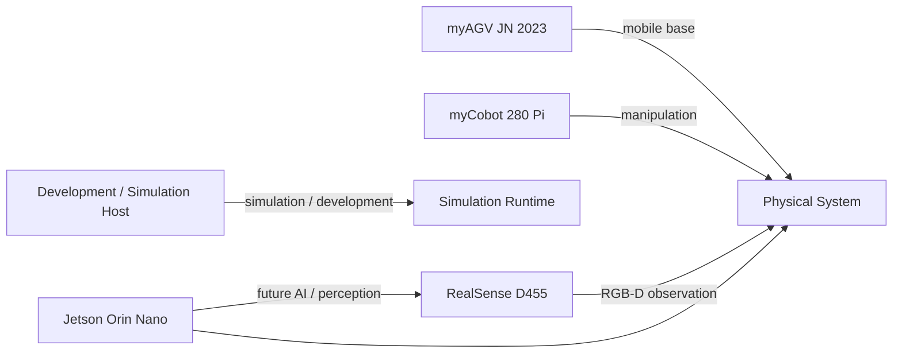

# Hardware Target Freeze v1

> Status: PROPOSED_FOR_FREEZE  
> Scope: Physical AI project target hardware selection  
> Architecture Policy: Simulation First → Hardware Later  
> Related ADR: `ADR-Simulation-First-Gating.md`

---

# 1. Purpose

Freeze the intended physical target hardware before simulation implementation begins.

This document answers:

> "Which real hardware shall the simulation-first software architecture eventually integrate with?"

This document does **not** claim that the hardware is already operationally ready.

---

# 2. Freeze Principle

The project distinguishes:

```text
TARGET_SELECTED
```

from:

```text
DEVICE_IO_READY
```

and from:

```text
PHYSICAL_INTEGRATION_READY
```

A hardware target may be selected even when:

- it is not currently connected;
- its device identity is not measured;
- its host access is not verified;
- its driver is not running;
- its camera path is not verified;
- physical motion is prohibited.

---

# 3. Frozen Physical Targets

## 3.1 Manipulator

```text
Selected target:
myCobot 280 Pi
```

Role:

- physical manipulation;
- future gripper operation;
- final hardware counterpart of the simulation manipulator adapter.

Phase 0 decision:

```text
TARGET_SELECTED
```

Not yet implied:

```text
DEVICE_IO_READY
MOTION_READY
TELEOP_READY
```

---

## 3.2 AMR

```text
Selected target:
myAGV JN 2023
```

Role:

- mobile base;
- future physical navigation execution;
- final counterpart of the simulation navigation adapter.

Phase 0 decision:

```text
TARGET_SELECTED
```

The integrated Jetson Nano/vendor runtime is treated as the AMR's existing controller environment unless a later ADR explicitly changes ownership.

---

## 3.3 Primary Perception Camera

```text
Selected target:
Intel RealSense D455
```

Role:

- RGB/depth observation;
- manipulation perception;
- future VLA observation source where applicable;
- physical counterpart of the simulation observation adapter.

Phase 0 decision:

```text
TARGET_SELECTED
```

Not yet implied:

```text
CAMERA_IO_READY
CALIBRATION_READY
TIMING_READY
```

---

## 3.4 Edge AI Compute

```text
Selected target:
Jetson Orin Nano
```

Role:

- future edge AI/VLA inference or supporting perception workloads;
- physical deployment compute distinct from the AMR's existing Jetson Nano controller where the architecture requires separation.

Phase 0 decision:

```text
TARGET_SELECTED
```

Exact deployment ownership shall remain governed by future integration decisions and measured resource constraints.

---

## 3.5 Development / Validation Host

Current development host capability includes the accepted VLA runtime environment with:

```text
GPU:
NVIDIA GeForce RTX 2060 with Max-Q Design

VRAM:
6144 MiB
```

Role:

- development;
- testing;
- simulation support;
- local VLA runtime validation.

This document does not classify the host as verified SmolVLA training hardware.

Training-resource authority remains with `TASK-P0-007` and successors.

---

# 4. Hardware Topology



The exact physical network and USB topology shall be verified during hardware readiness.

---

# 5. Simulation Counterparts

Each selected physical target shall have a simulation-side counterpart.

| Physical Target | Simulation Responsibility |
|---|---|
| myCobot 280 Pi | simulated manipulator |
| myAGV JN 2023 | simulated mobile base |
| RealSense D455 | simulated RGB/depth observation source |
| Jetson Orin Nano | deployment boundary / simulated compute contract where needed |

The simulator does not need to reproduce vendor implementation details.

It must preserve the project-facing contract required by the domain layer.

---

# 6. Frozen Interface Boundaries

## 6.1 Manipulation

Conceptual boundary:

```text
ManipulatorPort
```

Expected responsibilities:

- state observation;
- approved skill/action requests;
- gripper requests where applicable;
- explicit result/failure status.

Simulation implementation:

```text
SimulationManipulatorAdapter
```

Future physical implementation:

```text
MyCobotAdapter
```

---

## 6.2 Navigation

Conceptual boundary:

```text
NavigationPort
```

Simulation implementation:

```text
SimulationNavigationAdapter
```

Future physical implementation:

```text
MyAGVNavigationAdapter
```

Business/mission logic shall not depend directly on vendor-specific navigation calls.

---

## 6.3 Observation

Conceptual boundary:

```text
ObservationPort
```

Simulation implementation:

```text
SimulationObservationAdapter
```

Future physical implementation:

```text
RealSenseD455Adapter
```

The observation contract shall preserve required:

- image dimensions;
- timestamp semantics;
- frame identity;
- RGB/depth ownership;
- failure semantics

when those fields are frozen by the project.

---

# 7. Phase 0 Compatibility Assessment

The hardware target freeze requires architectural suitability, not full operational verification.

## myCobot 280 Pi

Required Phase 0 assessment:

```text
Manipulator role suitable         YES / accepted target
Future control path identifiable  required
Future state path identifiable    required before physical integration
Simulation counterpart feasible   YES
```

Operational USB/network/SDK tests belong to the hardware-readiness phase.

---

## myAGV JN 2023

Required Phase 0 assessment:

```text
AMR role suitable                 YES / accepted target
Navigation abstraction feasible   YES
Simulation counterpart feasible   YES
Physical Nav/control path         later verification
```

---

## RealSense D455

Required Phase 0 assessment:

```text
RGB-D role suitable               YES
Simulation observation possible   YES
Physical acquisition              later verification
Calibration/timing                later verification
```

---

## Jetson Orin Nano

Required Phase 0 assessment:

```text
Edge compute target selected      YES
Deployment role                   defined at architecture level
Actual workload fit               later measured evidence
```

---

# 8. Known Risks

## HW-R01 — myCobot physical command semantics

Status:

```text
OPEN_FOR_HW_READINESS
```

Future evidence required:

- state interface;
- command interface;
- gripper interface;
- limits;
- abort path.

---

## HW-R02 — myAGV controller/runtime differences

Status:

```text
OPEN_FOR_HW_READINESS
```

Risk:

Simulation development may not reproduce vendor runtime, timing, or driver behavior.

Mitigation:

Use an explicit navigation adapter boundary.

---

## HW-R03 — D455 USB/timing/calibration

Status:

```text
OPEN_FOR_HW_READINESS
```

Future evidence required:

- discovery;
- bounded acquisition;
- resolution/FPS;
- RGB/depth alignment assumptions;
- calibration state.

---

## HW-R04 — Orin Nano deployment fit

Status:

```text
OPEN_FOR_INTEGRATION
```

Future evidence required:

- runtime compatibility;
- workload placement;
- memory/performance;
- deployment packaging.

---

## HW-R05 — Simulation-to-reality gap

Status:

```text
ACCEPTED_PROJECT_RISK
```

Mitigation:

- frozen ports;
- adapter replacement;
- hardware readiness gate;
- physical regression after HW_GO.

---

# 9. What This Freeze Does Not Prove

This document does not prove:

```text
myCobot is connected
myAGV is connected
D455 acquisition works
Orin runtime is deployed
physical teleoperation works
physical E-stop works
physical motion is safe
SmolVLA can train locally
SmolVLA can control the physical robot
```

Those claims require later measured evidence.

---

# 10. Hardware Change Control

After this document becomes FROZEN, changing any primary target requires explicit review.

Examples:

```text
myCobot 280 Pi → another manipulator
myAGV JN 2023 → another AMR
D455 → another primary camera
Orin Nano → another deployment compute
```

A proposed change must document:

- reason;
- interface impact;
- simulation impact;
- task/backlog impact;
- evidence invalidated;
- migration cost;
- new risks.

Do not silently replace a frozen physical target because another device is easier to simulate.

---

# 11. Freeze Checklist

Before status changes to:

```text
FROZEN
```

verify:

```text
[ ] Manipulator target explicitly selected
[ ] AMR target explicitly selected
[ ] Primary camera explicitly selected
[ ] Edge compute target explicitly selected
[ ] Simulation counterpart defined for each relevant target
[ ] Domain interface boundary identified
[ ] Known physical-readiness risks recorded
[ ] No operational-readiness claim is implied
[ ] No physical motion is authorized
[ ] Change-control rule accepted
```

---

# 12. Frozen Decision

Upon approval:

```text
Manipulator:
myCobot 280 Pi

AMR:
myAGV JN 2023

Camera:
Intel RealSense D455

Edge AI Compute:
Jetson Orin Nano

Development Host:
accepted project development environment
```

The project shall implement simulation adapters against these intended future physical targets.

Physical readiness remains a later gate.