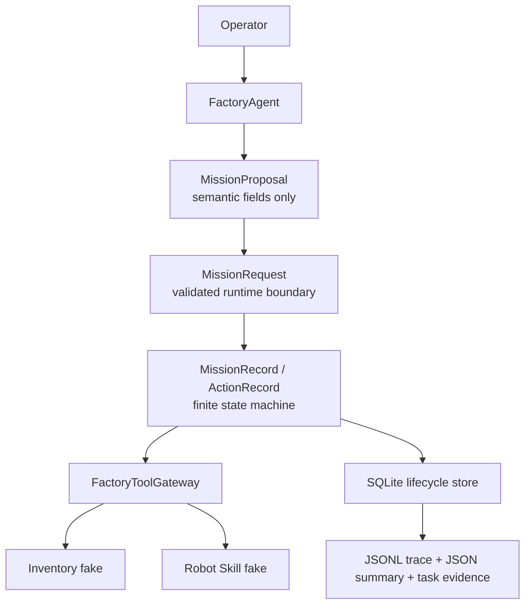

# Architecture와 Contract Discipline

## 실제 MVP 구성요소



이 다이어그램은 Day-10에 실제 존재하는 software boundary만 포함한다. ROS 2, Nav2, MoveIt, VLA server는 architecture의 미래 boundary이며 MVP runtime component가 아니다.

## 결정 1 — Agent는 의미를 제안하고 runtime은 실행을 소유한다

| 항목 | 내용 |
|---|---|
| Decision | `MissionProposal`은 `mission_type`, `part_id`, `quantity`, `destination`만 제공하고, `MissionRequest` runtime metadata는 service boundary가 부여한다. |
| Why | future hosted provider가 `request_id`, `mission_id`, `requested_by`, `created_at`를 발명하면 ownership과 reproducibility가 흔들린다. |
| Alternative rejected | provider output을 곧바로 execution request로 사용하거나 LLM에 metadata 생성을 맡기는 방식. |
| Failure prevented | non-mapping payload, forbidden field, invalid UUID, naive timestamp, whitespace-only string, boolean quantity가 valid mission으로 통과하는 문제. |
| Evidence | `src/contracts/mission.py`, `src/factory_agent/service.py`, `tests/test_factory_agent.py`, `results/mvp/MVP-001.json`. |

`ADR-006`은 provider-neutral adapter와 deterministic fake provider를 선택한다. fake provider의 determinism은 semantic proposal 수준의 재현성이지, 실제 hosted model accuracy claim이 아니다.

## 결정 2 — physical ambiguity는 finite state model로 보존한다

| 항목 | 내용 |
|---|---|
| Decision | mission은 `CREATED`, `READY`, `EXECUTING`, `RECONCILING`, `RECOVERING`, `COMPLETED`, `ESCALATED`, `FAILED`를, action은 `REQUESTED`, `EXECUTING`, `SUCCEEDED`, `FAILED`, `UNKNOWN`, `RECONCILING`을 사용한다. |
| Why | timeout이 발생해도 physical action의 실제 outcome은 알 수 없다. |
| Alternative rejected | timeout을 immediate failure/success로 치환하거나 Agent가 outcome을 선택하는 방식. |
| Failure prevented | duplicate side effect와 unbounded retry, `UNKNOWN`의 false success 전환. |
| Evidence | `src/mission_runtime/state.py`, `src/mission_runtime/recovery.py`, `tests/test_mission_runtime.py`, `tests/test_recovery.py`, `results/mvp/MVP-004.json`. |

`ADR-007`의 custom deterministic executor 선택은 LangGraph가 없어서 만든 단순화가 아니라, framework가 safety·idempotency·reconciliation authority를 대체할 수 없다는 boundary decision이다.

## 결정 3 — typed tool gateway는 robot implementation이 아니다

`FactoryToolGateway`는 `query_inventory(part_id)`, `transfer_part(...)`, `get_action_status(action_id)`라는 typed high-level contract만 노출한다. inventory fake는 canonical part에 `Rack A19`을 반환하고, recovery fake는 첫 attempt에 timeout을 주입한 뒤 approved retry에 성공한다.

따라서 Agent가 raw ROS command, pose, trajectory, controller command를 생성할 경로는 없다. Nav2는 later navigation adapter의 local planning/recovery authority이고, MoveIt/`ros2_control`은 later manipulation/controller authority라는 contract plan을 유지한다.

## 결정 4 — persistence는 evidence를 보조하는 대신, evidence correlation도 검증한다

`ADR-008`에 따라 SQLite는 single-process MVP의 local source of truth다. `lifecycle.sqlite3`, `trace.jsonl`, `summary.json`은 run reconstruction을 위한 artifact이고 PostgreSQL·multi-process durability를 증명하지 않는다. `ADR-009`에 따라 JSONL/run manifest는 현재 observability surface이며 OpenTelemetry/Grafana가 아니다.

`MissionLifecycleStore`는 attempted tool call의 `request_id`, `action_id`, operation, version, timestamp와 typed result를 cross-check한다. valid-looking JSON만으로 `tool_call_valid`를 주장할 수 없도록 만든 결정이다.

## Dependency direction

```text
Factory Agent → typed MissionRequest → deterministic runtime → typed tool gateway → fake result
                                         ↓
                               SQLite / JSONL / JSON evidence
```

반대 방향은 허용하지 않는다. tool fake가 mission state를 직접 바꾸지 않고, Agent가 gateway 구현이나 persistence를 우회하지 않으며, evidence writer가 caller-provided validity flag를 신뢰하지 않는다.
