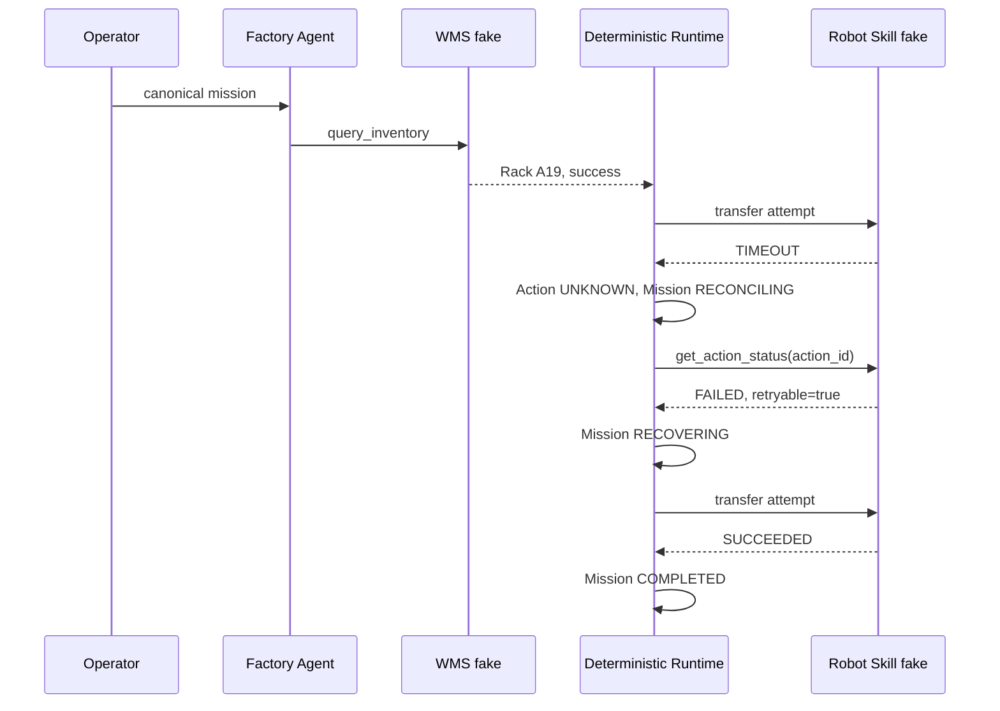

# Failure Recovery와 Validation

## 정상 경로

`TASK-MVP-006`은 canonical text를 `MissionRequest`로 parse한 뒤, WMS fake의 `Rack A19` observation과 one successful `transfer_part` result를 확인한다. mission state는 `CREATED → READY → EXECUTING → COMPLETED`이고, action state는 `REQUESTED → EXECUTING → SUCCEEDED`다. timeout/reconciliation/retry는 이 normal run에서 발생하지 않는다.

Evidence: [`results/mvp/normal_e2e/latest.json`](../../../results/mvp/normal_e2e/latest.json), [`results/mvp/MVP-006.json`](../../../results/mvp/MVP-006.json).

## 단일 실패·복구 경로



`TASK-MVP-007` evidence는 `timeout_detected=true`, `reconciliation_performed=true`, `retry_budget=1`, `retry_count=1`, `recovery_result=SUCCEEDED`, `mission_result=COMPLETED`를 기록한다. `logical_transfer_count=2`는 initial timeout attempt와 approved recovery retry를 뜻하며 `extra_execution_count=0`이다.

Evidence: [`results/mvp/failure_recovery/latest.json`](../../../results/mvp/failure_recovery/latest.json), [`results/mvp/MVP-007.json`](../../../results/mvp/MVP-007.json).

## 실제 Review → Fix → ACCEPT 사례

### 발견된 결함

MVP-006의 initial review는 valid-shaped attempted-call trace의 `request_id`가 typed component result와 달라도 evidence가 생성될 수 있음을 발견했다. 원래 focused tests는 canonical happy path와 machine-readable reconstruction을 확인했지만, **correlated field를 의도적으로 변조한 input**은 만들지 않았기 때문에 이 bypass를 잡지 못했다.

MVP-007 review는 같은 유형을 E2E wrapper에서 확인했다. inventory context와 recovery artifact가 각각 valid해도 서로 다른 mission/request correlation을 묶을 가능성이 있었다.

### 수정

- MVP-006: `_validate_normal_run`이 inventory/transfer result와 attempted-call의 `request_id`, `component_version`, timestamp, result kind를 cross-check한다.
- MVP-007: `_validate_failure_recovery_e2e`가 `inventory_call`과 typed inventory, recovery mission/action, durable summary의 run/action/state values를 함께 검증한다.

### 강화된 regression

`test_persistence_rejects_tampered_normal_run_correlation_or_tool_result`와 `test_e2e_evidence_rejects_tampered_inventory_correlation`은 tampered evidence writer가 fail-closed exception을 내도록 고정한다.

### 재검토 결과

각 TASK의 `04_review.md`는 `ACCEPT`를 기록한다. final release manifest는 full regression `50 PASS`, normal/recovery focused tests 각 `3 PASS`, evidence validation `PASS`를 기록한다.

## 검증 경로와 한계

```text
Implementation
→ focused unit/E2E tests
→ full regression
→ SQLite + JSONL + JSON evidence
→ independent read-only review
→ REJECT when correlation is incomplete
→ fix + tamper regression
→ re-review ACCEPT
→ task-focused Git commit
```

이는 in-process deterministic fixture의 correctness evidence다. real robot action, observation uncertainty, recovery latency, network failure, hosted provider behavior, multi-day soak을 검증한 결과는 아니다.
