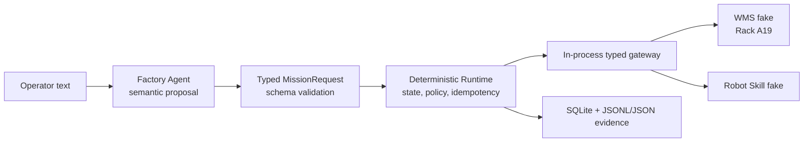

# Factory Physical AI — Day-10 MVP Portfolio

## 한 줄 소개

자동차 제조 line-side parts logistics에서 한국어 공급 요청을 typed mission으로 바꾸고, deterministic runtime이 단 한 번의 ambiguous timeout을 reconciliation과 one bounded retry로 처리하며, SQLite·JSONL·JSON evidence로 결과를 재구성하는 software MVP다.

## 문제와 범위

대상 문제는 `Line B에 Brake ECU Type-B 1개를 공급해줘.`라는 line-side 부품 공급 요청이다. Day-10 scope는 **1 Mission + 1 Failure + 1 Recovery + Evidence**로 고정했다. 정상 경로에서는 `Rack A19`의 fixture inventory를 확인한 뒤 one transfer로 `COMPLETED`가 되고, 실패 경로에서는 첫 Robot Skill attempt의 timeout을 성공이나 실패로 추측하지 않는다.

명시적 비범위는 physical robot/camera, ROS 2, Nav2, MoveIt, VLA fine-tuning/inference, real WMS/MES/PHM, hosted provider, Docker/PostgreSQL, multi-agent, multi-day soak, production deployment이다. 이는 구현 누락이 아니라 `plans/day10_mvp_scope_v1.md`의 동결된 scope 결정이다.

## Engineering highlights

1. **Agent와 실행 권한을 분리했다.** `MissionProposal`의 semantic field와 service-owned runtime metadata를 나누고, `MissionRequest`를 fail-closed 검증했다.
2. **ambiguous physical result를 상태 모델로 다뤘다.** `UNKNOWN != SUCCEEDED`, reconciliation 선행, one bounded retry, deterministic escalation 경로를 테스트했다.
3. **증거 자체를 검증 대상에 포함했다.** SQLite transition, immutable attempted-call trace, JSONL/summary correlation을 저장하고 tampered evidence를 거부한다.
4. **happy path만으로 acceptance하지 않았다.** MVP-005/006/007은 independent review에서 correlation bypass를 발견하고 regression test를 추가한 뒤 `ACCEPT`되었다.

## 검증과 최종 상태

release evidence [`results/mvp/release/day10_release.json`](../../../results/mvp/release/day10_release.json)은 validation 시점에 full regression `50 PASS`, normal E2E `3 PASS`, failure/recovery E2E `3 PASS`, evidence validator `PASS`를 기록한다. 8개 MVP TASK는 accepted 상태이며, Git commit trace는 [task traceability](05_task_traceability.md)에 정리했다.

이 결과는 deterministic fixture 기반 software evidence다. physical execution, provider accuracy, latency, VLA 성능, 실제 factory integration에 관한 주장은 하지 않는다.

## 문서 안내

- [MVP 개요](01_mvp_overview.md)
- [Architecture와 contracts](02_architecture_and_contracts.md)
- [Engineering highlights](03_engineering_highlights.md)
- [Failure recovery와 validation](04_failure_recovery_and_validation.md)
- [TASK traceability](05_task_traceability.md)
- [이력서용 프로젝트 요약](06_resume_project_summary.md)
- [면접 talking points](07_interview_talking_points.md)

## 작업 보고

MVP PORTFOLIO BUILD COMPLETE

생성한 포트폴리오 문서:

- [README.md](/home/jinho/projects/factory_physical_ai/docs/portfolio/mvp/README.md)
- [01_mvp_overview.md](/home/jinho/projects/factory_physical_ai/docs/portfolio/mvp/01_mvp_overview.md)
- [02_architecture_and_contracts.md](/home/jinho/projects/factory_physical_ai/docs/portfolio/mvp/02_architecture_and_contracts.md)
- [03_engineering_highlights.md](/home/jinho/projects/factory_physical_ai/docs/portfolio/mvp/03_engineering_highlights.md)
- [04_failure_recovery_and_validation.md](/home/jinho/projects/factory_physical_ai/docs/portfolio/mvp/04_failure_recovery_and_validation.md)
- [05_task_traceability.md](/home/jinho/projects/factory_physical_ai/docs/portfolio/mvp/05_task_traceability.md)
- [06_resume_project_summary.md](/home/jinho/projects/factory_physical_ai/docs/portfolio/mvp/06_resume_project_summary.md)
- [07_interview_talking_points.md](/home/jinho/projects/factory_physical_ai/docs/portfolio/mvp/07_interview_talking_points.md)

선정한 핵심 주제는 Agent/execution boundary, `UNKNOWN` 기반 bounded recovery, SQLite·JSONL evidence correlation, independent `REJECT → Fix → ACCEPT` 검증입니다.

가장 강한 개선 사례는 `TASK-MVP-006/007`의 evidence correlation bypass입니다. initial happy-path test는 통과했지만 independent review가 request ID·version·timestamp correlation의 변조 가능성을 발견했고, fail-closed validation과 tamper regression을 추가해 재검토 `ACCEPT`를 받았습니다.

검증:

- 8개 TASK 모두 traceability 문서에 포함
- `bash scripts/verify_mvp_evidence.sh` — `PASS`
- tracked/untracked portfolio 문서 whitespace 검사 — `PASS`

최종 MVP 상태는 accepted 및 task-focused commit 완료입니다. 단, `TASK-MVP-001/002`는 global history/evidence/commit은 있으나 per-task independent review 기록이 없어 해당 이력 공백을 명시했습니다.

의도적으로 제외한 주장은 real robot·ROS·VLA·hosted provider·실제 factory system·production deployment·성능/soak 측정입니다. 구현, 테스트, evidence, contracts, ADRs, task spec, Git history는 변경하지 않았습니다.