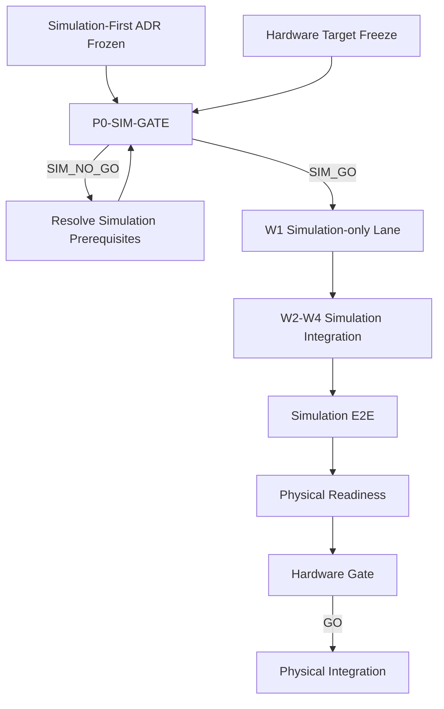

# TASK-P0-SIM-GATE — Simulation Development Readiness Gate

> Phase: Phase 0  
> Type: Readiness Gate / Authorization Task  
> Status: READY_FOR_IMPLEMENTATION after prerequisite freeze  
> Governing ADR: `ADR-Simulation-First-Gating.md`  
> Hardware Target Source: `hardware_target_freeze_v1.md`  
> Gate Outcome:
> - `SIM_GO`
> - `SIM_NO_GO`

---

# 1. Purpose

Determine whether the project may begin **simulation-only Week development** without waiting for physical hardware readiness.

This task does not authorize physical integration.

The gate answers:

> "Is the architecture, contract, target-hardware selection, simulator path, and software environment sufficiently defined to begin simulation-only implementation?"

---

# 2. Preconditions

Before executing this gate:

1. `ADR-Simulation-First-Gating.md` must be accepted/frozen.
2. `hardware_target_freeze_v1.md` must be accepted/frozen.
3. relevant system architecture must be available.
4. applicable domain contracts/interfaces must be frozen or explicitly stable enough for simulation implementation.
5. accepted P0-005 software-runtime evidence must remain valid.
6. accepted predecessor evidence must not be modified by this gate.

The following do **not** automatically block this gate:

```text
P0-006 = DEVICE_IO_BLOCKED
```

because physical-device readiness belongs to the later hardware integration gate.

A blocked P0-007 training-resource result does not block simulation work that performs no actual training.

---

# 3. Relationship to P0-004R

Existing:

```text
TASK-P0-004R = NO_GO
```

shall remain unchanged.

This gate has a narrower authorization scope.

Therefore:

```text
P0-004R NO_GO
+
P0-SIM-GATE SIM_GO
```

is allowed.

Interpretation:

```text
Full physical/VLA readiness:
NO_GO

Simulation-only software development:
GO
```

---

# 4. Gate Decision

Return exactly one:

```text
SIM_GO
```

or:

```text
SIM_NO_GO
```

---

# 5. Meaning of SIM_GO

`SIM_GO` means:

> The project may begin explicitly authorized simulation-only Week work using frozen contracts and simulation/fake adapters.

It does not mean:

- physical devices are ready;
- robot motion is authorized;
- physical camera use is authorized;
- physical teleoperation is authorized;
- training compute is ready;
- SmolVLA fine-tuning is authorized;
- the physical system is production ready.

---

# 6. Authorization Matrix

The gate evidence shall explicitly record an authorization matrix.

Minimum policy:

| Activity | SIM_GO Authorization |
|---|---:|
| TASK-W1-001 simulation-only implementation | true |
| Simulation adapters | true |
| Deterministic fakes | true |
| Simulated manipulator work | true |
| Simulated AMR work | true |
| Simulated observation/camera work | true |
| Simulation-only teleoperation logic | true if task specification remains non-physical |
| Dataset schema/contracts | true |
| Simulation/offline dataset pipeline development | true |
| Physical demonstration collection | false |
| Real robot commands | false |
| Real gripper commands | false |
| Physical teleoperation | false |
| Physical camera dependency | false |
| SmolVLA fine-tuning | false unless separately authorized by training-resource readiness |
| Paid compute provisioning | false |
| P0-004R physical bypass | false |

---

# 7. Scope

## 7.1 Architecture Readiness

Verify that the simulation implementation has an authoritative architecture.

At minimum identify:

- mission/runtime ownership;
- manipulator boundary;
- navigation boundary;
- observation boundary;
- VLA/skill boundary where applicable;
- fake/simulation ownership.

---

## 7.2 Hardware Target Freeze

Verify that final physical target hardware is selected.

At minimum:

```text
Manipulator
AMR
Primary camera
Edge compute
```

must be explicitly selected.

The gate shall not require physical discovery of those devices.

---

## 7.3 Simulation Counterparts

Verify that each relevant physical role has an intended simulation counterpart.

Examples:

```text
myCobot 280 Pi
→ SimulationManipulatorAdapter

myAGV JN 2023
→ SimulationNavigationAdapter

RealSense D455
→ SimulationObservationAdapter
```

Exact implementation may belong to later W1 tasks.

The gate only verifies that the boundary is defined and implementable.

---

## 7.4 Simulation Runtime

Verify that an executable simulation/runtime path exists for the intended Week work.

The exact simulator shall come from the accepted project environment and architecture.

The gate shall record:

- simulator/runtime identity;
- applicable ROS/runtime identity where required;
- launch/test entry point where available;
- known limitations.

---

## 7.5 Deterministic Fake Path

Where physical systems are intentionally unavailable, verify that deterministic fakes or simulation adapters can satisfy the frozen contract without hidden physical dependencies.

---

## 7.6 No Physical Dependency

Simulation entry shall not require:

- `/dev/tty*` robot devices;
- physical camera devices;
- physical motion;
- physical E-stop execution;
- physical teleoperation;
- vendor hardware availability.

If W1-001 cannot run without those dependencies, return `SIM_NO_GO`.

---

## 7.7 Dataset Boundary

Verify that the simulation lane can work on:

- dataset schema;
- observation/action contracts;
- simulation/offline pipeline.

Do not require a completed physical Dataset V1.

Physical data collection remains prohibited.

---

## 7.8 Training Boundary

Verify that simulation work which does not train the model can proceed independently of unresolved training resources.

Actual fine-tuning remains separately gated.

---

# 8. Explicitly Out of Scope

This task shall not:

- implement W1 functionality;
- implement simulation adapters;
- implement Dataset V1;
- train/fine-tune SmolVLA;
- collect physical demonstrations;
- command a robot;
- command a gripper;
- run physical teleoperation;
- remediate P0-006 hardware blockers;
- remediate P0-007 compute/budget blockers;
- replace P0-004R;
- modify accepted predecessor evidence.

This is a gate-evaluation task only.

---

# 9. Required Artifacts

## 9.1 Gate Verifier

```text
scripts/verify_simulation_development_readiness.py
```

Requirements:

- bounded;
- non-destructive;
- no physical-device execution;
- fail-closed;
- deterministic where practical;
- atomic JSON output.

---

## 9.2 Machine-readable Evidence

```text
results/phase0/P0-SIM-GATE_simulation_readiness.json
```

Include:

- task identity;
- governing ADR identity/hash;
- hardware target freeze identity/hash;
- accepted predecessor evidence references;
- simulation runtime classification;
- contract readiness;
- target-hardware freeze status;
- simulation counterpart classification;
- physical-dependency classification;
- dataset boundary;
- training boundary;
- unresolved simulation blockers;
- authorization matrix;
- final decision.

---

## 9.3 Human-readable Report

```text
docs/simulation/simulation_development_readiness_v1.md
```

Include:

- decision;
- allowed work;
- prohibited work;
- simulator/runtime assumptions;
- frozen interfaces;
- known simulation limitations;
- relation to P0-004R;
- relation to P0-006/P0-007;
- Week authorization matrix.

---

## 9.4 Task History

Create/update:

```text
docs/task_history/TASK-P0-SIM-GATE/01_implementation.md
docs/task_history/TASK-P0-SIM-GATE/README.md
docs/task_history/README.md
```

Independent review history is recorded separately.

---

# 10. Minimum Gate Checks

The evidence shall contain explicit results for:

```text
C01 Simulation-first ADR accepted/frozen
C02 Hardware target freeze accepted/frozen
C03 System architecture available
C04 Required simulation-facing contracts available
C05 Accepted VLA/software runtime preserved
C06 Simulation runtime identified
C07 Simulation runtime executable or otherwise sufficiently evidenced
C08 Manipulator simulation boundary defined
C09 Navigation simulation boundary defined
C10 Observation simulation boundary defined
C11 Deterministic fake strategy defined where required
C12 W1-001 can be implemented without physical-device dependency
C13 No physical motion required
C14 No physical camera required
C15 No physical teleoperation required
C16 Dataset V1 physical collection is not a simulation-gate prerequisite
C17 Training-resource blocker does not contaminate unrelated simulation work
C18 Authorization matrix is internally consistent
C19 No downstream implementation performed
C20 Final decision matches underlying mandatory checks
```

---

# 11. Exit Criteria

## EC-01 — ADR Freeze

`ADR-Simulation-First-Gating.md` is accepted/frozen.

---

## EC-02 — Hardware Target Freeze

`hardware_target_freeze_v1.md` is accepted/frozen.

---

## EC-03 — Architecture

Simulation-facing architecture is sufficiently defined for downstream implementation.

---

## EC-04 — Contract Boundary

Required project-facing interfaces are frozen or explicitly stable.

Simulation implementations must not require a new incompatible contract merely to begin.

---

## EC-05 — Runtime

The required simulation development runtime is available or sufficiently evidenced to permit implementation.

---

## EC-06 — Simulation Counterparts

Manipulator, navigation, and observation roles required by W1 have defined simulation/fake counterparts.

---

## EC-07 — Physical Independence

`TASK-W1-001` simulation scope can execute without a physical robot, physical camera, or physical motion.

---

## EC-08 — Device Blocker Isolation

Current:

```text
DEVICE_IO_BLOCKED
```

must not automatically cause this criterion to fail.

It causes failure only if W1-001 simulation implementation actually requires the unresolved physical capability.

---

## EC-09 — Training Blocker Isolation

Current training-resource readiness shall be evaluated only against tasks that require training.

Simulation-only software implementation shall not be blocked by unrelated training-resource uncertainty.

---

## EC-10 — Dataset Dependency

A physical validated Dataset V1 shall not be required merely to authorize the task that is supposed to create or develop it downstream.

No circular gate dependency is allowed.

---

## EC-11 — No Physical Authorization

All physical execution authorizations remain false.

---

## EC-12 — Scope Preservation

No W1 implementation is performed during this gate.

---

## EC-13 — Regression Safety

Relevant existing regression tests pass.

---

## EC-14 — Evidence Integrity

Gate report, JSON evidence, source bindings, and authorization matrix agree.

---

## EC-15 — Final Decision

Return exactly:

```text
SIM_GO
```

or:

```text
SIM_NO_GO
```

---

# 12. SIM_GO Decision Rules

Return:

```text
SIM_GO
```

only when all mandatory simulation-development prerequisites are satisfied.

At minimum:

```text
Architecture                  READY
Contracts                     READY
Hardware target selection     FROZEN
Simulation runtime            READY
Simulation boundaries         DEFINED
Physical dependency           NONE
Physical motion authorization FALSE
Dataset circular dependency   NONE
Scope isolation               PASS
Evidence integrity            PASS
```

---

# 13. SIM_NO_GO Decision Rules

Return:

```text
SIM_NO_GO
```

when a mandatory simulation prerequisite remains unresolved.

Examples:

- no simulator/runtime path exists;
- frozen contracts are unavailable;
- W1-001 directly depends on real robot access;
- simulator adapter boundaries are undefined;
- hardware target selection is unresolved;
- dataset gate dependency is circular;
- authorization matrix accidentally enables physical motion.

Do not return `SIM_NO_GO` solely because:

```text
P0-006 = DEVICE_IO_BLOCKED
```

or because a training-resource blocker affects only later fine-tuning.

---

# 14. Required Authorization Output

For `SIM_GO`, the report must explicitly state at minimum:

```text
TASK-W1-001 simulation-only authorized: true
TASK-W1-002 physical teleoperation authorized: false
Physical robot motion authorized: false
Physical gripper motion authorized: false
Physical camera dependency authorized: false
Physical Dataset V1 collection authorized: false
SmolVLA fine-tuning authorized: false unless separately cleared
P0-004R physical NO_GO bypassed: false
```

---

# 15. Independent Review Policy

Implementation completion does not imply gate acceptance.

Run a separate independent READ-ONLY review.

The review shall independently verify:

- ADR status;
- hardware freeze;
- architecture;
- contract boundaries;
- simulator dependency;
- absence of physical-device dependency;
- absence of circular Dataset dependency;
- authorization matrix;
- decision reconstruction;
- evidence integrity.

A correct:

```text
SIM_NO_GO
```

may still be accepted as a trustworthy gate result.

Likewise:

```text
SIM_GO
```

must not be accepted unless the underlying evidence independently supports it.

---

# 16. Final Report

Return:

```markdown
# Implementation Result — TASK-P0-SIM-GATE

## Inputs

## Architecture / Contract Readiness

## Hardware Target Freeze

## Simulation Runtime

## Simulation Counterparts

## Physical Dependency Review

## Dataset Boundary

## Training Boundary

## Authorization Matrix

## Tests / Validation

## Evidence

## Gate Decision

## Repository Check

## Recommended Commit Message

## Final Status
```

Final output shall distinguish:

```text
TASK-P0-SIM-GATE implementation:
complete | incomplete

Independent acceptance:
pending | accepted | rejected

Gate decision:
SIM_GO | SIM_NO_GO
```

---

# 17. Relationship to Later Physical Integration

`SIM_GO` opens only the simulation lane.

Before physical integration:

```text
P0-006 physical blockers
        ↓
physical remediation
        ↓
TASK-P0-006R
        ↓
DEVICE_IO_READY
```

and other applicable readiness requirements must be satisfied.

The later physical gate shall consume current evidence rather than assuming that earlier simulation success proves physical readiness.

---

# 18. Expected Flow



`TASK-P0-SIM-GATE` shall never authorize physical execution.