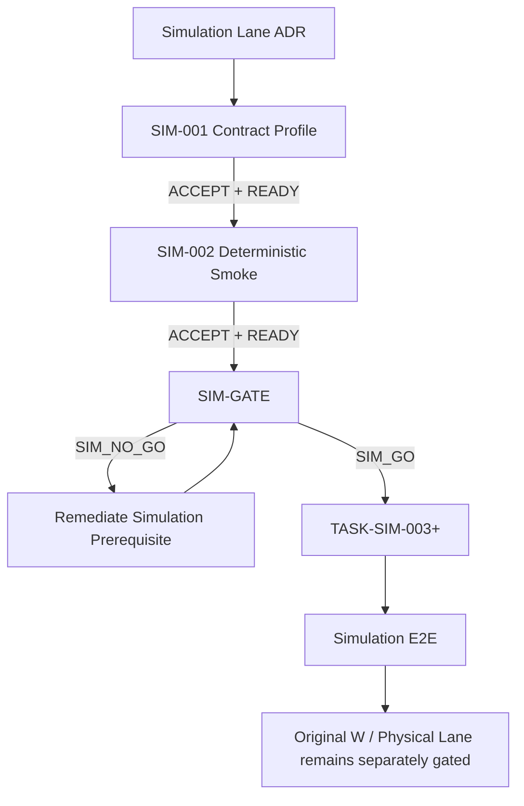

# TASK-SIM-GATE — Simulation Lane Authorization Gate

> Lane: Simulation
> Type: Readiness / Authorization Gate
> Status: READY_FOR_IMPLEMENTATION only after accepted SIM-001 and SIM-002
> Governing ADR: `ADR-Simulation-Lane-v1.md`
> Physical Authorization: NONE

---

# 1. Purpose

Determine whether downstream `TASK-SIM-*` development may begin.

This gate does not authorize:

* `TASK-W1-*`;
* physical robot work;
* physical teleoperation;
* physical Dataset V1 collection;
* fine-tuning;
* paid compute;
* hardware selection.

---

# 2. Required Inputs

The gate shall consume at minimum:

```text
FROZEN ADR-Simulation-Lane-v1
FROZEN simulation_task_mapping_v1
ACCEPTED TASK-SIM-001 evidence
ACCEPTED TASK-SIM-002 evidence
current authoritative P0/W authorization state
```

The gate shall not implement missing simulation behavior.

---

# 3. Gate Decision

Return exactly:

```text
SIM_GO
SIM_NO_GO
```

---

# 4. SIM_GO Meaning

`SIM_GO` means only:

> Downstream tasks in the `TASK-SIM-*` namespace may begin within the simulation-only authorization envelope.

It does not modify any existing W-task authorization.

---

# 5. Required Authorization Output

The gate shall explicitly record:

```text
simulation_lane_authorized:
true | false
```

and must preserve the authoritative values for:

```text
TASK-W1-001
TASK-W1-002
TASK-W1-003
...
```

It shall not rewrite them.

---

# 6. Mandatory Prohibitions Under SIM_GO

Even when:

```text
SIM_GO
```

the following remain false unless independently authorized elsewhere:

```text
physical_motion_authorized = false
physical_gripper_authorized = false
physical_teleop_authorized = false
physical_dataset_collection_authorized = false
physical_camera_required = false
```

Fine-tuning:

```text
fine_tuning_authorized
```

shall remain whatever the authoritative training-resource gate says.

`SIM_GO` cannot set it true.

---

# 7. Gate Checks

## C01 — Governing ADR

`ADR-Simulation-Lane-v1` is FROZEN.

## C02 — Simulation Mapping

`simulation_task_mapping_v1` is FROZEN.

## C03 — SIM-001 Acceptance

`TASK-SIM-001` has independent acceptance and:

```text
SIM_CONTRACT_PROFILE_READY
```

## C04 — SIM-002 Acceptance

`TASK-SIM-002` has independent acceptance and:

```text
SIM_SMOKE_READY
```

## C05 — Evidence Binding

SIM-002 is bound to the accepted SIM-001 profile.

## C06 — Bounded Execution Evidence

Smoke execution proves bounded behavior.

## C07 — Physical Independence

The smoke path requires no physical robot.

## C08 — Camera Independence

The smoke path requires no physical camera.

## C09 — No Physical Motion

No physical command path is authorized or executed.

## C10 — No Week Authorization Rewrite

Existing W-task authorization state remains unchanged.

## C11 — Dataset Boundary

No simulation fixture is represented as Dataset V1.

## C12 — Training Boundary

No actual fine-tuning is required for the authorized simulation lane unless separately authorized.

## C13 — Contract Boundary

Simulation uses the accepted skill/verification boundaries.

## C14 — No Direct Actuator Contract

No incompatible direct actuator ownership has been introduced.

## C15 — No Hardware Freeze Assumption

The gate does not require unresolved candidate hardware to be treated as architecturally frozen.

## C16 — Historical P0 Evidence Preserved

P0-005/P0-006/P0-007/P0-004R evidence remains unchanged.

## C17 — Authorization Matrix Consistent

All authorization fields are consistent with the gate scope.

## C18 — No Downstream Work

The gate itself implemented no future SIM task.

## C19 — Evidence Integrity

All hashes/bindings/decisions are consistent.

## C20 — Decision Reconstruction

The final gate result is recomputable from mandatory underlying checks.

---

# 8. SIM_GO Rules

Return:

```text
SIM_GO
```

only when all mandatory checks pass.

At minimum:

```text
SIM-001 ACCEPTED / READY
SIM-002 ACCEPTED / READY
physical dependency = none
physical authorization = false
W-task authorization mutation = none
Dataset aliasing = none
contract violation = none
evidence integrity = pass
```

---

# 9. SIM_NO_GO Rules

Return:

```text
SIM_NO_GO
```

when:

* SIM-001 is absent/unaccepted;
* SIM-002 is absent/unaccepted;
* smoke execution is unbounded;
* physical devices are required;
* direct actuator contracts were introduced;
* W-task authorization has been overridden;
* Dataset V1 is aliased;
* gate evidence is internally inconsistent.

---

# 10. Non-Blockers

The following do not automatically force SIM_NO_GO:

```text
P0-006 DEVICE_IO_BLOCKED
```

provided the accepted smoke path does not require physical I/O.

Likewise:

```text
P0-007 TRAINING_RESOURCE_BLOCKED
```

does not block simulation tasks that perform no actual training.

It continues to block any task that actually requires unresolved training compute.

---

# 11. No HW_GO

This gate shall not produce:

```text
HW_GO
```

or any equivalent blanket physical authorization.

Future hardware readiness and execution authorizations remain separate.

---

# 12. Required Artifacts

## Verifier

```text
scripts/verify_simulation_lane_gate.py
```

## Evidence

```text
results/simulation/SIM-GATE_readiness.json
```

## Report

```text
docs/simulation/simulation_lane_gate_v1.md
```

## History

Per repository convention.

---

# 13. Validator Requirements

The gate validator shall not merely trust:

```text
check.status = PASS
decision = SIM_GO
```

fields.

It must reconstruct material predicates from underlying accepted evidence.

A recomputed payload hash is not sufficient evidence of semantic validity.

Add negative tests for:

* W-task authorization mutation;
* physical authorization flip;
* missing SIM-001;
* missing SIM-002;
* unaccepted SIM evidence;
* contract-boundary mismatch;
* Dataset aliasing;
* forged SIM_GO plus recomputed hash;
* modified predecessor bindings.

---

# 14. Independent Review

A separate READ-ONLY review must independently verify:

* source authority;
* SIM-001/SIM-002 accepted bindings;
* gate decision reconstruction;
* no W-task authorization override;
* no physical authorization;
* no hardware freeze assumption;
* no Dataset alias;
* no direct actuator contract;
* evidence integrity.

A correct:

```text
SIM_NO_GO
```

may be accepted as a truthful implementation outcome.

---

# 15. Final Report

Return:

```text
Implementation/evidence acceptance:
pending independent review

Gate result:
SIM_GO | SIM_NO_GO

Simulation lane authorized:
true | false

TASK-W1-001:
unchanged from authoritative source

Physical motion authorized:
false

Physical teleoperation authorized:
false

Physical Dataset V1 collection authorized:
false

Fine-tuning authorization:
unchanged from authoritative training gate
```

---

# 16. Downstream Effect

If:

```text
ACCEPT TASK-SIM-GATE
+
SIM_GO
```

then future:

```text
TASK-SIM-003+
```

may start.

It still does not authorize:

```text
TASK-W1-001
```

or any other existing W task.

---

# 17. Expected Flow


